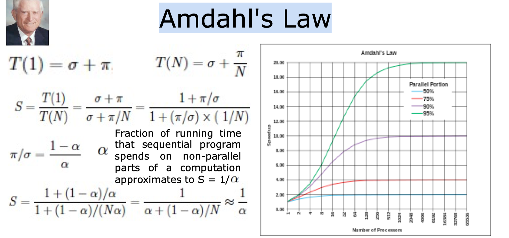
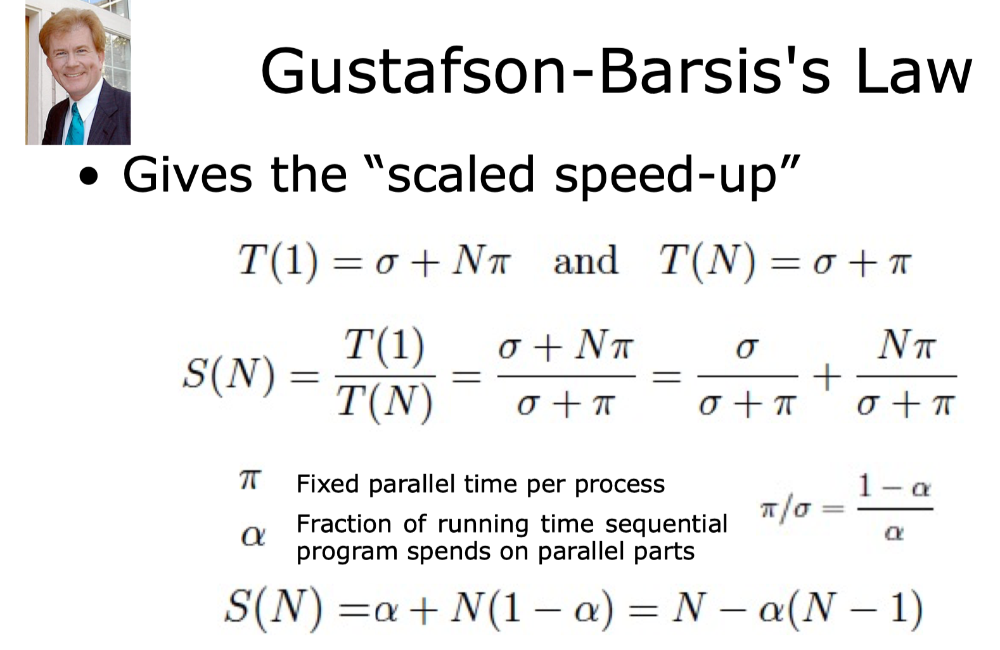
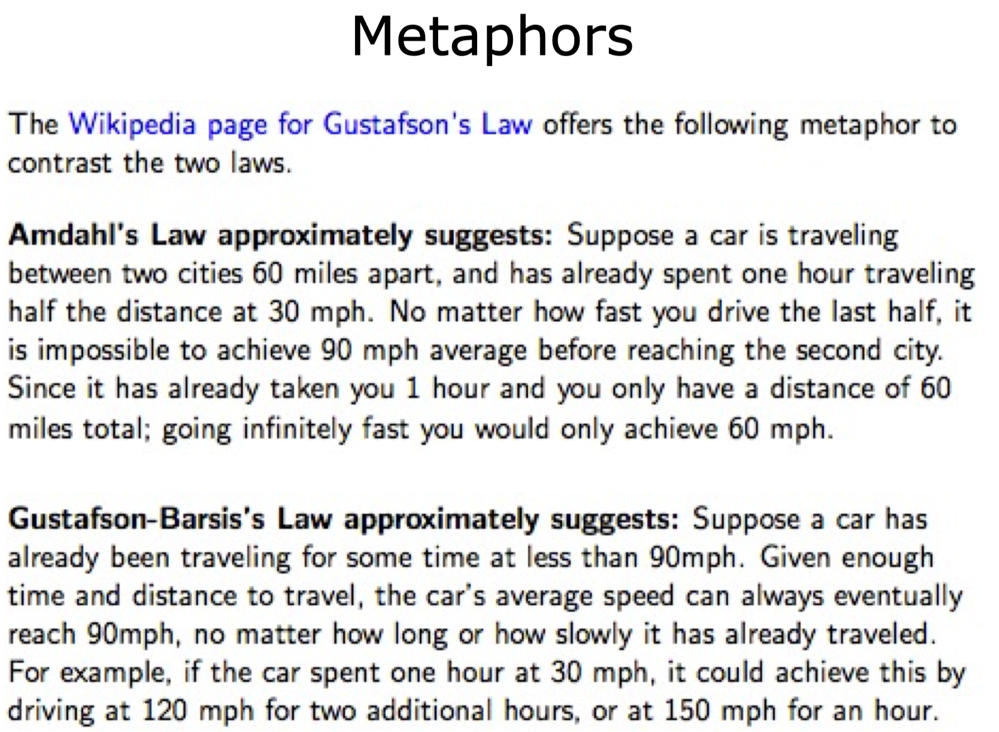

# Intro
在高并发程序设计中有非常重要的两个定律，这个两个定律从不同角度诠释了加速比与系统串行化程度、CPU核心数之间的关系，他们使我们在做高并发程序设计的理论依据：

- Amdahl（阿姆达尔定律）
- Gustafson（古斯塔夫森定律）

# Amdahl Law
## 加速比定义

      加速比 = 优化前系统耗时 / 优化后系统耗时

所谓加速比就是优化前的耗时和优化后的耗时的比值。加速比越高，表明优化效果越明显。

下图是该公式的推导过程：其中n表示处理器个数，T表示时间，T1表示优化前耗时(也就是一个CPU耗时),Tn表示使用n个处理器优化后的耗时。F是程序中只能串行执行的比例。

根据这个公式，如果CPU处理器数量趋于无穷，那么加速比与系统的串行化比例成反比，也就说 如果系统中有50%的代码必须串行化，那么系统的最大加速比为2.

在极端情况下，假定并行处理器个数为无穷大，也就说 步骤2和步骤5的耗时为0.即使这样，系统整体耗时依然大于300，使用加速比计算公式,N趋于无穷大，有加速比= 1/F，且F=0.6，固有加速比= 1.67.即加速比的极限为 500/300 = 1.67.

由此可见，为了提高系统的速度，仅仅增加CPU的数量并不一定能达到我们预期的效果。需要从根本上修改程序的串行行为，提高系统内可并行化的模块比重，在此基础上，合理增加并行处理器数量，才能以最小的投入，得到最大的加速比。

## Gustafson Law
该定律也试图说明处理器个数，串行化比例和加速比之间的关系:

从上面的公式我们可以看出两个公式截然不同，Gustafson定律中，我们可以更容易的发现，如果串行化比例很小，并行化比例很大，那么加速比就是处理器个数，只要不断的累加处理器数，就能获得更快的速度。

# Metaphors

# 矛盾?
两个定律的结论不同，这是不是说两个定律中有一个是错误的呢，其实不然，两者的差异其实是因为这两个定律对一个客观事实从不同角度去审视的后果，他们的侧重点不同。

Amdahl强调，当串行化比例一定时，加速比是有上限的，不管你堆叠多少个CPU参与计算，都不能突破上限。

而Gustafson 定律的出发点不同，对Gustafson定律来说，如果可被并行化的代码所占比例足够大，那么加速比就能随着CPU的数量线性增长。

所以这两者并不矛盾，从极端的角度来说，如果系统中没有可以被并行化的代码，那么对于两个定律，其 加速比是1，反之，如果系统中可被并行化的代码比例100%，那么两个定律得到的加速比都是处理器个数.

阿姆达尔法则指明了系统加速的极限， 但是古斯塔夫森法则指出了， 虽然随着计算资源的增加， 系统加速会出现边际效应递减， 但是系统在一定时间内， 可以完成的计算量， 确会大幅增加。 而且更重要的是， 这种增加的趋势并不会因为系统资源变多而打折。

古斯塔夫森法则为机器学习，大数据指明了一个方向。 如果可以通过增加问题的规模（增加模型复杂度， 增加样本量）来提高产出， 那么就可以利用云计算提供的大规模计算资源。

# Copyright
版权声明：本文为CSDN博主「g-Jack」的原创文章，遵循CC 4.0 BY-SA版权协议，转载请附上原文出处链接及本声明。
原文链接：https://blog.csdn.net/hao134838/article/details/107448500

