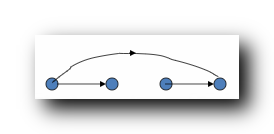
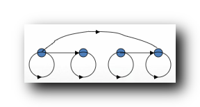
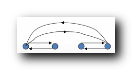
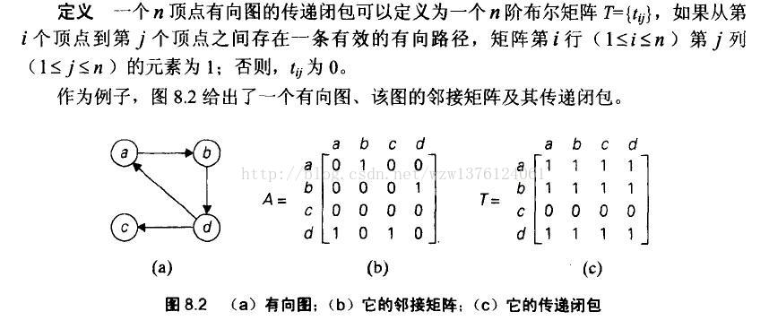

# 关系闭包
包含给定的元素 , 并且具有指定性质的**最小的**集合,称为关系的闭包.

- 自反闭包 r ( R ) : 包含 R 关系 , 向 R 关系中 , 添加有序对 , 变**自反**的最小的二元关系;

- 对称闭包 s ( R ) : 包含 R 关系 , 向 R 关系中 , 添加有序对 , 变**对称**的最小的二元关系;

- 传递闭包 t ( R ) : 包含 R 关系 , 向 R 关系中 , 添加有序对 , 变**传递**的最小的二元关系;

# 详情

今天有如下二元关系:

## 自反闭包 Reflexive closure

自反闭包 关系图 : 在 R 的基础上, 添加有些有序对, 使变成自反的最小的二元关系, **自反的条件是所有的顶点都有环**, 这里为四个顶点都添加环;

## 对称闭包 symmetric closure
在 R 的基础上 , 添加有些有序对 , 使变成对称的最小的二元关系, **对称的条件是任意两个顶点之间有0/2条有向边, 有0条边的不管 , 有1条边的在添加一条反向有向边**;

## 传递闭包 transitive closure
发现传递性,要添加直连的有序对.

