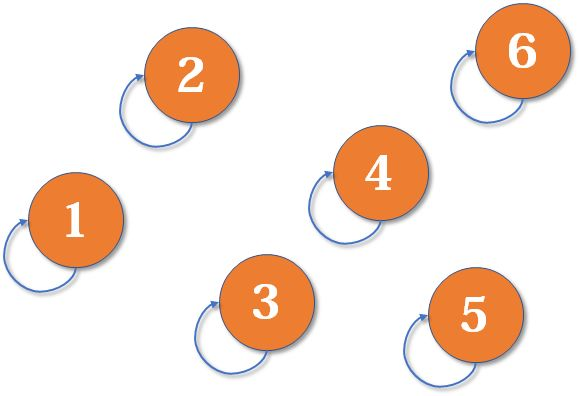
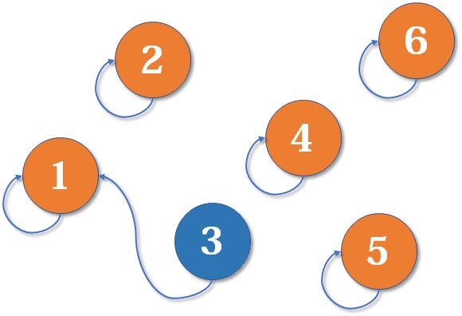
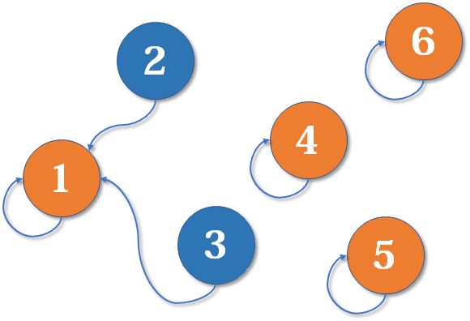
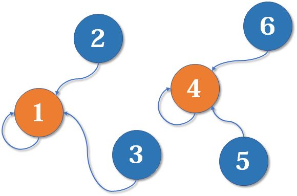
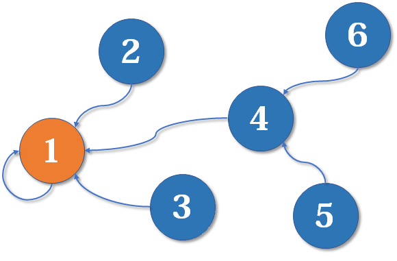
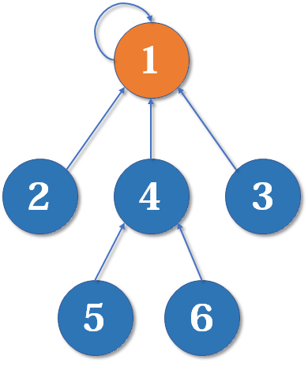
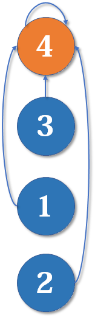
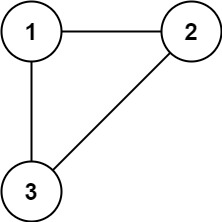

# 并查集

并查集是简洁而优雅的数据结构之一，主要用于解决一些**元素分组**的问题。它管理一系列**不相交的集合**，并支持两种操作：

- 合并（Union）：把两个不相交的集合合并为一个集合。
- 查询（Find）：查询两个元素是否在同一个集合中。

# 数据结构
并查集的重要思想在于：**用集合中的一个元素代表集合**。

如果把集合比喻成帮派，而代表元素则是帮主，接下来我们利用这个比喻，看看并查集是如何运作的。


最开始，所有大侠各自为战。他们各自的帮主自然就是自己。（对于只有一个元素的集合，代表元素自然是唯一的那个元素）


现在2号想和3号比武（合并3号和2号所在的集合），但3号表示，别跟我打，让我帮主来收拾你（合并代表元素）。不妨设这次又是1号赢了，那么2号也认1号做帮主。


现在我们假设4、5、6号也进行了一番帮派合并，江湖局势变成下面这样：


现在假设2号想与6号比，跟刚刚说的一样，喊帮主1号和4号出来打一架（帮主真辛苦啊）。1号胜利后，4号认1号为帮主，当然他的手下也都是跟着投降了。


综上所述，并查集是一个**树状的结构**，要寻找集合的代表元素，只需要一层一层往上访问**父节点**（图中箭头所指的圆），**直达树的根节点（图中橙色的圆）即可**。根节点的父节点是它自己。我们可以直接把它画成一棵树：


# 数据结构核心代码
## Init
假如有编号为1, 2, 3, ..., n的n个元素，我们用一个数组fa[]来存储每个元素的父节点（因为每个元素有且只有一个父节点，所以这是可行的）。一开始，我们先将它们的父节点设为自己。
```
int fa[MAXN];
void init(int n)
{
    for (int i = 1; i <= n; ++i)
        fa[i] = i;
}
```

## Find
我们用递归的写法实现对代表元素的查询：一层一层访问父节点，直至根节点（根节点的标志就是父节点是本身）。**要判断两个元素是否属于同一个集合，只需要看它们的根节点是否相同即可**。

**注意：该查询算法有优化方案，见后文。**
```
int find(int x)
{
    if(fa[x] == x)
        return x;
    else
        return find(fa[x]);
}
```

## Union
合并操作也是很简单的，先找到两个集合的代表元素，然后将前者的父节点设为后者即可。比如如下代码是i帮派加入j的帮派。
```
void merge(int i, int j)
{
    fa[find(i)] = find(j);
}
```

## Find（Optimized）
既然我们只关心一个元素对应的根节点，那我们希望每个元素到根节点的路径尽可能短，最好只需要一步。我们可以优化合并，防止形成过长的路径。
**路径压缩**：只要我们在**查询**的过程中，把沿途的每个节点的父节点都设为根节点即可。
对比：
 

```
int find(int x)
{
    return x == fa[x] ? x : (fa[x] = find(fa[x]));
}
```
为了好看, 以上代码等价为：
```
int find(int x)
{
    if(x == fa[x])
        return x;
    else{
        fa[x] = find(fa[x]);  //父节点设为根节点
        return fa[x];         //返回父节点
    }
}
```

# 例题
**剑指 Offer II 118. 多余的边**
```text
树可以看成是一个连通且 无环 的 无向 图。

给定往一棵 n 个节点 (节点值 1～n) 的树中添加一条边后的图。添加的边的两个顶点包含在 1 到 n 中间，且这条附加的边不属于树中已存在的边。图的信息记录于长度为 n 的二维数组 edges ，edges[i] = [ai, bi] 表示图中在 ai 和 bi 之间存在一条边。

请找出一条可以删去的边，删除后可使得剩余部分是一个有着 n 个节点的树。如果有多个答案，则返回数组 edges 中最后出现的边。

来源：力扣（LeetCode）
链接：https://leetcode.cn/problems/7LpjUW
著作权归领扣网络所有。商业转载请联系官方授权，非商业转载请注明出处。
```

```text
输入: edges = [[1,2],[1,3],[2,3]]
输出: [2,3]
```

**题解：**
在一棵树中，边的数量比节点的数量少 1。如果一棵树有 n 个节点，则这棵树有 n-1 条边。这道题中的图在树的基础上多了一条边，因此边的数量也是 n。

树是一个连通且无环的无向图，在树中多了一条边之后就会出现环，因此多余的边即为导致环出现的边。

可以通过并查集寻找多余的边。初始时，每个节点都属于不同的连通分量。遍历每一条边，判断这条边连接的两个顶点是否属于相同的连通分量。

1. 如果两个顶点属于不同的连通分量，则说明在遍历到当前的边之前，这两个顶点之间不连通，因此当前的边不会导致环出现，合并这两个顶点的连通分量。

2. 如果两个顶点属于相同的连通分量，则说明在遍历到当前的边之前，这两个顶点之间已经连通，因此当前的边导致环出现，为多余的边，将当前的边作为答案返回。

```java
class Solution {
    int[] p;
    //查询根节点爸爸
    int find(int x){
        return p[x]==x ? x : (p[x]=find(p[x]));
    }
    //连接两个节点， 认b的爸爸为新爸爸
    void union(int a,int b){
        p[find(a)] = find(b);
    }
    //判断两个节点是否连通，是否是同一个爸爸即可
    boolean query(int a,int b){
        return find(a) == find(b);
    }
    public int[] findRedundantConnection(int[][] edges) {
        int n = edges.length;
        p = new int[n+1];
        //初始化并查集，先自己认自己为爸爸
        for(int i=0;i<=n;i++)    p[i] = i;
        for(int[] e : edges){
            if(query(e[0], e[1])) return e;
            else union(e[0], e[1]);
        }
        return null;
    }
}
```

