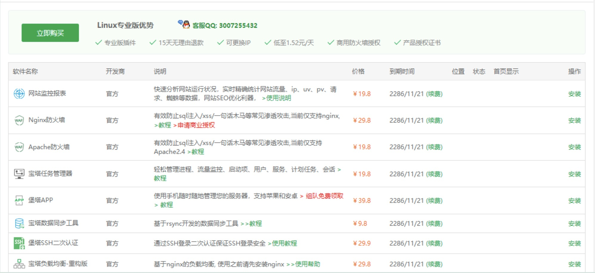

# 起因
闲的没事干,想要交流学习宝塔面板的付费软件的设计思想,并在24小时内删除,故采取下述方式.

打击盗版,文明上网,从我做起. 请务必支持正版!

# 经过
在宝塔面板自带的FTP界面里进入:
`www/server/panel/data/plugin.json`

先备份,然后,

替换里面的内容: `"endtime": -1` 变成 `"endtime": 999999999999`, 然后保存.

此时专业版付费插件就开放供大家交流学习其编程思想了:

**注意:**
完成上述操作,并安装完研究所需的软件后,进入面板设置,调成离线模式,这样修改过的JSON就不会因为自动更新被覆盖了.

# 声明
打击盗版,从我做起. 此方法仅供学习交流软件的编程思想为目的，严禁用于商业用途，付费插件请于24小时内删除. 请支持正版!
