# 1. Definition of B+ Tree
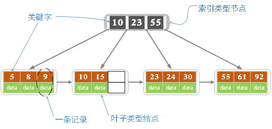
各种资料上B+树的定义各有不同，一种定义方式是关键字个数和孩子结点个数相同。这里我们采取维基百科上所定义的方式，即**关键字个数比孩子结点个数小1**，这种方式是和B树基本等价的。上图就是一颗阶数为4的B+树。

除此之外B+树还有以下的要求。

1. B+树包含2种类型的结点：内部结点（也称索引结点）和叶子结点。根结点本身即可以是内部结点，也可以是叶子结点。根结点的关键字个数最少可以只有1个。

2. B+树与B树最大的不同是内部结点不保存数据，只用于索引，所有数据（或者说记录）都保存在叶子结点中。

3. m阶B+树表示了内部结点最多有m-1个关键字（或者说内部结点最多有m个子树），阶数m同时限制了叶子结点最多存储m-1个记录。

4. 内部结点中的key都按照从小到大的顺序排列，对于内部结点中的一个key，左树中的所有key都小于它，右子树中的key都大于等于它。叶子结点中的记录也按照key的大小排列。

5. 每个叶子结点都存有相邻叶子结点的指针，叶子结点本身依关键字的大小自小而大顺序链接。

# 2. Insertion of B+ Tree
1. 若为空树，创建一个叶子结点，然后将记录插入其中，此时这个叶子结点也是根结点，插入操作结束。

2. 针对叶子类型结点：根据key值找到叶子结点，向这个叶子结点插入记录。插入后，若当前结点key的个数小于等于m-1，则插入结束。否则将这个叶子结点分裂成左右两个叶子结点，左叶子结点包含前m/2个记录，右结点包含剩下的记录，将第m/2+1个记录的key进位到父结点中（父结点一定是索引类型结点），进位到父结点的key左孩子指针向左结点,右孩子指针向右结点。将当前结点的指针指向父结点，然后执行第3步。

3. 针对索引类型结点：若当前结点key的个数小于等于m-1，则插入结束。否则，将这个索引类型结点分裂成两个索引结点，左索引结点包含前(m-1)/2个key，右结点包含m-(m-1)/2个key，将第m/2个key进位到父结点中，进位到父结点的key左孩子指向左结点, 进位到父结点的key右孩子指向右结点。将当前结点的指针指向父结点，然后重复第3步。

下面是一颗5阶B+树的插入过程，5阶B+ Tree的结点最少2个key，最多4个key。
1. 空树中插入5

2. 依次插入8，10，15

3. 插入16

插入16后超过了关键字的个数限制，所以要进行分裂。在叶子结点分裂时，分裂出来的左结点2个记录，右边3个记录，中间key成为索引结点中的key，分裂后当前结点指向了父结点（根结点）。结果如下图所示:
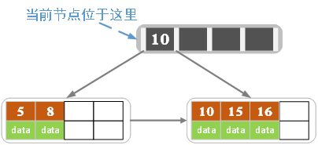

4. 插入17
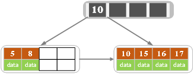

5. 插入18，插入后如下图所示
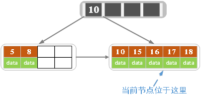

当前结点的关键字个数大于5，进行分裂。分裂成两个结点，左结点2个记录，右结点3个记录，关键字16进位到父结点（索引类型）中，将当前结点的指针指向父结点。
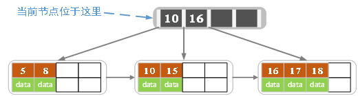

当前结点的关键字个数满足条件，插入结束。

6. 插入若干数据后
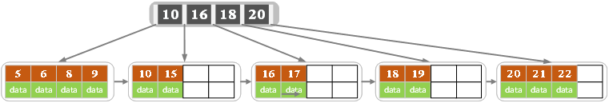

7. 在上图中插入7，结果如下图所示
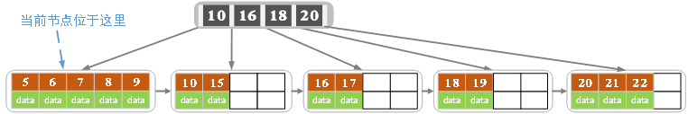

当前结点的关键字个数超过4，需要分裂。左结点2个记录，右结点3个记录。分裂后关键字7进入到父结点中，将当前结点的指针指向父结点，结果如下图所示。

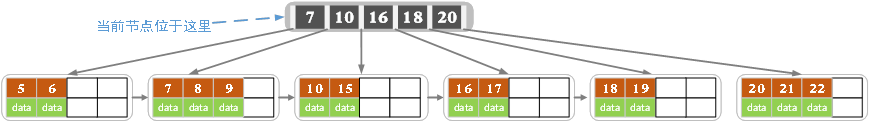

当前结点的关键字个数超过4，需要继续分裂。左结点2个关键字，右结点2个关键字，关键字16进入到父结点中，将当前结点指向父结点，结果如下图所示。

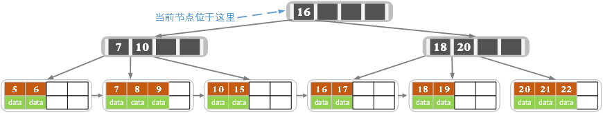

当前结点的关键字个数满足条件，插入结束。

# Deletion of B+ Tree
如果叶子结点中没有相应的key，则删除失败。否则执行下面的步骤

1. 删除叶子结点中对应的key。删除后若结点的key的个数大于等于Math.ceil(m-1)/2 – 1，删除操作结束,否则执行第2步。

2. 若兄弟结点key有富余（大于Math.ceil(m-1)/2 – 1），向兄弟结点借一个记录，同时用借到的key替换父结（指当前结点和兄弟结点共同的父结点）点中的key，删除结束。否则执行第3步。

3. 若兄弟结点中没有富余的key,则当前结点和兄弟结点合并成一个新的叶子结点，并删除父结点中的key（父结点中的这个key两边的孩子指针就变成了一个指针，正好指向这个新的叶子结点），将当前结点指向父结点（必为索引结点），执行第4步（第4步以后的操作和B树就完全一样了，主要是为了更新索引结点）。

4. 若索引结点的key的个数大于等于Math.ceil(m-1)/2 – 1，则删除操作结束。否则执行第5步

5. 若兄弟结点有富余，父结点key下移，兄弟结点key上移，删除结束。否则执行第6步

6. 当前结点和兄弟结点及父结点下移key合并成一个新的结点。将当前结点指向父结点，重复第4步。

注意，通过B+树的删除操作后，索引结点中存在的key，不一定在叶子结点中存在对应的记录。

下面是一颗5阶B+ tree的删除过程，5阶B+ trrr的结点最少2个key，最多4个key。

1. 初始状态

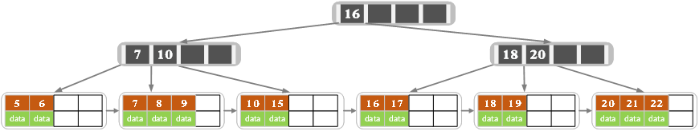

2. 删除22,删除后结果如下图

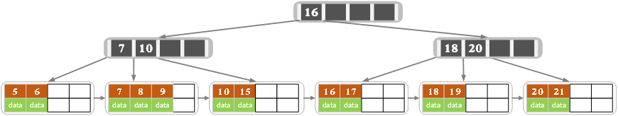

删除后叶子结点中key的个数大于等于2，删除结束

3. 删除15，删除后的结果如下图所示

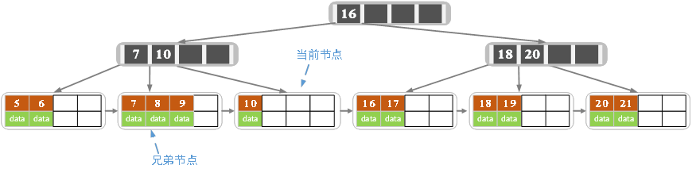

删除后当前结点只有一个key,不满足条件，而兄弟结点有三个key，可以从兄弟结点借一个关键字为9的记录,同时更新将父结点中的关键字由10也变为9，删除结束。

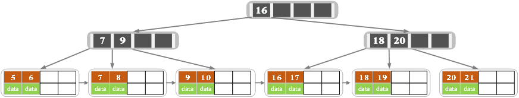

4. 删除7，删除后的结果如下图所示

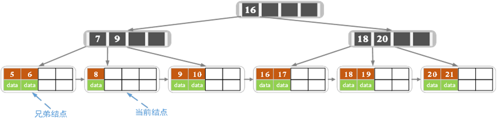

当前结点关键字个数小于2，（左）兄弟结点中的也没有富余的关键字（当前结点还有个右兄弟，不过选择任意一个进行分析就可以了，这里我们选择了左边的），所以当前结点和兄弟结点合并，并删除父结点中的key，当前结点指向父结点。

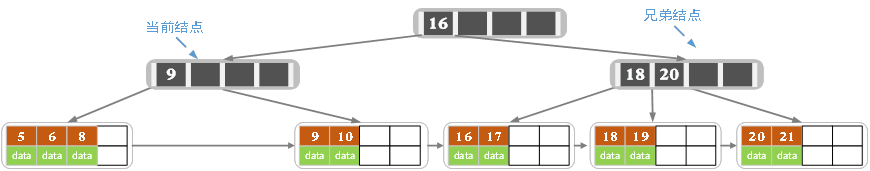

此时当前结点的关键字个数小于2，兄弟结点的关键字也没有富余，所以父结点中的关键字下移，和两个孩子结点合并，结果如下图所示。

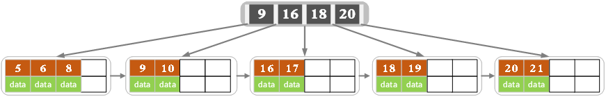

# Search in B+ Tree

树的高度为:
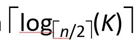, 其中:

- n: B+ tree阶数, 单个节点最大出度;
- k: 有多少个key values在这个树中.

举例:

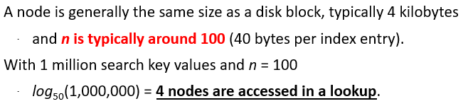

