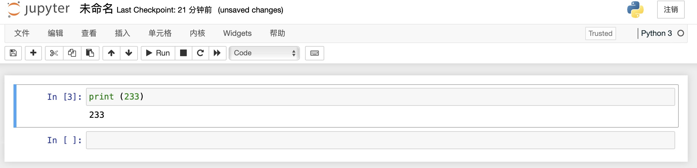

# 需求

安装一个Conda python环境, 然后安装jupyter notebook服务器, 设置密码访问, 然后配置Nginx反向代理, 能够通过域名访问它.

# 步骤

### 0. 建议

推荐不要在root用户下安装conda, 请`useradd`一个新用户, 并`passwd`设置密码, 然后`su new-user`.

### 1. 安装python3
`yum install python3`

### 2. 安装pip
`yum install pip`

### 3. 安装MiniConda
`wget https://repo.anaconda.com/miniconda/Miniconda3-latest-Linux-x86_64.sh`

然后在当前目录下能看到到下载下来的`Miniconda3-latest-Linux-x86_64.s`

赋予其运行权限:`chmod +x Miniconda3-latest-Linux-x86_64.sh`
然后运行`./Miniconda3-latest-Linux-x86_64.sh`

根据提示完成安装, 然后他会提示一个是否conda init, yes就行.

安装完成后重新打开terminal, 或者`source ~/.bash_profile`

查查看看conda命令有没有效果`conda -h`

升级一下: `conda upgrade conda`

### 4. 可以考虑新建一个虚拟环境
```
# 注意：这里最好指定python的版本，例如python=2.7
# 不然系统会直接使用global python version
# 并且把你所安装的依赖包全部放在global env下面，不利于你对python虚拟环境的隔离
conda create -n jupyter  python=3.7 -y
```

激活一个环境`source activate jupyter`
取消激活`source deactivate`

### 5. 安装Jupyter Notebook
`pip install jupyter`
验证: `jupyter --version`

### 6. 配置Notebook
生成配置文件: `jupyter notebook --generate-config`, 于是会生成一个配置文件`jupyter_notebook_config.py`, 可以用vim访问到. 配置文件一般位于`/home/用户名/.jupyter`目录下.

注意把配置文件里的`c.NotebookApp.allow_remote_access` 设置为`True`.

配置密码: `jupyter notebook password`, 成功后会有提示说保存了一个json文件, 里面有经过Hash过的密码. 

用vim打开生成的`jupyter_notebook_config.json`文件, 把里面那个密码的Hash结果复制. 然后vim打开之前自动生成的`jupyter_notebook_config.py`配置文件, 里面有个字段`c.NotebookApp.password`, 在后面把密码粘贴上去, `:wq`保存.

然后顺便设置Notebook的开始目录, 例如`c.NotebookApp.notebook_dir = '/home/用户名/notes'`.

### 7. 运行NoteBook
`jupyter notebook`, 此时默认会跑在8888端口上

### 8. Nginx反向代理配置

如果你不想用8888端口访问, 而是通过公网域名来访问notebook, 可以配置Nginx反向代理, 但是里面有坑.

如果反向代理没有配置好,或者只是当做普通静态网页配置了反向代理, 你会发现在新建notebook或者连接kernel的时候发生错误. 

以下是一个合适的Nginx反向代理配置, 经过测试能够进入生产:
```
location / {
    proxy_pass http://127.0.0.1:8888/; # JUPYTER_PORT 为 Jupyter 运行端口
    proxy_set_header X-Real-IP $remote_addr;
    proxy_set_header Host $host;
    proxy_set_header X-Forwarded-For $proxy_add_x_forwarded_for;
    proxy_http_version 1.1;
    proxy_set_header Upgrade $http_upgrade;
    proxy_set_header Connection "upgrade";
    proxy_redirect off;
}
```

# 结果


