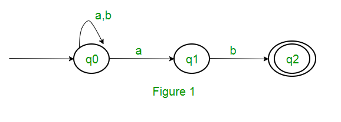
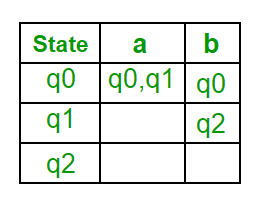
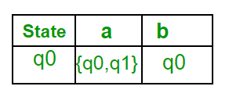
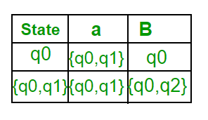
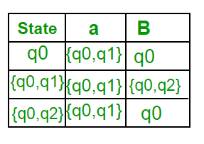
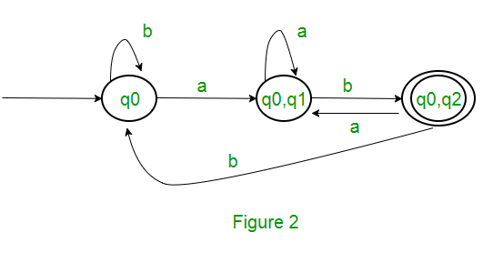

# Hello
A **Non-deterministic Finite Automata (NFA)** is a finite state machine, in which, the move from one state to another is not fully deterministic, i.e., for a particular symbol, there may be more than one moves leading to different states.

There are two ways of conversion from NFA to DFA, but we will talk about *Conversion from NFA to DFA using Transition Table*.

# Eg

Conversion from NFA to DFA:

Suppose there is an NFA `N < Q, ∑, q0, δ, F >` which recognizes a language L. Then the DFA `D < Q’, ∑, q0, δ’, F’ >` can be constructed for language L as:
- Step 1: Initially Q’ = ɸ.
- Step 2: Add q0 to Q’.
- Step 3: For each state in Q’, find the possible set of states for each input symbol using transition function of NFA. If this set of states is not in Q’, add it to Q’.
- Step 4: Final state of DFA will be all states with contain F (final states of NFA)

Consider the following NFA shown in the figure below:

Following are the various parameters for NFA.
`Q = { q0, q1, q2 }`
`∑ = ( a, b )`
`F = { q2 }`
`δ (Transition Function of NFA, we can show it in a table)`

Now, make the transition table for the δ:

- Step 1: `Q’ = ɸ`
- Step 2: `Q’ = {q0}`
- Step 3: For each state in `Q’`, find the states for each input symbol.

Currently, state in `Q’` is `q0`, find moves from `q0` on input symbol `a` and `b` using transition function of NFA and update the transition table of DFA.

`δ’ (Transition table for the current Q’)`:

Then, moves from state `{ q0, q1 }` on different input symbols are not present in transition table of DFA, we will calculate it like:
`δ’ ( { q0, q1 }, a ) = δ ( q0, a ) ∪ δ ( q1, a ) = { q0, q1 }`

`δ’ ( { q0, q1 }, b ) = δ ( q0, b ) ∪ δ ( q1, b ) = { q0, q2 }`
Now we will update the **transition table** of DFA.

`δ’ (Transition Function of DFA)`

Now, moves from state `{q0, q2}` on different input symbols are not present in transition table of DFA, we will calculate it like:
`δ’ ( { q0, q2 }, a ) = δ ( q0, a ) ∪ δ ( q2, a ) = { q0, q1 }`

`δ’ ( { q0, q2 }, b ) = δ ( q0, b ) ∪ δ ( q2, b ) = { q0 }`
Now we will update the transition table of DFA.

δ’ (Transition Function of DFA)

Following are the various parameters for DFA.
`Q’ = { q0, { q0, q1 }, { q0, q2 } }`
`∑ = ( a, b )`
`F = { { q0, q2 } }` 
and transition function δ’ as shown above. 

The final DFA for above NFA has been shown in the figure below:
.

# Copyright:

https://www.geeksforgeeks.org/conversion-from-nfa-to-dfa/

https://www.tutorialandexample.com/conversion-from-nfa-to-dfa/
