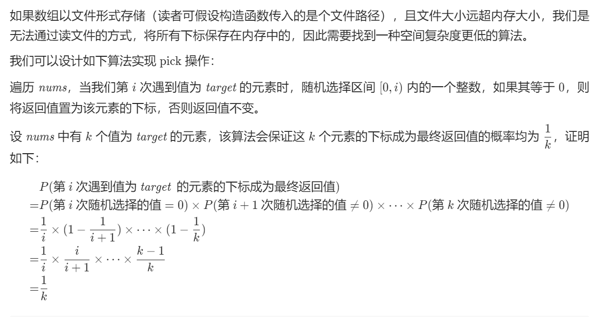

# 需求
给定一个可能含有重复元素的整数数组，要求随机输出给定的数字的索引。 

该数组很大, 可能存在海量下标.

# 解决方案

## 1. HashMap存储各种下标信息

不可以, 因为下标很多, 导致HashMap过大

- 时间复杂度：初始化消耗`O(n)`，给出索引为`O(1)`，其中`n`是`nums`的长度。

- 空间复杂度：`O(n)`。我们需要 `O(n)` 的空间存储 `n` 个下标。

## 2. 蓄水池算法


**代码**
```java
class Solution {
    int[] nums;
    Random random;

    public Solution(int[] nums) {
        this.nums = nums;
        random = new Random();
    }

    public int pick(int target) {
        int ans = 0;
        int count = 0;

        for (int i = 0; i < nums.length; ++i) {
            if (nums[i] == target) {
                count++; // 第 cnt 次遇到 target
                if (random.nextInt(count) == 0) {
                    ans = i;
                }
            }
        }
        return ans;
    }
}

```

- 时间复杂度：初始化为`O(1)`，pick 为 `O(n)`，其中 `n` 是 `nums` 的长度。

- 空间复杂度：`O(1)`。只需要常数的空间保存若干变量。

# 总结

典型地用时间换空间的应用.


