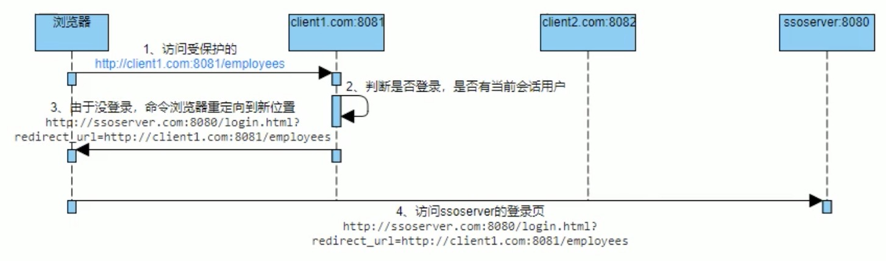
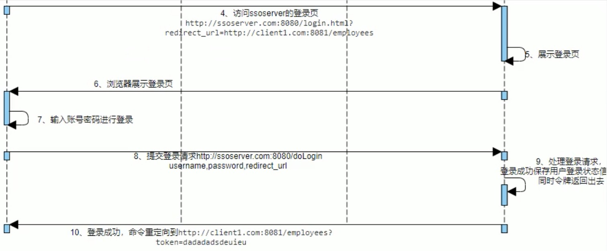

# 啥事单点登录
一个门户旗下的所有网络产品/服务, 一处登录处处登录, 一处退出处处退出. 

# 一种经典(且有点原始的)思路
一开始没有登录.

为了能让sso server知道登录后跳转回哪里, 可以在第一次跳转时在requestParam里带一个源地址信息, **也可以在表单里面放个隐藏字段保留源地址**.

当登录成功跳回原页面, 可以查询redis(基于跳回原页面时携带的令牌/UUID来查redis记录), 就知道有没有相关登录信息了. 这样做能防止再从原页面跳回登录页.

认证登录状态:
- Session里有登录信息, 或者
- 从token查redis有登录信息.

# 开源SSO例程Demo
[Github: xxl-sso](https://github.com/xuxueli/xxl-sso)

>XXL-SSO 是一个分布式单点登录框架。只需要登录一次就可以访问所有相互信任的应用系统。 拥有"轻量级、分布式、跨域、Cookie+Token均支持、Web+APP均支持"等特性。现已开放源代码，开箱即用。

这个可以使用web方式或者token方式实现登录.

# 使用

主要是使用xxl-sso-server服务

1. 检查application.properties配置文件: 

观察访问端口是几, 发现需要使用Redis. 根据配置文件信息准备第三方中间件;

2. 结构

该方案结构如下:
- 登录认证服务器;
- 其他的spring项目

这些系统的域名均不一样, 但是登录是维持唯一的用户票据.

3. 引入到自己的项目

...

**算了, 懒得写了, 自己看example和文档罢.**
[文档地址](https://www.xuxueli.com/xxl-sso/)
