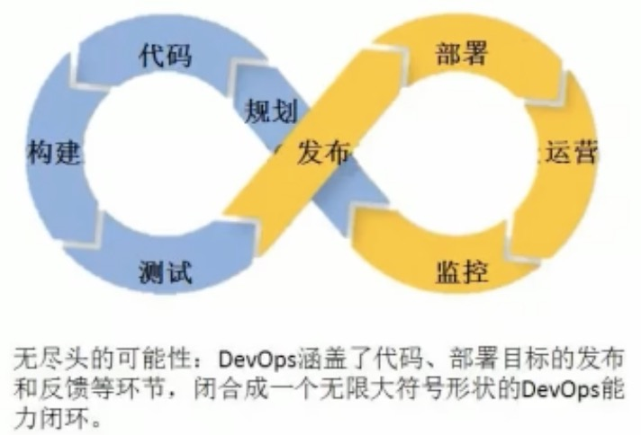
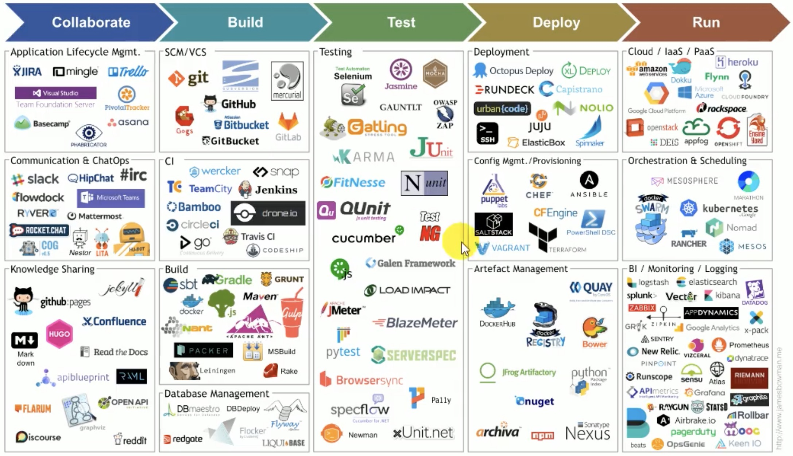

# 介绍
>Dev: Development; Ops: Operations

DevOps: 软件工程, 技术运维, 质量保障.
希望能做到软件产品交付时打通自动化的IT工具链.

# CI/CD

## CI -- Continuous Integration/持续集成
>Code -> Build - > Integrate -> Test

写了代码, 构建, 嵌入到整个系统, 然后测试以便更快地发现错误. 
必须具备:
- 全面自动化测试: CI基础;
- 基础设施(容器, 虚拟机): 使得开发人员和QA(质量保证)人员少扯皮;
- 版本控制: Git SVN...
- 自动化构建和发布流程工具: Jenkins, flow.ci...
- 反馈机制: 构建/测试失败, 能够快速反馈到相关责任人.

## CD -- Continuous Delivery/持续交付
> CI -> Deliver
在持续集成的基础上, 将集成后的代码部署到**贴近真是运行环境**的**类生产环境(production-like env)**中. 
特点:
- 快速发布;
- CI到交付的迭代周期缩短, 反馈加快;
- 软件发布标准化, 可复现;
- 交付进度可视化;
- 方便工人们协作.

## CD -- Continuous Deployment/持续部署
指交付的代码通过评审, **自动部署到生产环境中**. 也被叫做"Continuous Release."

## 典型工具链选型图

