# copyright
基于[电商系统如何防止超卖？ - 苏三说技术的回答 ](https://www.zhihu.com/question/402246926/answer/2453352059)的内容有所增减.

# Intro
高并发下如何设计秒杀系统是一个高频面试题。这个问题看似简单，但是里面的水很深，它考查的是高并发场景下，从前端到后端多方面的知识。

秒杀一般出现在商城的促销活动中，指定了一定数量（比如：10个）的商品（比如：手机），以极低的价格（比如：0.1元），让大量用户参与活动，但只有极少数用户能够购买成功。这类活动商家绝大部分是不赚钱的，说白了是找个噱头宣传自己。

虽说秒杀只是一个促销活动，但对技术要求不低。下面给大家总结一下设计秒杀系统需要注意的9个细节。

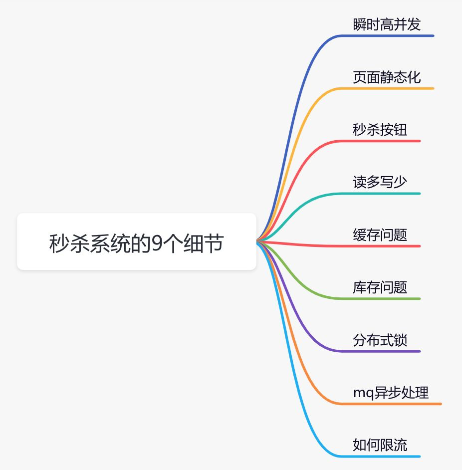

# 瞬时高并发
一般在秒杀时间点（比如：12点）前几分钟，用户并发量突增，达到秒杀时间点时，并发量会达到顶峰。

但由于这类活动是大量用户抢少量商品的场景，必定会出现狼多肉少的情况，所以其实绝大部分用户秒杀会失败，只有极少部分用户能够成功。

正常情况下，大部分用户会收到商品已经抢完的提醒，收到该提醒后，他们大概率不会在那个活动页面停留了，如此一来，用户并发量又会急剧下降。所以这个峰值持续的时间其实是非常短的，这样就会出现瞬时高并发的情况，下面用一张图直观的感受一下流量的变化：
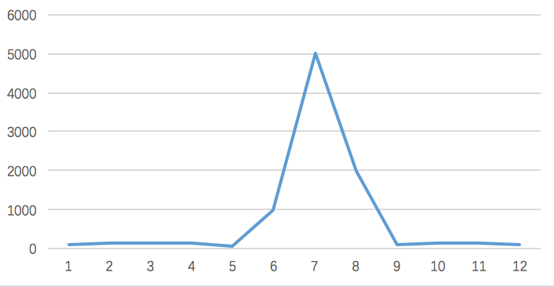

应对高并发, 基本就要上分布式多节点系统, 此外还要从以下几个方面入手:

- 页面静态化
- CDN加速
- 缓存
- mq
- 限流
- 分布式锁

# 页面静态化
可以把页面上的静态资源(图片, 描述)提前下发或者找非核心业务所在机器托管, 比如Nginx静态资源托管, 或者CDN托管.

此外, 尽可能精简页面的动态内容, 尽量静态化, 避免流量打到后台服务端.
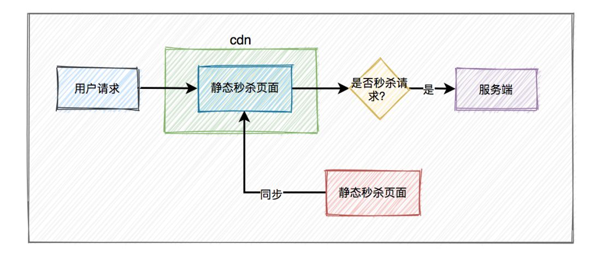

# 秒杀按钮逻辑
在秒杀开始前, 按钮是disabled, 当开始时按钮才能被点击.

在前端部分, 我们最好通过js控制按钮行为. 并且为了防止用户随便修改js, 可考虑在活动开始时再更新一个新的js文件到CDN. 前段可做个定时器, 比如10秒间隔才能点击按钮一次.

此外再后台也要小心前端代码被篡改的情况. 比如做个请求验证, 原理是给请求附加一个加密的token, 客户必须持有有效token才能秒杀, 并且一段时间内, 重复的token是不触发秒杀的.

# 应对读多写少情景 -- 缓存
在秒杀的过程中，系统一般会先查一下库存是否足够，如果足够才允许下单，写数据库。如果不够，则直接返回该商品已经抢完。

由于大量用户抢少量商品，只有极少部分用户能够抢成功，所以绝大部分用户在秒杀时，库存其实是不足的，系统会直接返回该商品已经抢完。可见是个读多写少的业务情景, 如图所示:
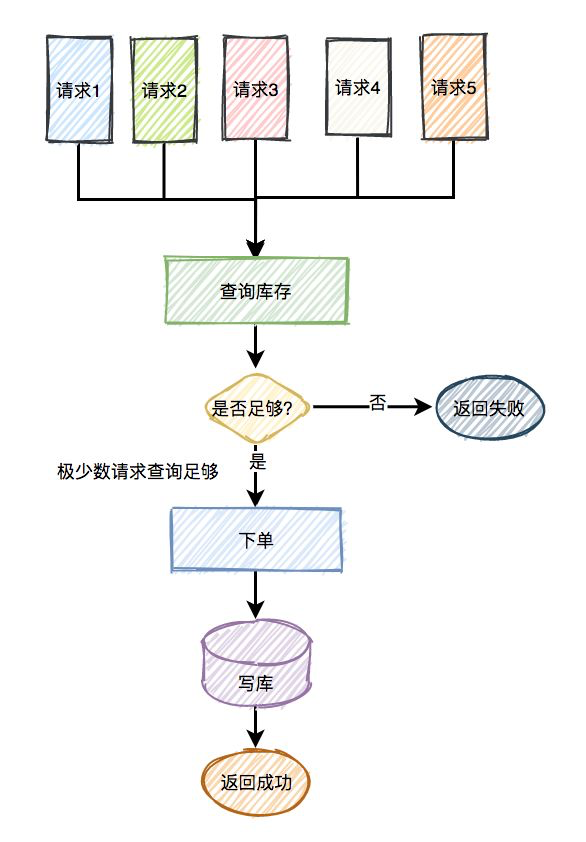

对于大量读请求, 直接打入MySQL可能直接耗尽数据库连接池, 产生卡顿或者请求失败的情况, 那么需要引入缓存, 并且还要是缓存集群才行. 下图就是引入缓存的查询操作:
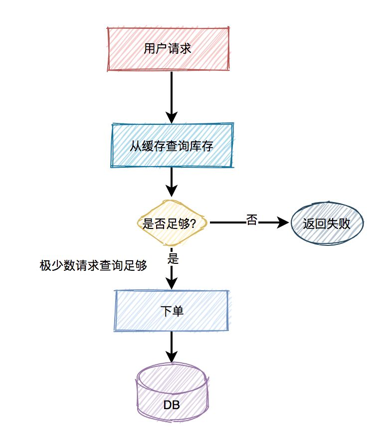

有时, 缓存会产生延迟, 为了避免不一致问题, 还是要想办法查询数据库查询商品的合法性:
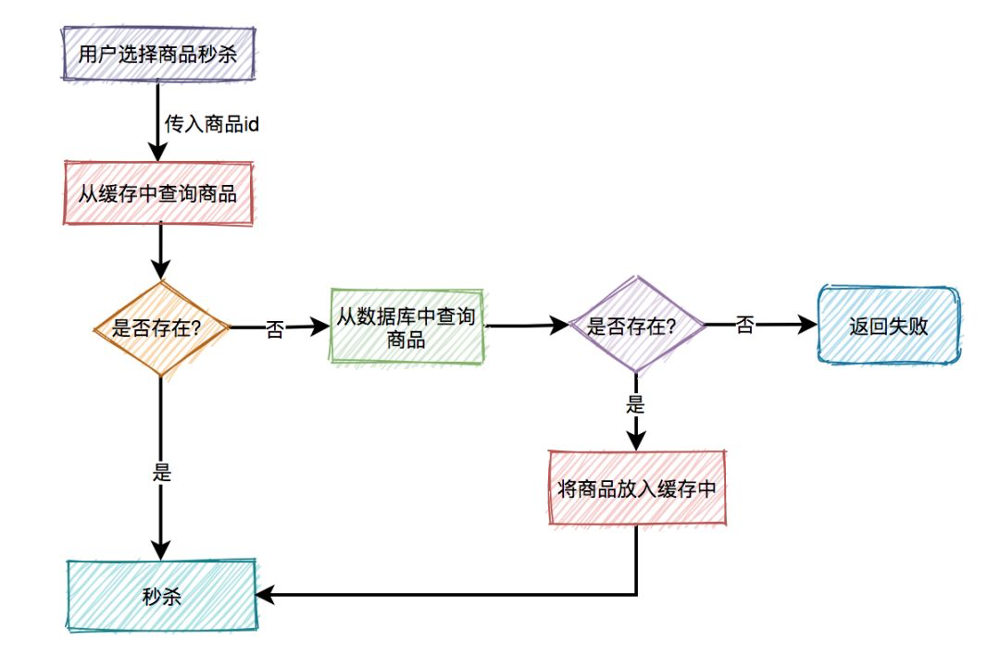

这是一个典型的**旁路缓存策略**. 但是可能会存在缓存的常见问题:

## 缓存穿透
假设今天有大量的请求都在访问缓存中各种不存在的商品, 最后大规模查询穿透了缓存层直接命中数据库.

解决方案: 
1. 可以在边界网关过滤恶意请求, IP信用打分; 
2. 布隆过滤器, 如果某个key不存在, 那就确实不存在, 就不访问缓存和数据库了.
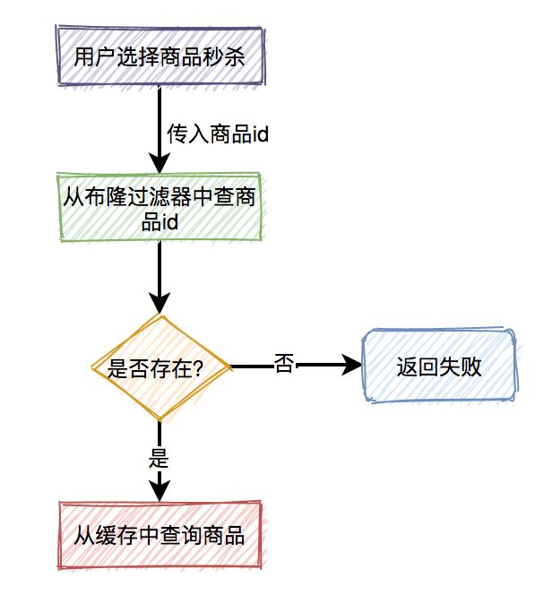
不过引入布隆过滤器相当于多了一层环节, 假设今天缓存和数据库的数据更新了, 我们需要考虑同步到布隆过滤器的问题, 要确保同步, 重试机制等等, 比较麻烦. **布隆过滤器适合应用于缓存数据更新不频繁的业务里.**
3. 缓存里缓存不存在的null value; 
如果今天缓存数据更新频繁, 最好的做法是把不存在的商品id缓存起来.
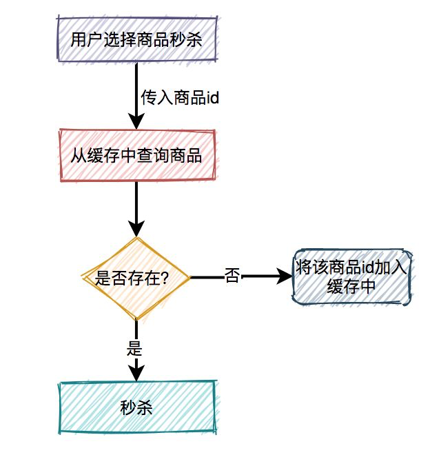

## 缓存击穿
假设今天有大量请求访问**同一个商品A**, 但是缓存中没有数据, 那么大量请求可能会同时蜂拥进入数据库取出数据放进缓存, 这样又容易使数据库失效. 应对这情况, 需要引入分布式锁:
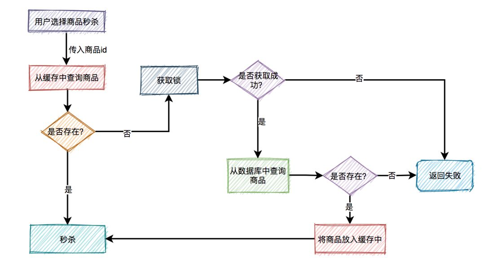

分布式锁还要注意, 有了锁可能会带来一系列问题, 比如是失效问题, 比如: 

1. 请求出了bug然后挂了, 无法释放锁, 导致死锁.
我们可以引入锁的TTL, 超时自动释放;
2. 请求由于网络拥堵等, 很慢, 到了锁超时时间没执行完, 锁释放,怎么办;
我们可以引入看门狗机制, 比如每过10秒续约一次锁.
3. 今天请求A结束, 正打算删除锁, 但是出于意外地锁在你删除钱一刻刚好过期自删, 更巧的是, 有个请求B进来了, 申请了一个锁, 那么,请求A可能最终删除了请求B的锁, 咋办?
我们可以给每个锁都加上请求ID的标识, 每个请求就删自己的锁.

此外, 在业务启动之前, 我们可以进行**缓存预热**, 先把所有已在数据库存在的商品放入缓存中.

## 缓存雪崩
假设我们给缓存里的k-v做了TTL, 如果同时大规模有缓存记录超时失效, 可能触发大规模流量查询数据库.

我们可以随机均匀化TTL, 也可以让一些热门且稳定的数据不要过期.

# 库存扣减问题
买东西不止是下单扣库存就行了, 用户还要在规定的时间内支付, 如果支付失败, 库存是要被加回去的. 我们一般使用**预扣库存**逻辑来应对这种业务需求, 如图所示:
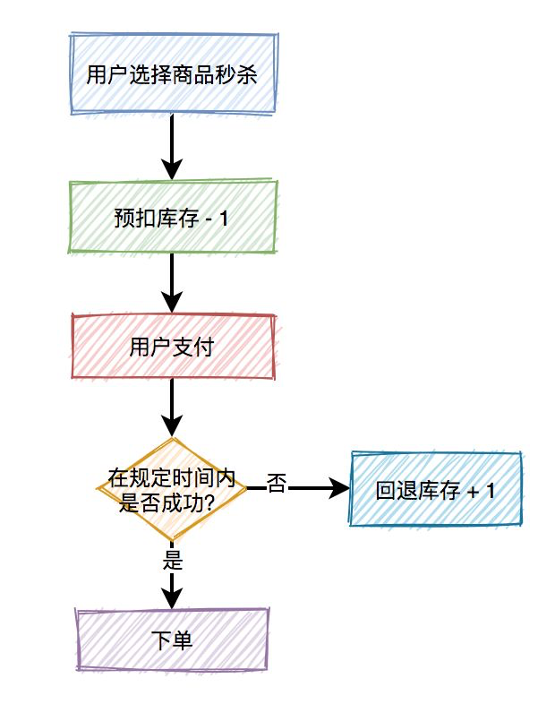
在应对库存扣减业务时, 可能会出现: 1.库存不足; 2. 库存超卖. 此外, 我们一般不会上来直接更新数据库来扣减库存, 这样会消耗大量数据库连接池, 我们需要使用redis来扣减库存.

有一段经典的lua原子性代码用于redis扣减库存:
```lua
StringBuilder lua = new StringBuilder();
  lua.append("if (redis.call('exists', KEYS[1]) == 1) then");
  lua.append("    local stock = tonumber(redis.call('get', KEYS[1]));");
  lua.append("    if (stock == -1) then");
  lua.append("        return 1;");
  lua.append("    end;");
  lua.append("    if (stock > 0) then");
  lua.append("        redis.call('incrby', KEYS[1], -1);");
  lua.append("        return stock;");
  lua.append("    end;");
  lua.append("    return 0;");
  lua.append("end;");
  lua.append("return -1;");
```
代码流程:

1. 先判断商品id是否存在，如果不存在则直接返回。
2. 获取该商品id的库存，判断库存如果是-1，则直接返回，表示不限制库存。
3. 如果库存大于0，则扣减库存。
4. 如果库存等于0，是直接返回，表示库存不足。

关于上锁的可以参考[克服商城超卖的一种思路](https://blog.996workers.icu/archives/ke-fu-shang-cheng-chao-mai-de-yi-zhong-si-lu)

# 消息队列的引入
秒杀后发生的工作流程如下图所示:

实际业务, 巨大并发的是秒杀, 而下单和支付的并发量相对较小, 并且为了降低用户的延迟, 可以将下单和支付放进消息队列, 实现异步和时空解耦, 比如:
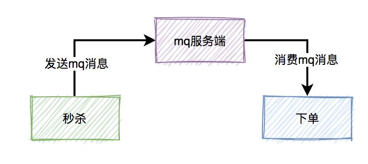
然而, 使用消息队列中间件会引入一些问题:

## 消息丢失
1. 从生产者到消息队列的丢失: 加入应答机制, 引入发送成功或者失败的回调函数, 可以让生产者知道发送失败, 并重试;
2. 消息队列自身丢失: 持久化机制/分片副本机制;
3. 消费者信息丢失: 消息队列中间件提交机制: 维持一个偏移量来记录消费者消费进度. 以Kafka为例, 分为自动提交和手动提交. 自动提交是在一定时间间隔后，Kafka客户端将当前消费者的Offset进度，在后端自动提交给Broker，这不仅会存在消息丢失的可能，而且还有可能导致消息被重复消费。因此，对消息丢失敏感的应用都会选择手动提交，虽然也有可能导致消息重复消费，但最少可以保证消息没有丢失的可能。

## 消息重复消费
消费者消费消息时，在ack应答的时候，如果网络超时，本身就可能会消费重复的消息。但由于消息发送者增加了重试机制，会导致消费者收到重复消息的概率增大。对此, 我们可以维护一个消息处理HashSet, 当这个set里有同样的消息被处理过, 将之抛弃, 如图:
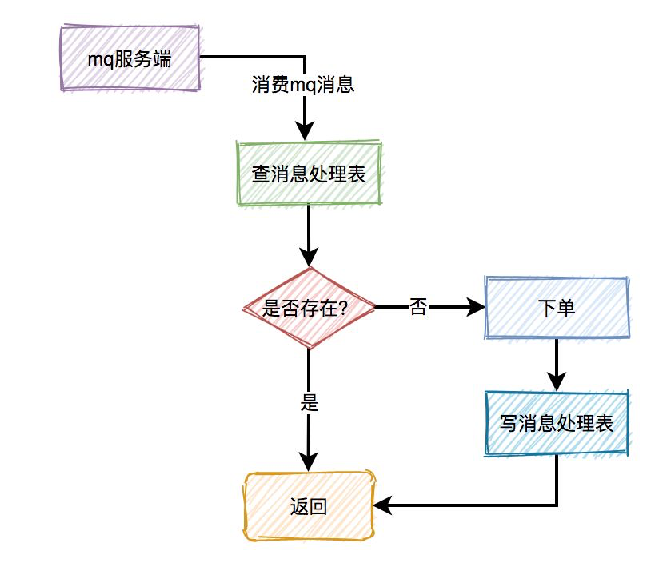

## 消息积压
有时候消费者挂了, 大量积压了消息. 我们可以新开个消息队列容纳挂了的消息, 比如死信队列. 当消费者复活了就可继续消费. 如果还不行就报警, ELK日志记录, Sleuth链路追踪debug.

此外, 我们还要避免大量垃圾消息的产生. 在重试机制进行时, 维护一个Map记录消息重试次数, 当次数到一定数目, 就不再重复发送消息.

## 消息延迟
e.g. 用户秒杀成功了，下单之后，在15分钟之内还未完成支付的话，该订单会被自动取消，回退库存。

## 消息乱序
多个消息分布在多个MessageQueue中，最后被多个不一样的消费者消费，就可能会出现消息乱序的场景. 只要将**同一批有序的消息**按照顺序都放入同一个MessageQueue中，最后就能被同一个消费者顺序消费了。

这种15分钟不付款自动取消订单的功能可以使用延迟队列机制, 如图:
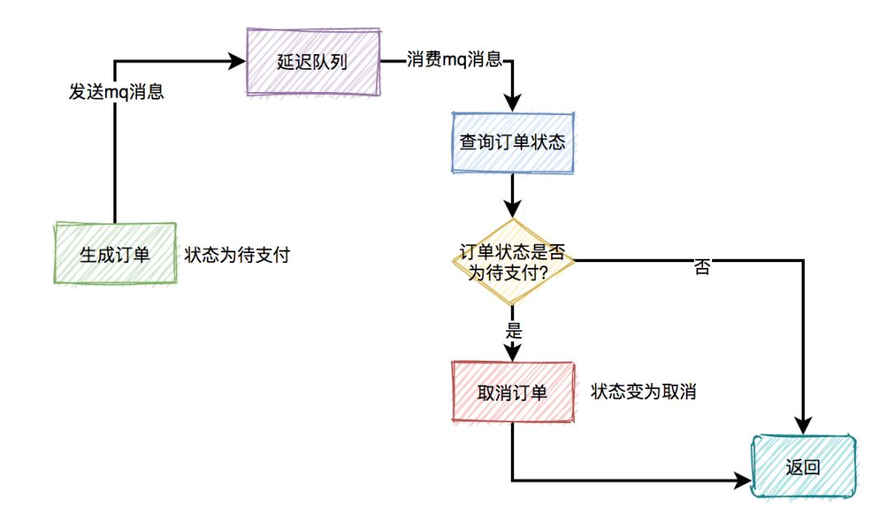
下单时消息生产者会先生成订单，此时状态为**待支付**，然后会向延迟队列中发一条消息。达到了延迟时间，消息消费者读取消息之后，会查询该订单的状态是否为待支付。如果是待支付状态，则会更新订单状态为取消状态。如果不是待支付状态，说明该订单已经支付过了，则直接返回。

# 限流/熔断/降级
## 限流
防止技术宅用脚本刷接口, QPS太大对非技术宅用户不公平, 需要引入限流. 限流可通过Nginx或者Redis实现. 限流可分为:
1. 同用户限流: 用户ID为单位;
2. 同IP限流: IP为单位
3. 接口限流: 接口的QPS为单位;

我们也可引入验证马, 能够有效地把访问速度降下来, 哪怕是打码平台用打手, 也是人看的, 很慢. 可使用移动滑块验证码, 结合用户拖动的加速度, 速度等数据和已有模型对比, 计算置信度来检验人机.

## 熔断/降级
**熔断:** 熔断就像是家里的保险丝一样，当电流达到一定条件时，比如保险丝能承受的电流是5A，如果你的电流达到了6A，因为保险丝承受不了这么高的电流，保险丝就会融化，这时候电路就会断开，起到了保护电器的作用；

在微服务里面也是一样，当下游的服务因为某种原因突然变得不可用或响应过慢，**上游服务**为了保证自己整体服务的可用性，不再继续调用目标服务，直接返回，快速释放资源。如果目标服务情况好转则恢复调用；

**降级:** 降级主要有以下几种情况

- 超时：当下游的服务因为某种原因响应过慢，下游服务主动停掉一些不太重要的业务，释放出服务器资源，增加响应速度;
- 不可用：当下游的服务因为某种原因不可用，上游主动调用本地的一些降级逻辑，避免卡顿，迅速返回给用户;
- 限流：防止上游服务请求太多导致服务崩溃，所以限制请求的数量，来达到保护下游服务的目的，当请求的流量到达一定阈值时，直接拒绝多余的请求，执行降级逻辑.

以上三者（超时、不可用、限流）触发时，都会走同一个逻辑，那就是降级逻辑，在hystrix里面叫做fallback；

**熔断和降级的关系:** 降级和熔断其实就是服务安全中的2个不同的流程，在服务发生故障时，肯定是先断开（熔断）与服务的连接，然后执行降级逻辑:
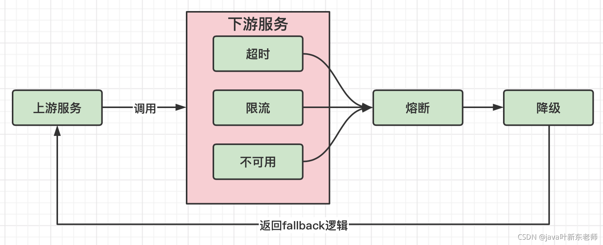


