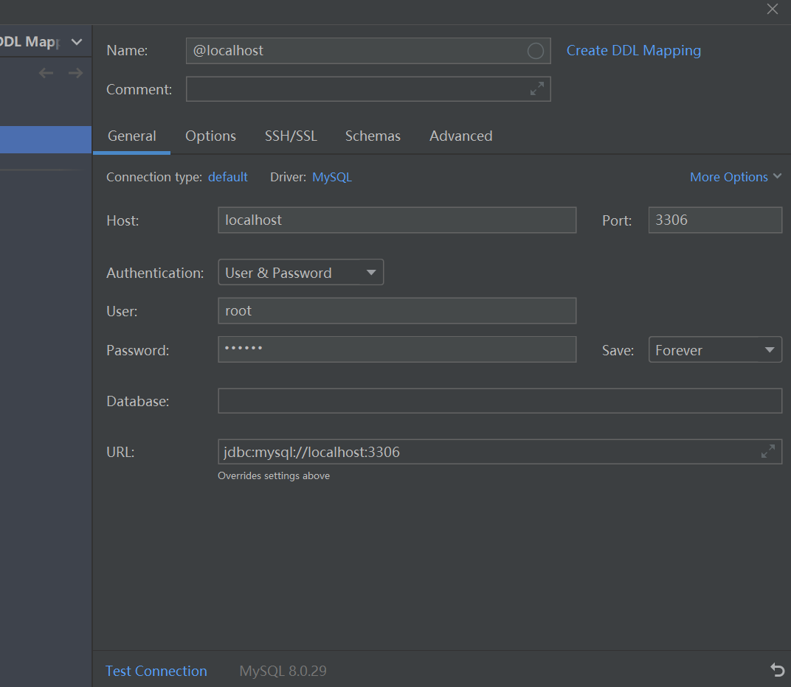

# 背景
DockerHub上的MySQL容器的使用说明纯纯大冤种傻逼。

# 使用
在安装了Docker后， 执行命令即可运行latest版本的MySQL：

`docker run -d -e MYSQL_ROOT_PASSWORD=123456 -p 3306:3306 mysql`
其中，访问用户名为`root`，root密码为`123456`, 暴露端口`3306`.

于是，就可以连接localhost的MySQL数据库了，例如:

