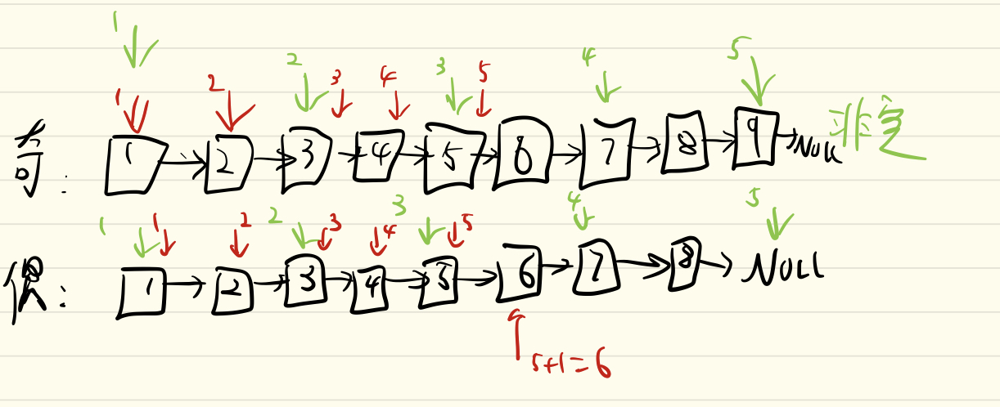

# 起因
因为链表不能随机访问，所以不太好找中点。今天有一个方法能够找到链表中点。有了终点后，能够解决点实际问题，比如判断回文链表.

# 经过
直接看代码
```java
ListNode slow, fast;
slow = fast = head;
while (fast != null && fast.next != null) {
    slow = slow.next;
    fast = fast.next.next;
}
// 此时。。。
```
我们来看`此时`的情况
- 当快指针`fast`非空，慢指针`slow`指向的就是中节点。
- 当快指针`fast`空，慢指针`slow + 1`指向中节点。

**为什么？**
画图：


道理很简单，快指针速度是慢指针的2倍。

## 有啥用？
今有一题：

**请判断一个链表是否为回文链表。**

*示例 1:*
输入: 1->2
输出: false

*示例 2:*
输入: 1->2->2->1
输出: true

对于此题，可以先找到链表中点：
```java
ListNode slow, fast;
slow = fast = head;
while (fast != null && fast.next != null) {
    slow = slow.next;
    fast = fast.next.next;
}

if (fast != null) {
    slow = slow.next;
}

// slow为中点
```

接下来，把`slow`中点后的反转,反转可以用递归.该递归思路见另一博文：

```java
public ListNode reverse(ListNode head) {
        if (head == null || head.next == null) {
            return head;
        }

        ListNode last = reverse(head.next);
        head.next.next = head;
        head.next = null;
        return last;
    }
```

用这反转函数反转slow后的list，然后对比左右两部分：
```java
ListNode left = head;
ListNode right = reverse(slow);

while (right != null) {
    if (left.val != right.val)
        return false;
    left = left.next;
    right = right.next;
}
return true;
```

合并下：
```java
class Solution {
    public boolean isPalindrome(ListNode head) {
        ListNode slow, fast;
        slow = fast = head;
        while (fast != null && fast.next != null) {
            slow = slow.next;
            fast = fast.next.next;
        }

        if (fast != null) slow = slow.next;
        
        ListNode left = head;
        ListNode right = reverse(slow);

        while (right != null) {
            if (left.val != right.val)
                return false;
            left = left.next;
            right = right.next;
        }

        return true;
    }

    public ListNode reverse(ListNode head) {
        if (head == null || head.next == null) {
            return head;
        }

        ListNode last = reverse(head.next);
        head.next.next = head;
        head.next = null;
        return last;
    }
}
```

**这方法有个缺点，就是会打乱输入的链表结构，解决方案：**
维持两个指针`p`和`q`,令`p`在`slow`之前一个节点，`q`在最后一个节点，然后在主函数return前添加:
```java
p.next = reverse(q);
```
