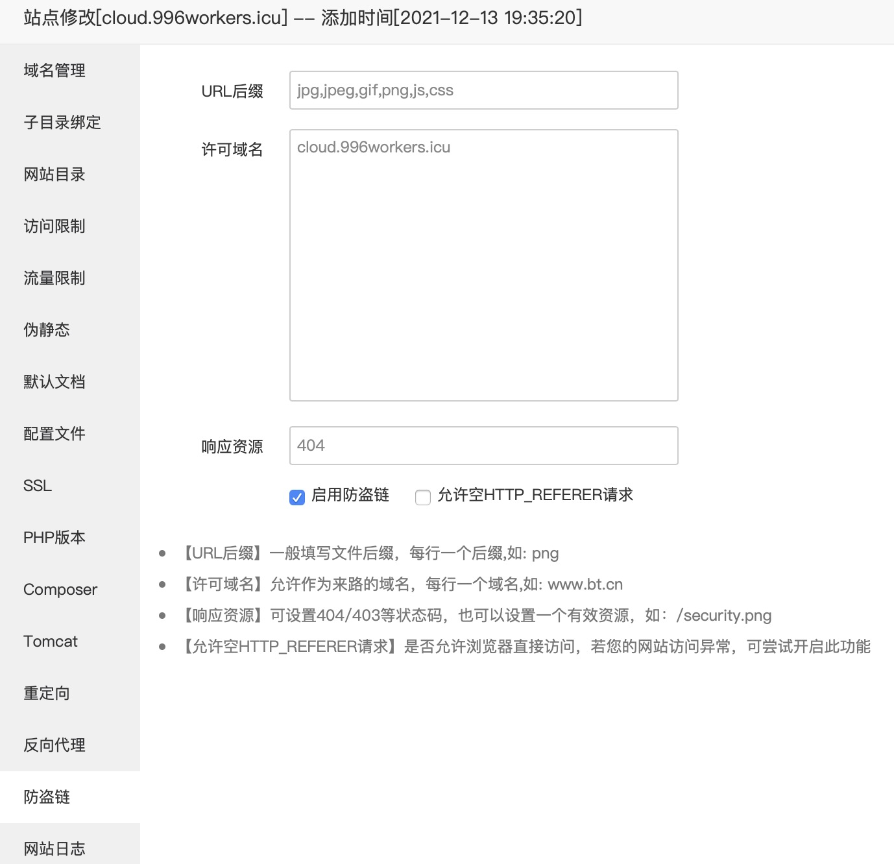
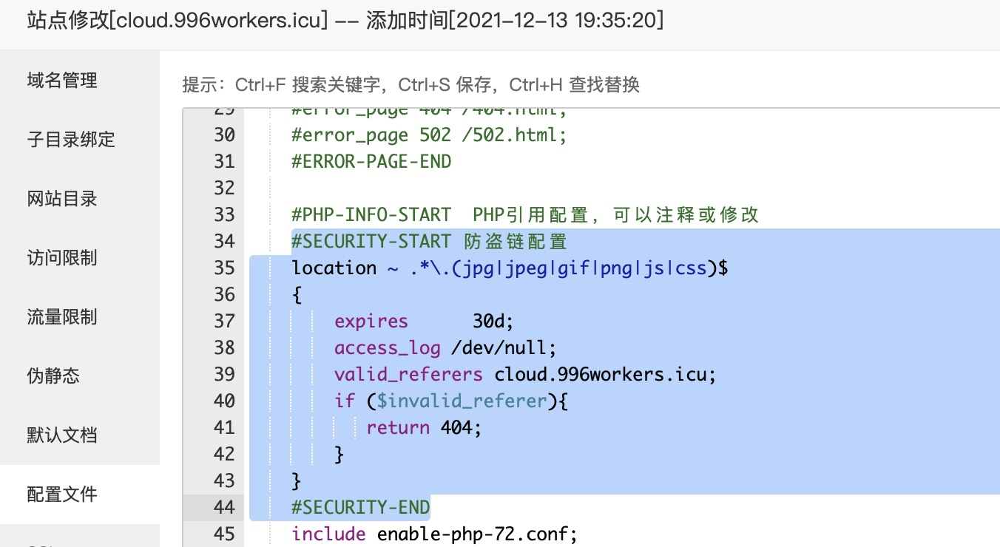
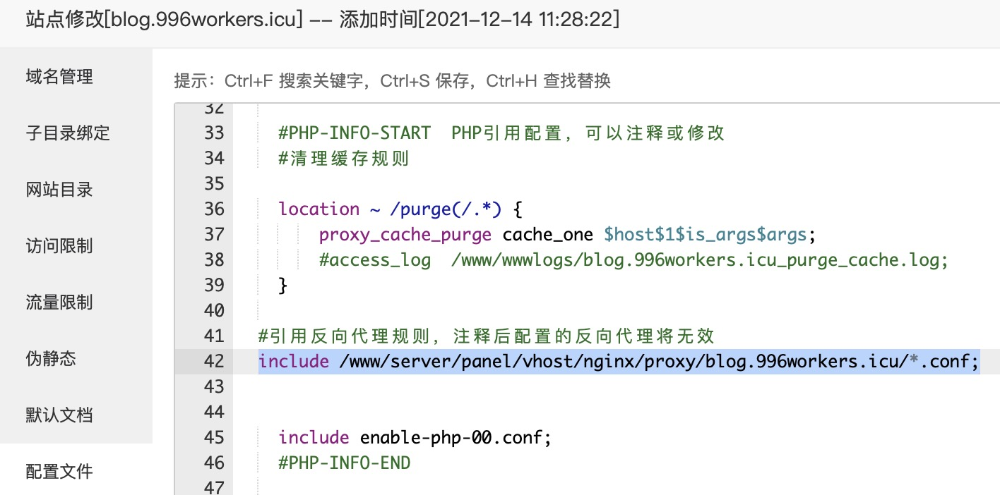
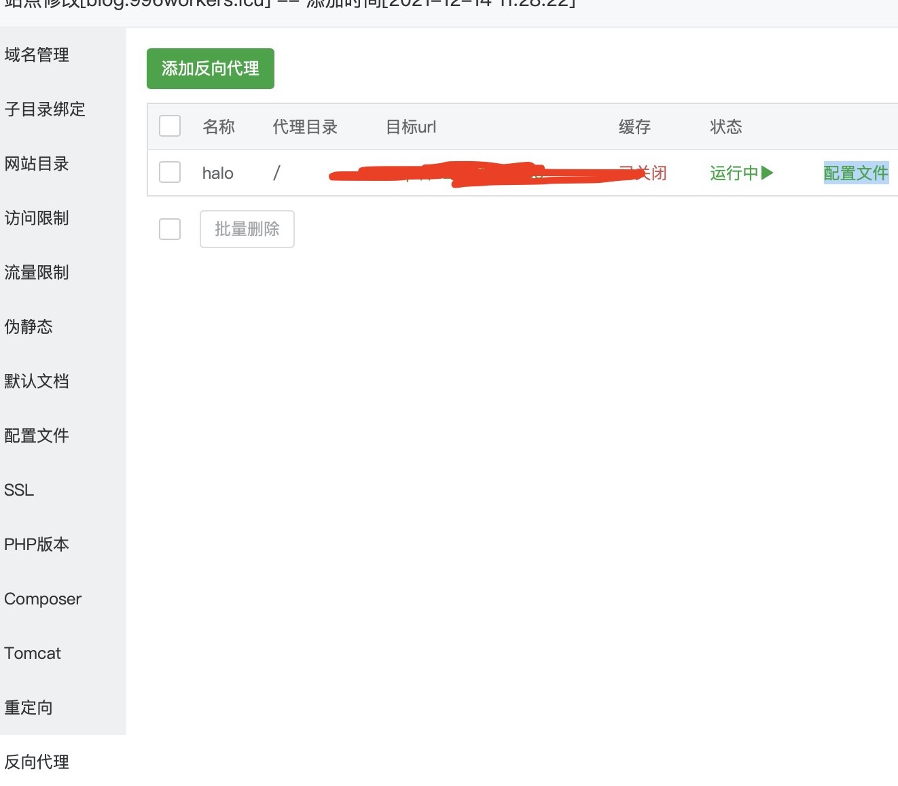
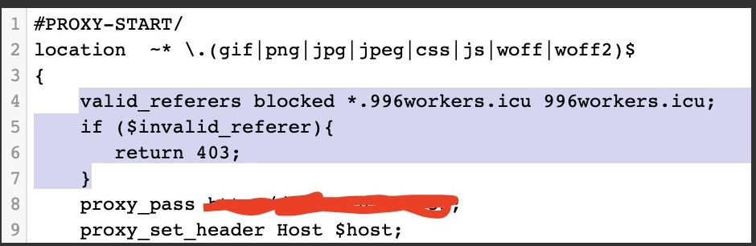

# 症状
宝塔通过自带的网站->设置->防盗链的方式开启防盗链,发现除jpeg总是被拦截(包括自己网站里的jpeg也被拦截),其余资源防盗链无效. 宝塔的配置界面如图所示:

# 排查
- 权限: 排查nginx所属用户, 还有存储静态资源的文件夹权限 -- 正常;
- 重启: nginx重启 -- 老样子;
- 语法检查: 终端使用`/etc/init.d/nginx configtest`命令检查配置文件语法 -- 正常;
- 配置文件参数复查: 核对防盗链配置和网上的反例的区别 -- 正常;

**全正常, 草你大爷的.**

# 解决思路

宝塔配置防盗链,是给网站的nginx配置文件自动插入语句,比如:

并且我用了反向代理,反向代理也会自动插入语句,比如:

实验了未使用反向代理的网页的防盗链,发现有效且功能正常,得到结论:
**宝塔bug: 反向代理下自动插入的防盗链配置位置或者顺序不对!**

# 解法

1. 首先, 去掉宝塔设置自动添加的防盗链配置,

2. 然后进入反向代理配置文件里配置防盗链. 由此进入反向代理配置文件

2. 在此处添加防盗链设置:

# 结果

配置成功,反向代理情境下的宝塔面板Nginx配置防盗链无效问题的解决得以解决.
