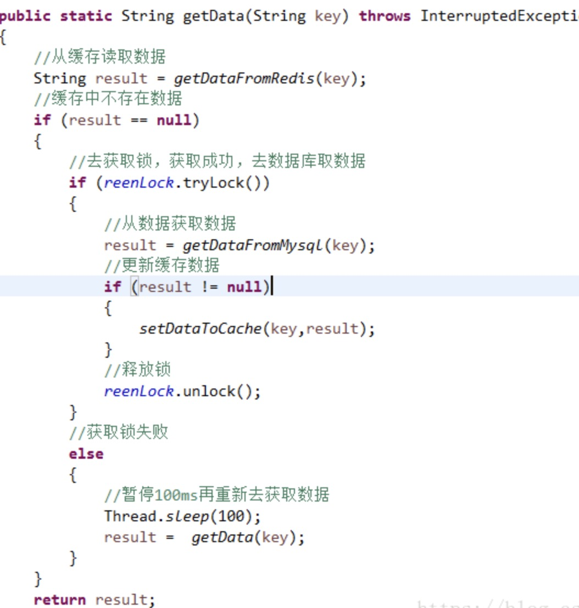

# 何为缓存击穿

缓存击穿是指, 存在某个**缓存中没有,但数据库中有的热点数据**（一般是缓存时间到期）, 而同时呢, 并发查询这条热点数据的用户特别多. 这些用户同时读缓存没读到数据，就又同时去数据库去取数据，导致数据库压力过大.

# 常见解决方案

1. 热点数据不让它过期;
2. **互斥锁.**

# 互斥锁方案

其实,当只有一个服务,一个容器的时候,假设采用SpringBoot框架,默认情况下,service bean是单例的,如果简单使用synchronized或者Reentrant Lock给查询加互斥锁是可行的.

加互斥锁的原因是, 当某条热点数据过期了, 同时有大量用户想要查询这条数据, 我们**不让他们同时进入service查询, 而是排队一个个来**. 第一个进来的用户发现数据不存在缓存中,那么service就查取数据库中的数据安到缓存里, 这样后来的用户们就不会直接访问数据库了.

示例:


# 使用synchronized或者Reentrant Lock带来的问题

我们知道,这两种锁是**本地锁**, 他们能成功是因为本地容器中的service对象是单例的. 倘若**在分布式, 多容器情景下, 有很多的容器, 那么使用本地锁是显然不行的.**

## 引入分布式锁的概念

就像是很多人去厕所拉屎, 厕所只有一个蹲坑. 成功占了坑位的就可以拉屎, 剩余的人就憋着. 等拉屎的拉完了就腾位子给下一个人. 说白了思想和本地锁差不多.

## 分布式锁的实现

### SET NX命令
在Redis里可以使用SET NX命令操作一个信号量, 大家都读取/修改这个信号量实现分布式锁:

多个微服务同时使用如下Redis命令:
`set lock 1 NX`
这样, 带NX参数时, 多个微服务设置lock信号量, 只能有一个成功.
NX参数其实就是类似于hashMap里的`putIfAbsent`方法.

代码示例:
```java
/**
     * 从数据库查询并封装数据::分布式锁
     * @return
     */
    public Map<String, List<Catelog2Vo>> getCatalogJsonFromDbWithRedisLock() {

        //1、占分布式锁。去redis占坑. 设置过期时间必须和加锁是同步的，保证原子性（避免死锁）
        String uuid = UUID.randomUUID().toString();
        Boolean lock = stringRedisTemplate.opsForValue().setIfAbsent("lock", uuid,300,TimeUnit.SECONDS);
        if (lock) {
            System.out.println("获取分布式锁成功...");
            Map<String, List<Catelog2Vo>> dataFromDb = null;
            try {

                //加锁成功...执行业务
                // 此getDataFromDB方法要再次查询下缓存, 看看其他线程有没有已经把数据放入缓存了, 就没必要再查数据库
                dataFromDb = getDataFromDb();
            } finally {
                // Redis官方文档推荐的删锁脚本
                String script = "if redis.call('get', KEYS[1]) == ARGV[1] then return redis.call('del', KEYS[1]) else return 0 end";

                //删除锁
                stringRedisTemplate.execute(new DefaultRedisScript<Long>(script, Long.class), Arrays.asList("lock"), uuid);

            }
            //先去redis查询下保证当前的锁是自己的
            //获取值对比，对比成功删除=原子性 lua脚本解锁
            // String lockValue = stringRedisTemplate.opsForValue().get("lock");
            // if (uuid.equals(lockValue)) {
            //    //删除我自己的锁
            //    stringRedisTemplate.delete("lock");
            }

            return dataFromDb;
        } else {
            System.out.println("获取分布式锁失败...等待重试...");
            //加锁失败...重试机制
            //休眠一百毫秒, 自旋锁
            try { TimeUnit.MILLISECONDS.sleep(100); } catch (InterruptedException e) { e.printStackTrace(); }
            return getCatalogJsonFromDbWithRedisLock();     //自旋的方式
        }
    }
```

**讨论:**

*Q. 为什么上面代码设置锁信号量的过期时间?*
*A*:当这个人去拉屎,拉屎过程中不小心掉粪坑里去了. 门外的人不知道里面发生了什么, 就一直傻等Q着. (成功抢占到锁的微服务在释放锁前挂了, 导致**死锁**);
解决方案: 设置锁自动过期.


*Q. 假设在获得锁以后,还没设置过期时间就挂了,还死锁,咋整?*
*A*: 搞个原子操作, 把设置锁和设定过期时间放一起去 -- `set lock 1 EX 300 NX`, Redis有这个原子性指令, 反映到Java代码里,也是一行搞定.


*Q. 业务代码时间太长, 锁过期了, 咋整?*
*A*: 雀食, 这样会带来新的问题. 当锁过期了, 会存在多人进入service的情况, 这样多人运动时,**只要有一个人释放锁信号量, 就相当于同时把其他人的信号量都给释放**了, 这时就会有更多的人进来了. 解决方法就是代码里写的UUID, 在lock信号量里不简单存1或0, 而是放进来UUID. 这样就能指明是谁的锁了.


*Q. 在判断锁是不是自己的时候, 也需要查Redis, 此时查询耗时. 但如果在查取Redis时记录没有过期, 但当结果在从Redis返回途中, 锁过期了, 这样删锁就会删到别人的锁,咋整?*
*A*: 雀食, 和之前的问题一样, 我们需要一种原子性(获取值来对比+删除). Redis官方文档建议可以写Lua脚本实现. 解锁脚本示例如下:
```lua
if redis.call("get",KEYS[1]) == ARGV[1]
then
    return redis.call("del",KEYS[1])
else
    return 0
end
```
>Redis脚本是原子性的

体现在Java里, 为:
```java
String script = "if redis.call('get', KEYS[1]) == ARGV[1] then return redis.call('del', KEYS[1]) else return 0 end";

//删除锁
stringRedisTemplate.execute(new DefaultRedisScript<Long>(script, Long.class), Arrays.asList("lock"), uuid);

```

# 后续

后续我们会继续深入讨论Redis的分布式锁的更多细节.

我们会使用**Redisson框架**, 这样就不用向上述代码一样自己写脚本.
