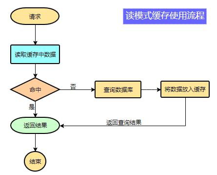

# 缓存

## 1.缓存使用

为了系统性能的提升，我们一般都会将部分数据放入缓存中加速访问。而db只是承担数据落盘工作。

>适合放入缓存的: 1. 即时性,数据性要求不高的(如物流状态, 商品分类); 2. 访问量大但是更新频率不高的数据(读多写少, 比如商品的介绍).

下图是读模式下的简单的分工图:



## 2.缓存实现

- HashMap -- 分布式情境下不适用. **可见性问题**: HashMap是装在各自的JVM里面的; **一致性问题**: 分布式系统下难以实现数据同步.
- Redis -- 分布式情境适用;

# Redis缓存在SpringBoot中的引入

1. pom依赖
```xml
<dependency>
    <groupId>org.springframework.boot</groupId>
    <artifactId>spring-boot-starter-data-redis</artifactId>
</dependency>
```

2. 写 `application.yml`:
```yaml
spring:
  redis:
    host: 127.0.0.1
    port: 6379
```

3. 可以使用`StringRedisTemplate<String, String>`,也能使用`RedisTemplate<Object, Object>`.

```java
@Autowired
StringRedisTemplate template;

@Test
public void test() {
  ValueOperations<String, String> ops = template.opsForValue();
  
  // save
  ops.set("key", "value" + UUID.randomUUID().toString());
  // get
  String res = ops.get("key");
}
```


