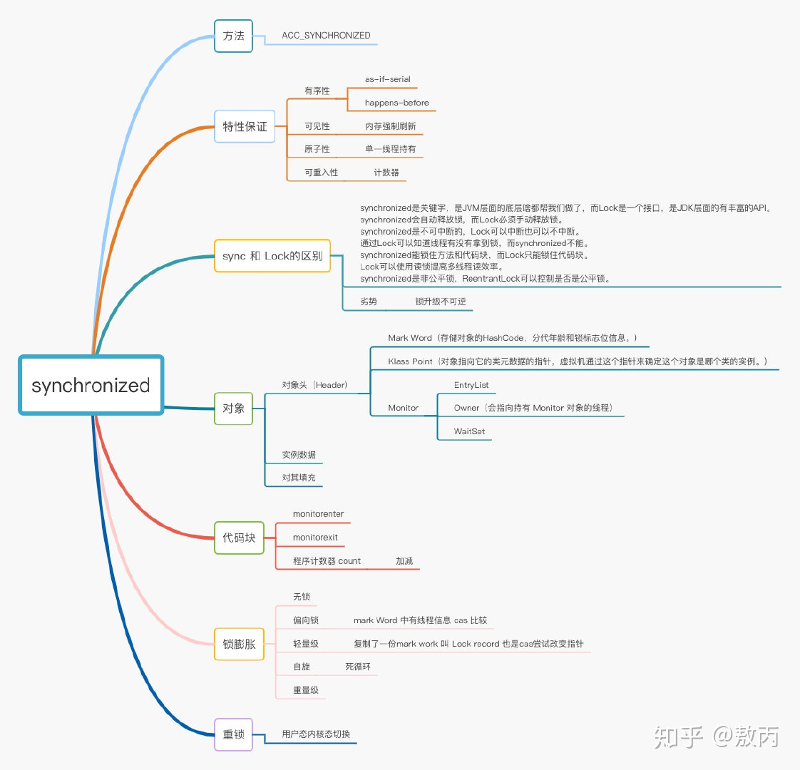

# 是什么
>synchronized可以保证方法或代码块在运行时，同一时刻只有一个线程可以进入到临界区（互斥性），同时它还保证了共享变量的内存可见性。

Synchronized是Java中解决并发问题的一种最常用最简单的方法 ，他可以确保线程互斥的访问同步代码

# 为什么
在并发编程中存在线程安全问题，主要原因有：
1. 存在共享数据；
2. 多线程共同操作共享数据。

关键字synchronized可以保证在同一时刻，只有一个线程可以执行某个方法或某个代码块，同时synchronized可以保证一个线程的变化可见（可见性），即可以代替volatile。

# 怎么用？

Java中每一个对象都可以作为锁，这是synchronized实现同步的基础：

- 普通同步方法（实例方法），锁是当前**实例对象** ，线程进入同步代码前要获得当前整个实例的锁.多个线程调用这同一个对象里的同步方法会阻塞，调用不同对象的同步方法不会阻塞。（java对象的内存地址是否相同);
```java
public synchronized void increase(){
        i++;
    }
```

- 静态同步方法，锁是当前类的class对象 ，进入同步代码前要获得当前类对象的锁；静态方法的锁是所在类的Class对象，普通方法的锁是this对象.
```java
synchronized (MainActivity.class) {
 // ...
}
```

- 同步方法块，锁是括号里面的对象，对给定对象加锁，进入同步代码库前要获得给定对象的锁。多个线程调用同一个对象的同步方法会阻塞，调用不同对象的同步方法不会阻塞。（java对象的内存地址是否相同）
```java
synchronized (objInstance) {
           int i = 5;
           while (i-- > 0) {
               System.out.println(Thread.currentThread().getName() + " : " + i);
               try {
                   Thread.sleep(500);
               } catch (InterruptedException ie) {
               }
           }
       }
```

>注意：synchronized锁有可重入性，同一个线程调用套娃在同一个对象的synchronized代码块不会死锁。

# 图例



