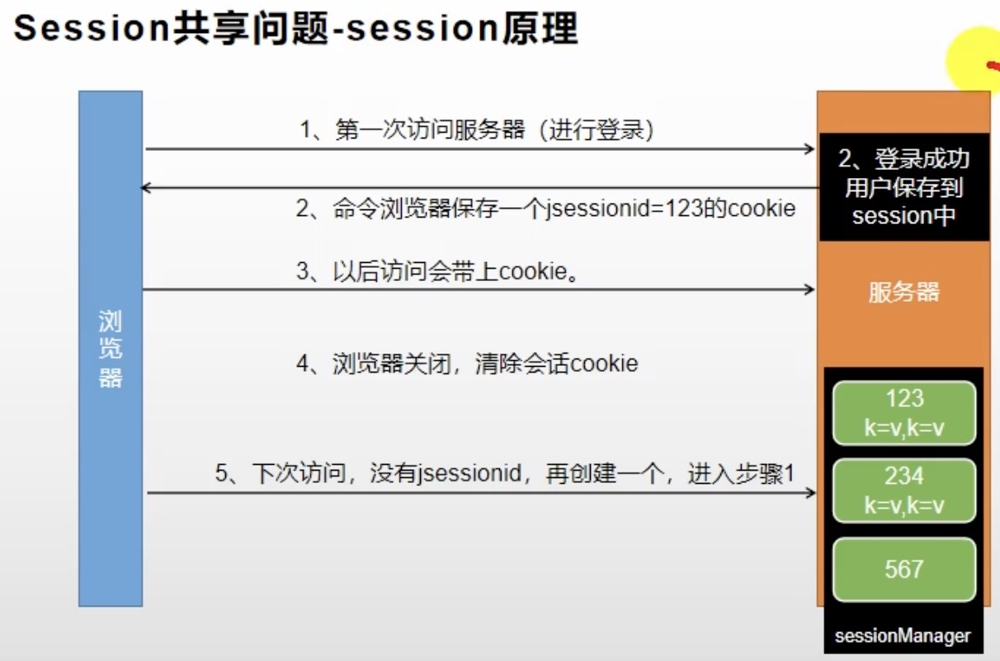
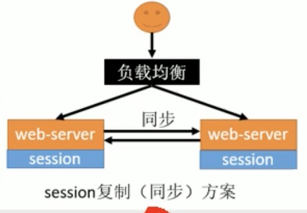

# 简介
类似于锁, session这种有状态的东西在单个服务下很灵光, 但是在分布式情景下无力. session的这种登录让服务器变得有状态, 这时使多台服务器具有同样的状态, 就会很艰难.

今天redis中间件可以用来充当服务器的session容器.

# Session登录回顾


咱们可以发现, 普通的Session模型很难进行跨服务器的共享.
哪怕是在同一个服务器下的微服务, 你复制多套session, 也可能会出现数据不一致的问题.

# 解决方案

- Session复制: 这个是Tomcat原生支持的方案, 但是容易占据网络带宽. 并且每个Tomcat保持全量的session拷贝, 当Tomcat多了, 就很浪费空间.


- 客户端存储: 用户Cookie保存登录状态. 垃圾, 浪费带宽, cookie还有长度限制, cookie还能被篡改窃取. 根本不能用这个方案.

- Hash一致性: 更改nginx配置, 不需要修改应用代码. 只是服务器重启后会导致session丢失, 并且如果服务进行了水平扩展, rehash session后, 有些用户可能路由不到正确session.

- 找个第三方统一存储: 比如使用数据库或者redis中间件. 就是引入中间件降低系统整体可靠性, 还多了远程调用开销. **统一存储还要注意下session作用域的问题**.

其实Spring Session with Redis是个统一存储的解决方案.

# Spring Session with Redis

1. 引入依赖:
```java
<dependency>
    <groupId>org.springframework.session</groupId>
    <artifactId>spring-session-data-redis</artifactId>
</dependency>
```

2. 配置
```xml
spring.session.store-type=redis
```
还有些自己查手册, 比如session超时时间等等.

也可写配置类
```java
@Configuration
public class GulimallSessionConfig {

    @Bean
    public CookieSerializer cookieSerializer() {

        DefaultCookieSerializer cookieSerializer = new DefaultCookieSerializer();

        //放大作用域
        cookieSerializer.setDomainName("demo.com");
        cookieSerializer.setCookieName("DEMOSESSION");

        return cookieSerializer;
    }


    @Bean
    public RedisSerializer<Object> springSessionDefaultRedisSerializer() {
        return new GenericJackson2JsonRedisSerializer();
    }

}
```

3. 业务代码

程序入口:
```java
@EnableRedisHttpSession     //整合Redis作为session存储
@EnableFeignClients
@EnableDiscoveryClient
@SpringBootApplication
public class GulimallAuthServerApplication {

    public static void main(String[] args) {
        SpringApplication.run(GulimallAuthServerApplication.class, args);
    }

}
```

然后其他的session相关代码正常写就行, 比如:

```java
@GetMapping(value = "/login.html")
    public String loginPage(HttpSession session) {

        //从session先取出来用户的信息，判断用户是否已经登录过了
        Object attribute = session.getAttribute(LOGIN_USER);
        //如果用户没登录那就跳转到登录页面
        if (attribute == null) {
            return "login";
        } else {
            return "redirect:http://demo.com";
        }

    }
```

# spring session作用域问题
```java
@Configuration
public class GulimallSessionConfig {

    @Bean
    public CookieSerializer cookieSerializer() {

        DefaultCookieSerializer cookieSerializer = new DefaultCookieSerializer();

        //放大作用域
        cookieSerializer.setDomainName("demo.com");
        cookieSerializer.setCookieName("DEMOSESSION");

        return cookieSerializer;
    }
}
```

# spring session JSON序列化
```java
@Configuration
public class GulimallSessionConfig {

    @Bean
    public RedisSerializer<Object> springSessionDefaultRedisSerializer() {
        return new GenericJackson2JsonRedisSerializer();
    }

}
```
