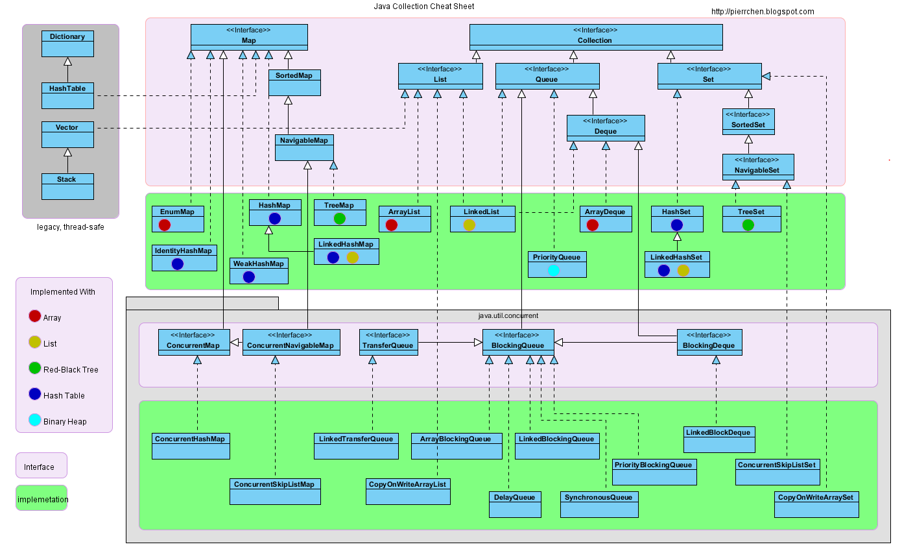

# Intro
A container is an object that can hold other Java objects. *Java Collections Framework(JCF)* Provides a generic container for Java developers, starting with JDK 1.2, with the following advantages:

- Reduced programming difficulty
- Improve program performance
- Improve interoperability between APIs
- Make learning things easier
- Reduce the difficulty of designing and implementing related APIs
- Increase program reusability
  
You can only put *objects* in a Java container. For basic types (int, long, float, double, etc.), you need to wrap them as object types (Integer, long, float, double, etc.) before you can put them in the container. In many cases unpacking and unpacking can be done automatically. This incurs additional performance and space overhead, but simplifies design and programming.

# Collection
> 容器主要包括 Collection 和 Map 两种，Collection 存储着对象的集合，而 Map 存储着键值对(两个对象)的映射表。

## Set
*TreeSet*
Red-black tree based implementation. Supports ordered operations, such as finding elements by a specific range.
However, it's efficiency is not as good as `HashSet`. A `HashSet`, which has a lookup time complexity of O(1), while a `TreeSet` has a lookup time complexity of O(logN).

*HashSet*
Hash-based implementation, support fast lookup, but do not support ordered operations. It also loses information about the order in which elements are inserted, which means that Iterator traversing the `HashSet` yields an indeterminate result.

*LinkedHashSet*
As efficient as `HashSet`, and it also maintains the order of insertion by using bidirectional linked list.

## List
*ArrayList*
Based on dynamic array implementation, support random access.**NOT thread safe**.

*Vector*
Similar to ArrayList, but thread safe.

*LinkedList*
Based on bi-directional linked list implementation, only sequential access. It can insert & remove quickly. 
Linked list can be used as a stack, queue & two-way queue.

## Queue
*LinkedList*
We can use it to implement two-way queue

*PriorityQueue*
Based on heap. We can use it to implement priority queue

## Map
*TreeMap*
Based on Red-black tree.

*HashMap*
Based on hashtable. **NOT thread safe**.

*HashTable*
Similar to `HashMap`, but it is thread safe -- multiple threads can write to `Hashtable` at the same time without inconsistent data. 
This class seems to be deprecated? We'd better not to call it.

To achieve thread safety for Hash stuff, try use `ConcurrentHashMap`. What's more, `ConcurrentHashMap` is more effective because of segmenting locking (分段锁).

*LinkedHashMap*
Using bidirectional linked list to maintain orders of elements.
