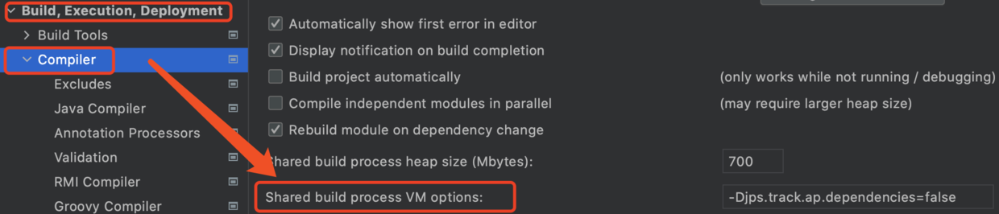

# 症状
形如:

java: You aren't using a compiler supported by lombok, so lombok will not work and has been disabled.   

Your processor is: jdk.proxy2.$Proxy29   Lombok supports: sun/apple javac 1.6, ECJ

# 解决
添加参数 `-Djps.track.ap.dependencies=false`在此:

# 原理
IDEA预编译的时候是以代理的方式来执行的，不是直接`javac`方式, 所以 lombok依赖的javac方式的`annotation processors`不再生效.
