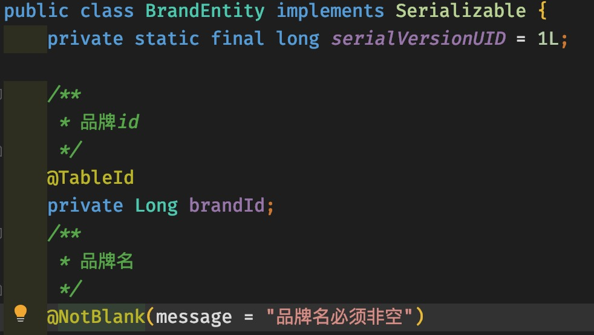
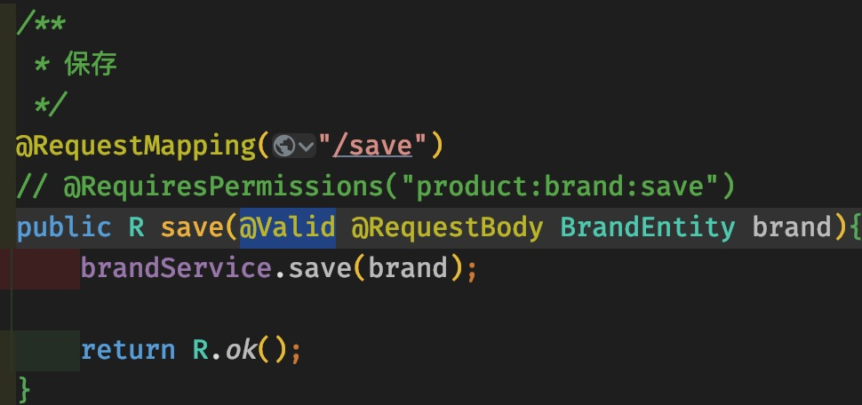

# 步骤
1. 给Entity Bean添加校验注解,可以自定义错误提示:


2. 在Controller的输入参数添加注解开启校验:


# 分组校验
分组校验:同一个字段可以有多个校验的方式,应对不同的业务情景.
例如:
```java
        /**
	 * 品牌id
	 */
	@NotNull(message = "修改时必须指定id", groups = {UpdateGroup.class})
	@Null(message = "新增时不可指定id", groups = {AddGroup.class})
	@TableId
	private Long brandId;
```
group里的是自定义的接口,内容是空的,可以放在新建validation包下.

此时,在controller里的注解`@Valid`改为`@Validated`, 例如:
```java
    /**
     * 保存
     */
    @RequestMapping("/save")
    // @RequiresPermissions("product:brand:save")
    public R save(@Validated({AddGroup.class}) @RequestBody BrandEntity brand){
		brandService.save(brand);

        return R.ok();
    }

    /**
     * 修改
     */
    @RequestMapping("/update")
    // @RequiresPermissions("product:brand:update")
    public R update(@Validated({UpdateGroup.class}) @RequestBody BrandEntity brand){
		brandService.updateById(brand);

        return R.ok();
    }
```

对于那些没有标注分组的检验注解,如`@NotBlank`,在分组校验下不会生效,只会在Controller里的未制定分组的`@Validated`生效.

# 一些额外信息
## 1. 正则表达式自定义校验:
使用正则表达式,例:
```java
        /**
	 * 检索首字母
	 */
	@Pattern(regexp = "^[a-zA-Z]$", message = "只能有一个字符!")
	private String firstLetter;
```


## 2. 自定义校验注解:
关联自定义校验器以及自定义校验注解.
1. 自定义校验注解:
```java
@Documented
@Constraint(
        validatedBy = {}
)
@Target({ElementType.METHOD, ElementType.FIELD, ElementType.ANNOTATION_TYPE, ElementType.CONSTRUCTOR, ElementType.PARAMETER, ElementType.TYPE_USE})
@Retention(RetentionPolicy.RUNTIME)
public @interface ValidValues {

    String message() default "{com.learn.common.validation.annotation.ValidValues.message}";

    Class<?>[] groups() default {};

    Class<? extends Payload>[] payload() default {};

    int[] values() default {};
}
```

**其中,message里的错误信息需要写在配置文件里** -- `ValidationMessage.properties`

```properties
com.learn.common.validation.annotation.ValidValues.message=Invalid value!
```

2. 自定义校验器:
```java
import javax.validation.ConstraintValidator;
import javax.validation.ConstraintValidatorContext;
import java.util.HashSet;
import java.util.Set;

public class ValidValuesConstraintValidator implements ConstraintValidator<ValidValues, Integer> {

    private Set<Integer> set;

    @Override
    public void initialize(ValidValues constraintAnnotation) {
        ConstraintValidator.super.initialize(constraintAnnotation);
        int[] values = constraintAnnotation.values();

        set = new HashSet<>();
        for (int value : values) {
            set.add(value);
        }
    }

    @Override
    public boolean isValid(Integer integer, ConstraintValidatorContext constraintValidatorContext) {
        if (set.contains(integer)) {
            return true;
        }

        return false;
    }
}

```

3. 将校验器与注解关联
在注解的头上有个:
```java
@Constraint(
        validatedBy = {}
)
```
大括号里写:`ValidValuesConstraintValidator.class`

4. 字段上写注解
```java
        /**
	 * 显示状态[0-不显示；1-显示]
	 */
	@ValidValues(values = {0, 1})
	private Integer showStatus;
```


## 3. `@NotNull`, `@NotEmpty`, `@NotBlank`

`@NotEmpty`, `@NotBlank`**只能**用于字符串,Empty是空串"", blank是只有空格,如"     ";
`@NotNull`可以用在数字上.

---

**当校验不通过,会有一个默认的400错误返回,最好自定义一下**

思路:统一异常处理

参考: [异常处理的系统错误码参考定义和代码实现](https://www.996workers.icu/archives/yi-chang-chu-li-de-xi-tong-cuo-wu-ma-can-kao-ding-yi)
