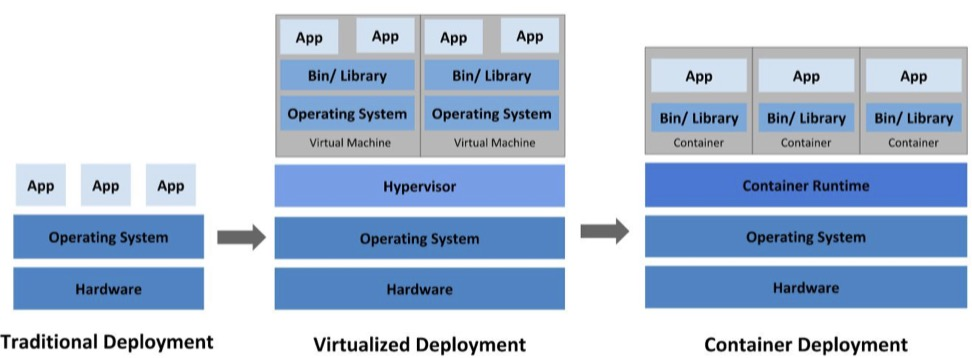
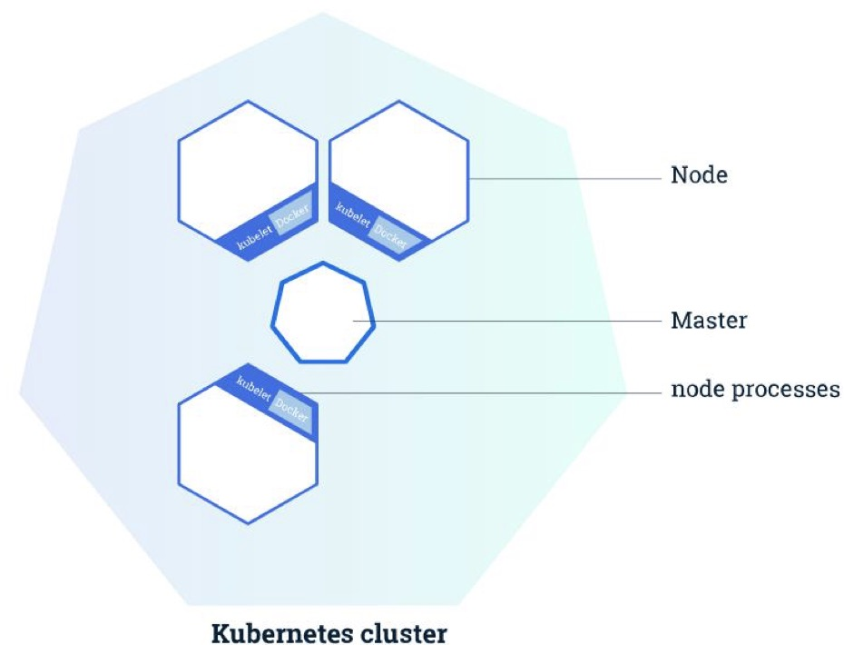
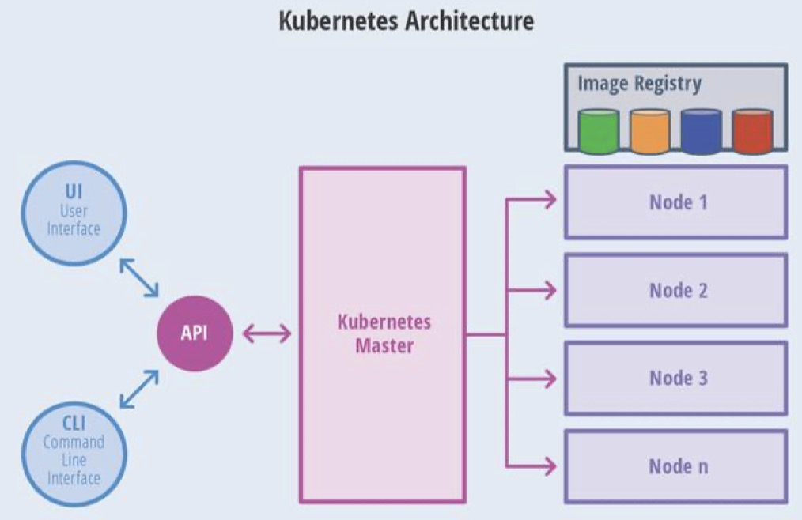
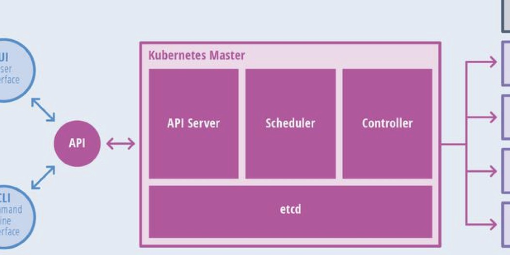
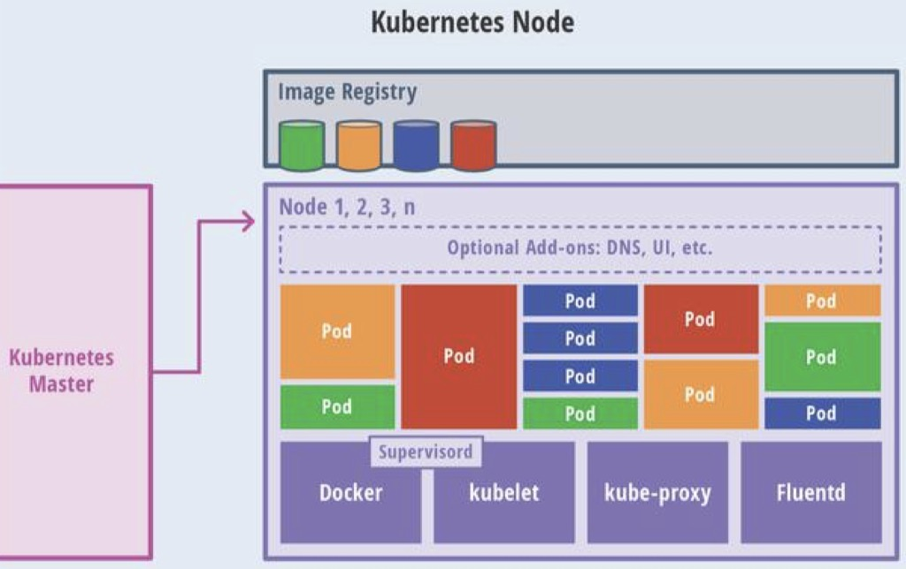
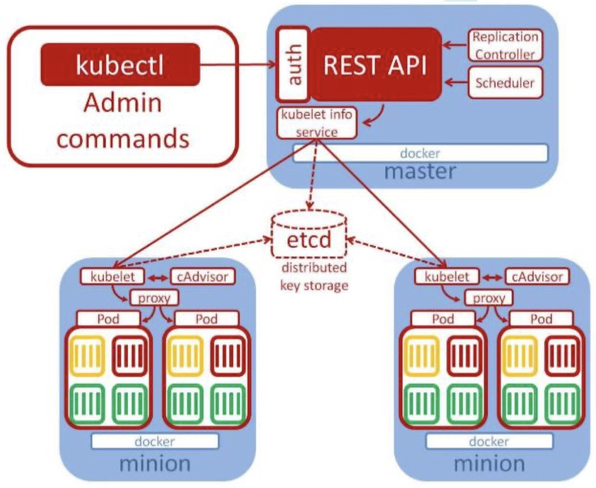

# 简介
Kubernetes, k8s. 自动部署， 扩展， 管理容器化应用程序。

中文官网： https://kubernetes.io/zh/
中文文档： https://kubernetes.io/zh/docs/home/

以下主要是以图形式记录k8s相关要点。 主要看文档

# 部署方式演变简介


# k8s架构简介

## 整体抽象：




## 节点抽象

### Master


- API server
    - 对外暴露api接口，公网唯一入口；
    - 可用于认证授权，API注册发现等.
- etcd
    - 是一个高可用一致性的键值对数据库;
    - 用于保存k8s本身的集群信息的后台数据;
    - 一般需要备份;
- scheduler
    - 监视新创建的, 但是尚未指定运行节点的Pod(之后介绍pod), 选择可用节点让Pod开始运行;
    - 所有集群的操作都要经过scheduler
- controller
    - 节点控制器: 负责节点故障通知响应
    - 副本控制器: 负责为系统中维持正确数量的Pod
    - 端点控制器: 填充端点对象(Endpoints)
    - 服务账户和令牌控制器: 命名空间, 账户, api访问令牌 

### Node


- Kublet
    - 在集群中每个Node上会运行的代理. 保证容器运行在Pod中.
    - 维护容器生命周期, 负责Volume和Network管理;
- kube-proxy
    - 为service提供服务发现和负载均衡
- Container Runtime(比如Docker)
    - 常见Docker, containerd, cri-p, rktlet等, 只要实现其Kubernetes CRI接口的虚拟化技术都可以.
- fluentd
    - 守护进程, 集群层面日志.

## 常用术语
- Container 
    - 容器, 比如Docker容器
- Pod
    - 一组容器的集合
    - 集合内容器共享一个网络
    - k8s最小部署单元
- Volume
    - Pod挂载的数据卷
- Service
    - 一组Pod的访问策略
    - 是Pod的负载均衡用的一个或者多个的稳定的Pod访问地址.
- Controllers
    - ReplicaSet: 确保预期Pod副本数量
    - Deplotment: 无状态应用部署(无所谓数据持久化的, 重启不敏感的)
    - StatefulSet: 有状态应用
    - DaemonSet: 所有Node都能运行某一个指定的Pod
    - Job: 一次性任务
    - Cronjob: 定时任务
- Deployment
    - 定义一组Pod的副本个数, 版本
    - 通过Controllers维持Pod数目(自动恢复挂了的Pod)
    - 通过Controllers进行滚动, 升级, 回滚等
- Label
    - 用于对象资源的查询筛选
- Namespace
    - 命名空间, 内部的逻辑隔离机制(鉴权, 资源隔离)
   

- Kubernetes API
    -  通过json/yaml格式, 以http给API server从而控制集群

# 部署
## 配置
- Linux系统.
- 2GB以上RAM
- 禁止SWAP.
- 集群中的设备互通

## 步骤
1. 所有服务器节点上Docker和Kubeadm


(可选)可考虑先卸载旧的Docker:
```
sudo yum remove docker \
docker-client \ docker-client-latest \ docker-common \ docker-latest \ docker-latest-logrotate \ docker-logrotate \ docker-engine
```

安装Docker-CE
```
# 安装必须的依赖 sudo yum install -y yum-utils \
device-mapper-persistent-data \ lvm2

#设置 docker repo 的 yum 位置 
sudo yum-config-manager \
--add-repo \ https://download.docker.com/linux/centos/docker-ce.repo

# 安装 docker，以及 docker-cli 
sudo yum install -y docker-ce docker-ce-cli containerd.io

# docker开机自启
systemctl enable docker
```

安装Kubeadm, kubelet, kubectl
```
yum list|grep kube

yum install -y kubelet-1.17.3 kubeadm-1.17.3 kubectl-1.17.3

systemctl enable kubelet systemctl start kubelet
```

2. 部署一个主机Kubernates Master
给一个机器部署k8s master
```
kubeadm init \
--apiserver-advertise-address=10.0.2.15 \
--image-repository registry.cn-hangzhou.aliyuncs.com/google_containers \
--kubernetes-version v1.17.3 \
--service-cidr=10.96.0.0/16 \
--pod-network-cidr=10.244.0.0/16
```

测试kubectl主节点执行状态
```
mkdir -p $HOME/.kube 
sudo cp -i /etc/kubernetes/admin.conf $HOME/.kube/config 
sudo chown $(id -u):$(id -g) $HOME/.kube/config
```

尝试获取所有节点: 
```
kubectl get nodes
```

查看日志
```
journalctl -u kubelet
```

3. 部署容器网络插件
```
kubectl apply -f \ https://raw.githubusercontent.com/coreos/flannel/master/Documentation/kube-flannel.yml
```

4. 部署Kubernetes Node, 并把Node加入Kubernetes集群

在Node节点执行, 向集群添加新节点.

5. 可以部署一个Dashboard页面, 可视化管理集群.


以下是一个安装地址
```
kubectl apply -f \ https://raw.githubusercontent.com/kubernetes/dashboard/v1.10.1/src/deploy/recommende d/kubernetes-dashboard.yaml
```

暴露其Service为NodePort类型, 使其暴露到公网
```
kind: Service 
apiVersion: v1 
metadata:
  labels: k8s-app: kubernetes-dashboard 
name: kubernetes-dashboard 
namespace: kube-system 
spec:
  type: NodePort 
  ports:
    - port: 443 
      targetPort: 8443 
      nodePort: 30001 
  selector:
    k8s-app: kubernetes-dashboard
```
暴露出访问地址`http://NodeIP:30001`.

创建授权账户以使用token登录:
```
$ kubectl create serviceaccount dashboard-admin -n kube-system 

$ kubectl create clusterrolebinding dashboard-admin --clusterrole=cluster-admin --serviceaccount=kube-system:dashboard-admin $ kubectl describe secrets -n kube-system 

$(kubectl -n kube-system get secret | awk '/dashboard-admin/{print $1}')
```

# 管理面板

 [Kubesphere](https://kubesphere.io), 比Dashboard好.

 
 


