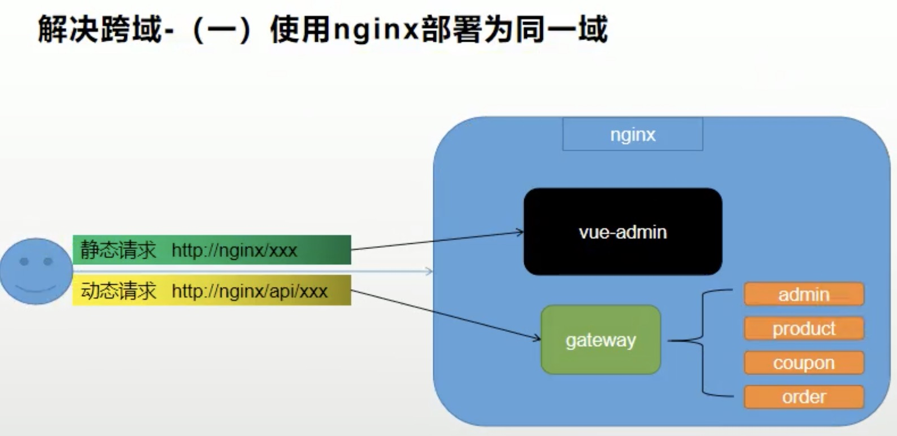
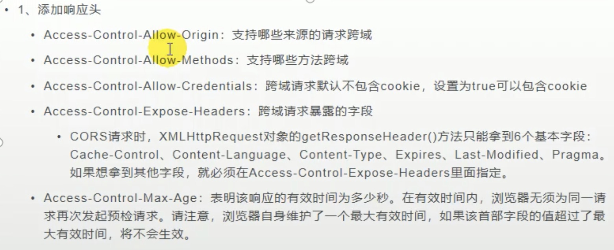
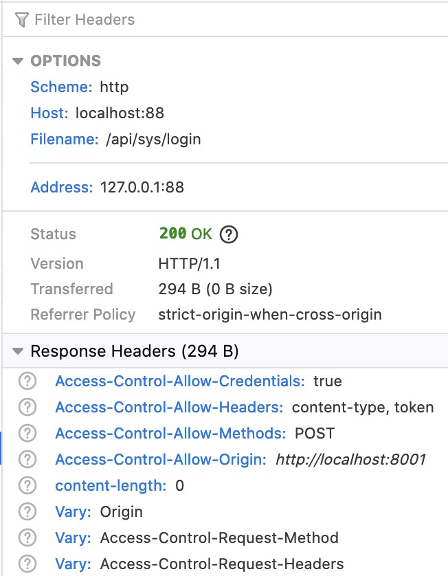

# 跨域请求
## 是什么
Cors, 从一个网站开始,当发起一个非简单请求的目标域名的端口或者端口前的任意东西和源网站不同时,就会是跨域请求

>简单请求: GET, POST, HEAD方式,其中无自定义头,Content-type为text/plain, multipart/form-data或者application/x-www-form-urlencoded

>非简单请求(预检请求): put，delete方法的ajax请求; 发送json格式的ajax请求; 带自定义头的ajax请求. 请求前会给服务器发送OPTIONS预检请求以获取服务器是否允许跨域请求.

## 为什么
安全,能防止跨站请求伪造, 跨站脚本攻击

---

# 跨域方案

1. 使用nginx部署为同一域,比较繁琐:


2. 服务端响应当次请求允许跨域


## 实例
**Spring Cloud全局跨域可以在gateway网关写个配置文件**

```java

// 注意下依赖包
import org.springframework.context.annotation.Bean;
import org.springframework.context.annotation.Configuration;
import org.springframework.web.cors.CorsConfiguration;
import org.springframework.web.cors.reactive.CorsWebFilter;
import org.springframework.web.cors.reactive.UrlBasedCorsConfigurationSource;

@Configuration
public class DemoCorsConfiguration {

    @Bean
    public CorsWebFilter corsWebFilter() {
        UrlBasedCorsConfigurationSource urlBasedCorsConfigurationSource = new UrlBasedCorsConfigurationSource();
        CorsConfiguration corsConfiguration = new CorsConfiguration();

        // 配置跨域全允许
        corsConfiguration.addAllowedHeader("*");
        corsConfiguration.addAllowedMethod("*");
        corsConfiguration.addAllowedOrigin("*");
        corsConfiguration.setAllowCredentials(true);

        urlBasedCorsConfigurationSource.registerCorsConfiguration(
                "/**",
                corsConfiguration
        );

        return new CorsWebFilter(urlBasedCorsConfigurationSource);
    }
}
```

此时预检请求能够收到回应:


这就说明此次访问被允许跨域了.
