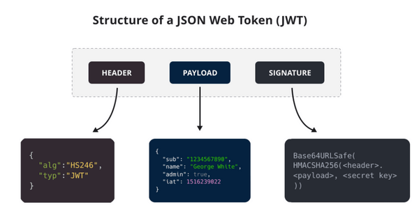
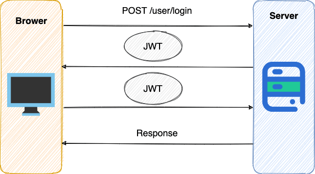

# What
JWT （JSON Web Token） 是目前最流行的跨域认证解决方案，是一种基于 Token 的认证授权机制。 从 JWT 的全称可以看出，JWT 本身也是 Token，一种规范化之后的 JSON 结构的 Token。

JWT 自身包含了身份验证所需要的所有信息，因此，我们的服务器不需要存储 Session 信息。这显然增加了系统的可用性和伸缩性，大大减轻了服务端的压力。

可以看出，JWT 更符合设计 RESTful API 时的「Stateless（无状态）」原则 。

并且， 使用 JWT 认证可以有效避免 CSRF 攻击，因为 JWT 一般是存在在 localStorage 中，使用 JWT 进行身份验证的过程中是不会涉及到 Cookie 的。

JWT组成如下图所示:

其本质是字符串, 切分成三个Base64编码部分:
- Header: JWT元数据, 声明签名算法和Token类型;
- Payload: 明文存放token内容, 比如JWT的ID, 主题, 签发人, 接收人, 过期时间等. 另外可以结合项目自定义一些声明, 不过最好结合相关手册防止自定义声明和已存在定义的声明冲突.
- Signature: 服务器用私钥和payload+header信息,结合签名算法做摘要, 用于比对JWT的正确性, 防止JWT篡改.

# How

在基于 JWT 进行身份验证的的应用程序中，用户POST了正确的登录信息,服务器通过 Payload、Header 和 Secret(私钥)创建 JWT 并将 JWT 发送给客户端。客户端接收到 JWT 之后，会将其保存在 Cookie(不推荐, 容易被CSRF) 或者 localStorage 里面，以后客户端发出的所有请求都会携带这个令牌, 服务器会计算JWT生成摘要, 与签名比较看是否被篡改, 然后从payload取出信息.

请求携带JWT的做法是放在Http Header的Authorization字段中. 

# Suggestions
1. 使用安全系数高的加密算法。
2. 使用成熟的开源库，没必要造轮子。
3. JWT 存放在 localStorage 中而不是 Cookie 中，避免 CSRF 风险。
一定不要将隐私信息存放在 Payload 当中。
4. 密钥一定保管好，一定不要泄露出去。JWT 安全的核心在于签名，签名安全的核心在密钥。
5. Payload 要加入 exp （JWT 的过期时间），永久有效的 JWT 不合理。并且，JWT 的过期时间不易过长。

