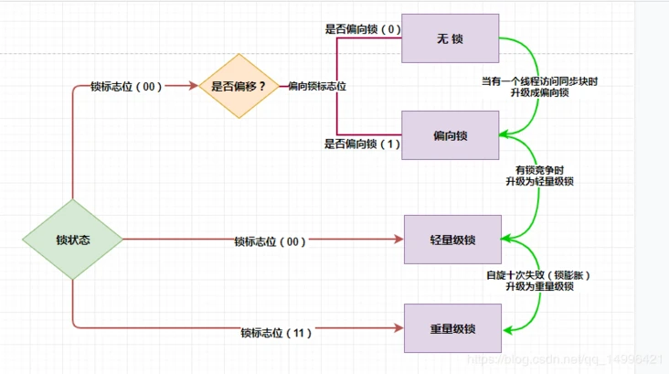

# Intro
>Before jdk 1.6, the synchronized keyword only represented heavyweight locks. After 1.6, it was divided into biased locks, lightweight locks and heavyweight locks

锁的状态总共有四种，级别由低到高依次为：无锁、偏向锁、轻量级锁、重量级锁.

在 JDK 1.6之前，synchronized 还是一个重量级锁，是一个效率比较低下的锁，但是在JDK 1.6后，Jvm为了提高锁的获取与释放效率（synchronized ）进行了优化，引入了 **偏向锁** 和 **轻量级锁** ，从此以后锁的状态就有了四种（无锁、偏向锁、轻量级锁、重量级锁），并且四种状态**会随着竞争的情况逐渐升级，而且是不可逆的过程**，即不可降级，也就是说只能进行锁升级（从低级别到高级别），不能锁降级（高级别到低级别），意味着偏向锁升级成轻量级锁后不能降级成偏向锁。

这种锁升级却不能降级的策略，目的是为了提高获得锁和释放锁的效率。

# Locks
## 无锁
无锁是指没有对资源进行锁定，所有的线程都能访问并修改同一个资源，但同时只有一个线程能修改成功。

无锁的特点是修改操作会在循环内进行，线程会不断的尝试修改共享资源。如果没有冲突就修改成功并退出，否则就会继续循环尝试。如果有多个线程修改同一个值，必定会有一个线程能修改成功，而其他修改失败的线程会不断重试直到修改成功。

## 偏向锁
偏向锁是指当一段同步代码一直被同一个线程所访问时，即不存在多个线程的竞争时，那么该线程在后续访问时便会自动获得锁，从而降低获取锁带来的消耗，即提高性能。

## 轻量级锁(自旋锁)
轻量级锁是指当锁是偏向锁的时候，却被另外的线程所访问，此时偏向锁就会升级为轻量级锁，其他线程会通过自旋（关于自旋的介绍见文末）的形式尝试获取锁，线程不会阻塞，从而提高性能。

## 重量级锁
重量级锁是指当有一个线程获取锁之后，其余所有等待获取该锁的线程都会处于阻塞状态。

# Lock Updrade

