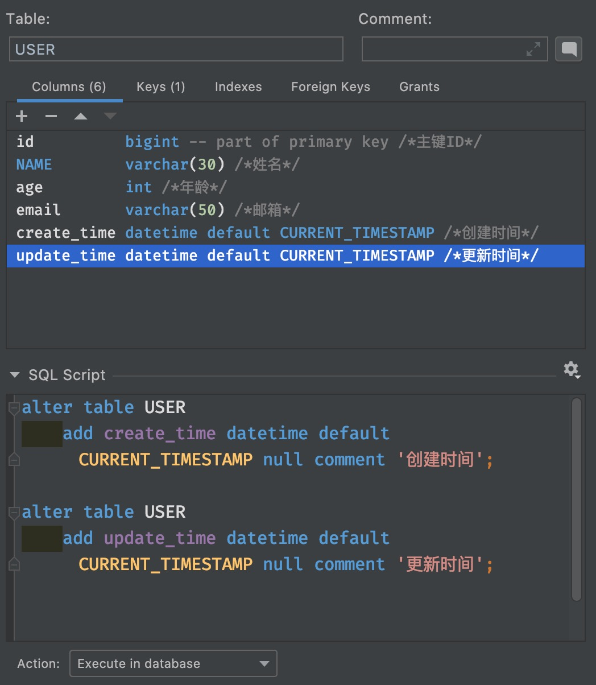

# 文档
- [Github地址](https://github.com/baomidou/mybatis-plus)
- [官文](https://baomidou.com/pages/24112f/)

# POM依赖
```
        <dependency>
            <groupId>mysql</groupId>
            <artifactId>mysql-connector-java</artifactId>
        </dependency>
	
	<!-- 非必须, 觉得方便就用 -->
        <dependency>
            <groupId>org.projectlombok</groupId>
            <artifactId>lombok</artifactId>
            <version>1.18.20</version>
        </dependency>

        <dependency>
            <groupId>com.baomidou</groupId>
            <artifactId>mybatis-plus-boot-starter</artifactId>
            <version>3.0.5</version>
        </dependency>
```

# 使用
## 搞好数据库

## 新建pojo
```
@Data
@AllArgsConstructor
@NoArgsConstructor
public class User {

    private Long id;
    private String name;
    private Integer age;
    private String email;
}
```

## 新建Mapper/DAO
```
@Repository
public interface UserMapper extends BaseMapper<User> {
}
```

只要extends了`BaseMapper<User>`, 里面的基本增删改查已经被Mybatis-plus实现了.

## 程序入口加Mapper扫描地址
```
@MapperScan("com.learn.learn_mybatis_plus.dao")
@SpringBootApplication
public class LearnMybatisPlusApplication {

    public static void main(String[] args) {
        SpringApplication.run(LearnMybatisPlusApplication.class, args);
    }


```

## Controller示例
```
@RestController
@RequestMapping("/")
public class IndexController {

    @Resource
    UserMapper userMapper;

    @GetMapping(value = {"/","index"})
    public List<User> index() {
        return userMapper.selectList(null);
    }
}
```

# 配置日志
为了能够追踪SQL执行的状态, 可考虑看日志. 等上线了去掉日志功能.

在配置文件里写, 比如我用了控制台标准输出的.
```
mybatis-plus.configuration.log-impl=org.apache.ibatis.logging.stdout.StdOutImpl
```

当你导入了其他的日志系统, 比slf4j, 则impl后面跟不同的实现类就好了.

结果示例:
```
Creating a new SqlSession
SqlSession [org.apache.ibatis.session.defaults.DefaultSqlSession@7e081dcb] was not registered for synchronization because synchronization is not active
JDBC Connection [HikariProxyConnection@272465902 wrapping com.mysql.cj.jdbc.ConnectionImpl@32ca2e12] will not be managed by Spring
==>  Preparing: SELECT id,name,age,email FROM user 
==> Parameters: 
<==    Columns: id, name, age, email
<==        Row: 1, 'Jone', 18, 'jone@qq.com'
<==        Row: 2, 'Jack', 20, 'jj@163.com'
<==        Row: 3, 'Tom', 30, 'tom@gmail.com'
<==        Row: 4, 'Dick', 26, 'd228@unimelb.edu.au'
<==        Row: 5, 'Harry', 44, 'harris@riseup.net'
<==      Total: 5
Closing non transactional SqlSession [org.apache.ibatis.session.defaults.DefaultSqlSession@7e081dcb]
```

# CRUD
以下是简单CRUD示例.
## 增
```
@GetMapping(value = "/insert")
    public String insert() {
        User user = new User();
        user.setId(Math.abs(UUID.randomUUID().getLeastSignificantBits() % 1000));
        user.setName(UUID.randomUUID().toString().substring(0,5));
        user.setEmail(UUID.randomUUID().toString().substring(0,5) + "@demo.com");
        user.setAge(Math.abs(new Random().nextInt() % 100));

        userMapper.insert(user);
        return "ok";
    }
```
其实不用刻意设置ID, Mybatis-plus会自动给生成ID. Mybatis-plus的主键生成策略默认是雪花算法. 常见策略有:
- 数据库自增: 分布式不行
- UUID: 全局唯一, 但不单调;
- RedisID
- 雪花算法: 全局唯一, 单调增

**ID生成设置方法**
```
@Data
@AllArgsConstructor
@NoArgsConstructor
public class User {

    @TableId(type = IdType.ID_WORKER)
    private Long id;
    private String name;
    private Integer age;
    private String email;
}
```

Mybatis-plus主键生成策略有
- AUTO: 自增
- NONE: 不设置主键
- INPUT: 手动输入
- ID_WORKER: 默认, 默认全局ID, Long
- UUID: UUID
- ID_WORKER_STR: ID_WORKER的字符串表示, String

## 改
### 更新操作
```
    @GetMapping(value = "/update/{id}")
    public String updateById(@PathVariable("id") Long id) {

        User user = new User();
        user.setId(id);
        user.setName(UUID.randomUUID().toString().substring(0,5));

        userMapper.updateById(user);
        return "ok";
    }
```

### 自动填充 

根据阿里巴巴开发规约, 推荐数据库表带上`gmt_create`和`gmt_modified`等字段来记录条目的创建和更改时间. 这些希望能自动化实现.

1. 数据库级别: 表中新增两字段, 并且默认值设置为`CURRENT_TIMESTAMP`, 例如:


提交修改后, 执行了, 已有的数据也能够获得更改.

2. 代码级别: 在实体类字段属性上写注解:
```
@Data
@AllArgsConstructor
@NoArgsConstructor
public class User {

    @TableId(type = IdType.ID_WORKER)
    private Long id;
    private String name;
    private Integer age;
    private String email;

    /* 字段添加填充内容 */
    @TableField(fill = FieldFill.INSERT)
    private Date createTime;

    @TableField(fill = FieldFill.INSERT_UPDATE)
    private Date updateTime;
}
```

配置Handler
```
@Slf4j
@Component
public class MyMetaObjectHandler implements MetaObjectHandler {

    // 插入时自动填充
    @Override
    public void insertFill(MetaObject metaObject) {
        log.info("start insert fill");

        this.setFieldValByName(
                "createTime",
                new Date(),
                metaObject
                );

        this.setFieldValByName(
                "updateTime",
                new Date(),
                metaObject
        );
    }

    // 更新时自动填充
    @Override
    public void updateFill(MetaObject metaObject) {
        log.info("start update fill");

        this.setFieldValByName(
                "updateTime",
                new Date(),
                metaObject
        );
    }
}
```

### 乐观锁

>乐观锁:不上同步锁, 在更改的时候一般不会出现问题. MVCC.

Mybatis-plus有个乐观锁插件, 实现方式:
1. 取出记录时, 获得当前version
2. 执行更新前一刹那, 用当前的version和即将改变的条目的当前version对比
3. 如果version一致, 继续更新. 如果version不一致, 说明有人在你操作过程中变动了数据, 为防止污染掉其他人的数据成果, 故放弃此次更新操作.
4. 更新完了, version + 1

实践步骤:
- 数据库中加version字段, 类型为int即可, 默认值为1即可.
- 实体类加上对应的version字段, 字段头上加注解`@Version`.
```
@Version
private Integer version;
```

- 注册组件 - 搞个配置类
- **据说新版本不用搞这个自动配置类了, 以实际手册为准.**
```
@EnableTransactionManagement
@Configuration
public class MyBatisPlusConfig {
    @Bean
    public OptimisticLockerInterceptor optimisticLockerInterceptor() {
        return new OptimisticLockerInterceptor();
    }
}
```

## 查
### 基本查询
```
    @GetMapping(value = "/select/{id}")
    public User selectById(@PathVariable("id") Long id) {

        return userMapper.selectById(id);
    }
```

批量查询用`selectBatchIds(Collection<?> colllection)`方法, 传入ID的集合. 返回的是`List<?>`结果.

条件查询用map封装:
```
    @GetMapping(value = "/selectByName/{name}")
    public List<User> selectByName(@PathVariable("name") String name) {
        HashMap<String, Object> map = new HashMap<>(10);
        map.put("name", name);

        return userMapper.selectByMap(map);
    }
```

### 分页查询
1. 原始limit分页;
2. pageHelper第三方插件;
3. Mybatis-Plus内置分页插件:

查手册就好了, 首先进行配置:
```
//Spring boot方式
@Configuration
@MapperScan("com.baomidou.cloud.service.*.mapper*")
public class MybatisPlusConfig {

    // 旧版
    @Bean
    public PaginationInterceptor paginationInterceptor() {
        PaginationInterceptor paginationInterceptor = new PaginationInterceptor();
        // 设置请求的页面大于最大页后操作， true调回到首页，false 继续请求  默认false
        // paginationInterceptor.setOverflow(false);
        // 设置最大单页限制数量，默认 500 条，-1 不受限制
        // paginationInterceptor.setLimit(500);
        // 开启 count 的 join 优化,只针对部分 left join
        paginationInterceptor.setCountSqlParser(new JsqlParserCountOptimize(true));
        return paginationInterceptor;
    }

    // 最新版
    @Bean
    public MybatisPlusInterceptor mybatisPlusInterceptor() {
        MybatisPlusInterceptor interceptor = new MybatisPlusInterceptor();
        interceptor.addInnerInterceptor(new PaginationInnerInterceptor(DbType.H2));
        return interceptor;
    }

}
```

**分页简单使用:**

```
@Test
public void testPage() {
   // 第1页, 页面大小为5
   Page<User> page = new Page<>(1, 5);
   
   // null处为wrapper, null为无条件,全选 
   userMapper.selectPage(page, null);
   
   // 遍历查询分页结果并输出
   page.getRecords().forEach(System.out::println);

}
```

**XML 自定义分页:**
- UserMapper.java 方法内容
```
public interface UserMapper {//可以继承或者不继承BaseMapper
    /**
     * <p>
     * 查询 : 根据state状态查询用户列表，分页显示
     * </p>
     *
     * @param page 分页对象,xml中可以从里面进行取值,传递参数 Page 即自动分页,必须放在第一位(你可以继承Page实现自己的分页对象)
     * @param state 状态
     * @return 分页对象
     */
    IPage<User> selectPageVo(Page<?> page, Integer state);
}

```

- UserMapper.xml 等同于编写一个普通 list 查询，mybatis-plus 自动替你分页
```
<select id="selectPageVo" resultType="com.baomidou.cloud.entity.UserVo">
    SELECT id,name FROM user WHERE state=#{state}
</select>
```

- UserServiceImpl.java 调用分页方法
```
public IPage<User> selectUserPage(Page<User> page, Integer state) {
    // 不进行 count sql 优化，解决 MP 无法自动优化 SQL 问题，这时候你需要自己查询 count 部分
    // page.setOptimizeCountSql(false);
    // 当 total 为小于 0 或者设置 setSearchCount(false) 分页插件不会进行 count 查询
    // 要点!! 分页返回的对象与传入的对象是同一个
    return userMapper.selectPageVo(page, state);
}
```

### Wrapper条件构造器
可用于复杂条件查询, 替代写复杂SQL.
[参考文档入口](https://baomidou.com/pages/10c804/#alleq).

**基本使用**
```
QueryWrapper<User> wrapper = new QueryWrapper<>();

// not null, greater than
wrapper.isNotNull("name").isNotNull("email").ge("age", 12);
userMapper.selectList(wrapper);
```

## 删
### 基本删除
```
userMapper.deleteById()
userMapper.deleteByMap()
userMapper.deleteBatchIds()
...
```

### 逻辑删除
只是不显示了而已, 但是数据库中有存根. 使用个标志量表示删除的状态.

1. 写配置文件
```
mybatis-plus:
  global-config:
    db-config:
      logic-delete-field: flag # 全局逻辑删除的实体字段名(since 3.3.0,配置后可以忽略不配置步骤2)
      logic-delete-value: 1 # 逻辑已删除值(默认为 1)
      logic-not-delete-value: 0 # 逻辑未删除值(默认为 0)
```

2. Bean中字段加注解
```
        /**
	 * 是否显示
	 */
	@TableLogic
	private Integer isDeleted;
```

>**说明**:
只对自动注入的 sql 起效:
插入: 不作限制
查找: 追加 where 条件过滤掉已删除数据,且使用 wrapper.entity 生成的 where 条件会忽略该字段
更新: 追加 where 条件防止更新到已删除数据,且使用 wrapper.entity 生成的 where 条件会忽略该字段
删除: 转变为 更新
例如:
删除: update user set deleted=1 where id = 1 and deleted=0
查找: select id,name,deleted from user where deleted=0
字段类型支持说明:
支持所有数据类型(推荐使用 Integer,Boolean,LocalDateTime)
如果数据库字段使用datetime,逻辑未删除值和已删除值支持配置为字符串null,另一个值支持配置为函数来获取值如now()
附录:
逻辑删除是为了方便数据恢复和保护数据本身价值等等的一种方案，但实际就是删除。
如果你需要频繁查出来看就不应使用逻辑删除，而是以一个状态去表示。


# 性能分析
**在开发/测试环境下使用**
**新版本建议用p6spy了!**
在自动配置类里加个Bean
```
@Bean
@Profile({"dev", "test"})
public PerformanceInterceptor performanceInterceptor() {
  PerformanceInterceptor interceptor = new PerformanceInterceptor();

  interceptor.setMaxTime(100); // 设置sql最大执行时间100ms, 超过则不执行
  interceptor.setFormat(true); // 格式化sql代码
  return interceptor;
}
```

# 代码生成器

[官方文档入口](https://baomidou.com/pages/779a6e/#快速入门)
还有renren-fast的Git repo也有自动生成代码的功能.


