# In the client

In the java application, there exists MySQL Driver (such as JDBC) that developers can use it easily. This Driver will provide developers java APIs that performs MySQL operations.

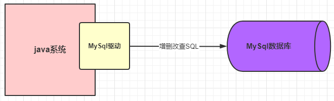

We can also use multi-thread model to provide data services for multiple requests like this:
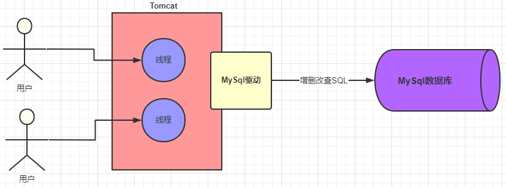

MySQL Driver uses TCP/IP protocol to communicate with MySQL system. To guarantee performance of sockets, we'd better use **Connection Pool** to reuse connections. Some common database connection pools: Druid, C3P0 and DBCP.
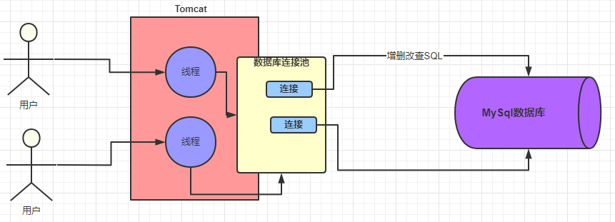

# In MySQL
## Handling connections
Inside the MySQL system, there also maintains a connection pool to hold multiple connections. MySQL also use different worker threads to perform database operations.
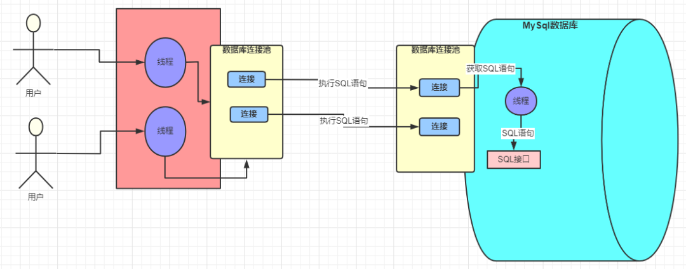

## Handling SQL statements
Let's say there is a SQL statement:
```sql
SELECT stuName,age,sex FROM students WHERE id=1
```
As we all know, this SQL statement is a text. MySQL will parse this SQL text to some directives that MySQL knows.
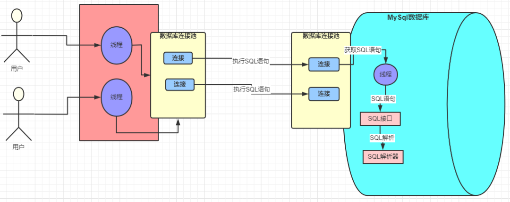

Then, MySQL will try to optimise query directives to be more effective (Not always though...)
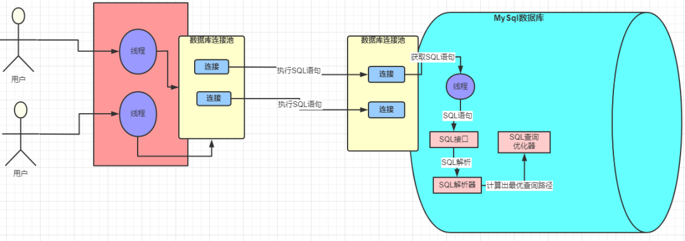

There are usually two aspects of the performance optimisation:
- I/O cost: File pages, load file from disk to memory, and so on. Usually depends on page size.
- CPU cost: Handle data that is loaded in memory. Usually it depends on the row amount of the data.

MySQL will caculate *I/O cost + CPU cost* to optimise the performance.

## Run SQL with Storage Engine
MySQL uses **Executer** to run SQL directives. It will call MySQL **Storage Engine** to perform operations:
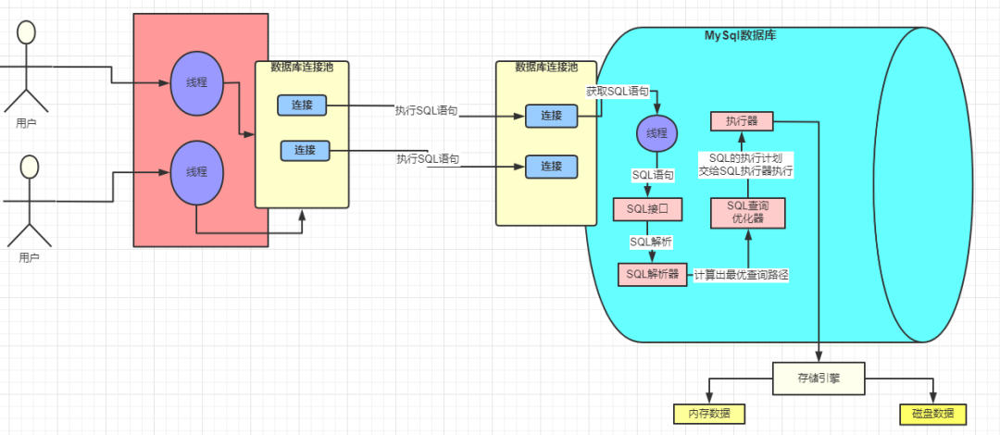

While performing operations, MySQL InnoDB engine will use **Buffer Pool** to buff the result of the first query.
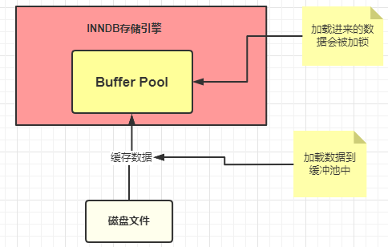

if the SQL is : 
```sql
UPDATE students SET stuName = '小强' WHERE id = 1
```
InnoDB will runs like this:
1. Check Buffer Pool to see whether the query result is existing or not;
2. If not, load from disk, then put it in Buffer Pool;
3. During updating, an Exclusive lock will be used.

What's more, MySQL will use **undo log** to support **Transaction**.
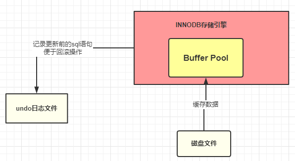

Usually, MySQL update data in the Buffer Pool. To make the change durable, InnoDB uses **redo log** to support Durability:
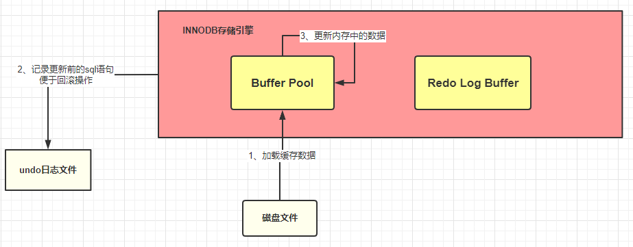

>redo log is unique to InnoDB storage Engine.

redo log need to be saved in the disk periodically:
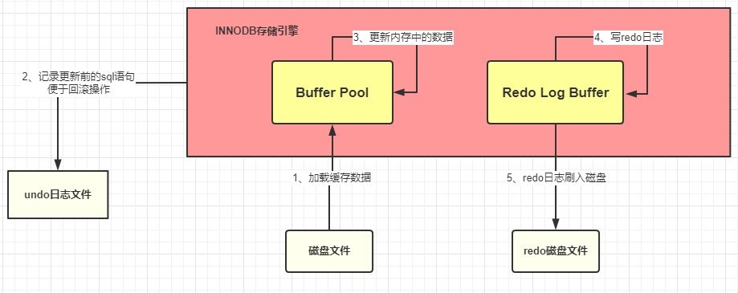

To sum up:
- If you want to update a SQL statement, MySQL (InnoDB) will look for the data in the BufferPool;
- if it doesn't find it, it will look on disk; if it finds it, it will load the data into the BufferPool.
-  After loading data into the BufferPool, Innodb performs an update in the Buffer Pool and the updated data is recorded in the redo log Buffer when MySQL commits a transaction, The redo log buffer is written to the redo log file;

Also, MySQL uses **bin log** to record the whole work.
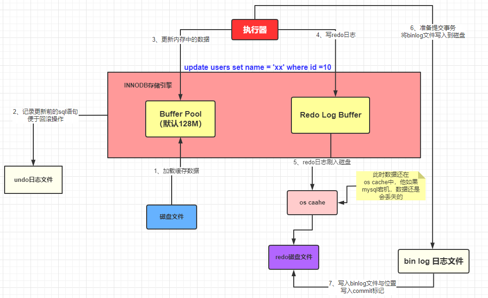
It is helpful for master-slave replication in MySQL database cluster.

# Summary

- Buffer Pool is a very important component of MySQL, because the operation of inserting, deleting and updating data is done in the Buffer Pool.
- Undo log records the status before data operations and is used to roll back transactions.
- Redo log records what data looks like after being manipulated (redo log is unique to Innodb storage engine) for data persistence;
- bin log records the entire operation, which is very important for cluster replication.

Description of the process from preparing to update a piece of data to committing a transaction:
- The executor first queries data from the MySQL Buffer Pool according to the execution plan. If it does not get result, it queries the database file. 
- When data is cached to the Buffer Pool, the undo log file is written
- Updates are performed in the Buffer Pool and are added to the redo log buffer
- Once completed, you can commit the transaction, which does three things at the same time:
- Flush redo log buffer data to redo log file
- Writes the operation record to the bin log file
- Log the bin log file name and the update location in the bin log to the redo log, and add the commit flag at the end of the redo log

Then, the entire update transaction is complete.

# Copyright 
https://www.pdai.tech/md/db/sql-mysql/sql-mysql-execute.html
