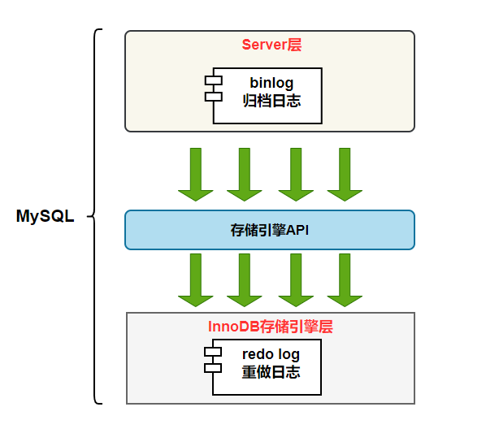
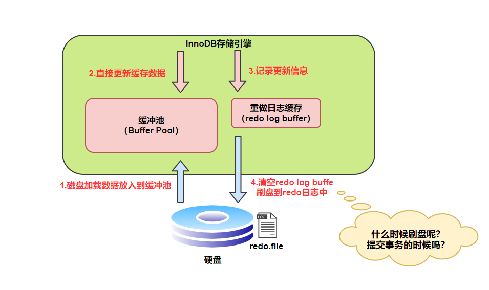
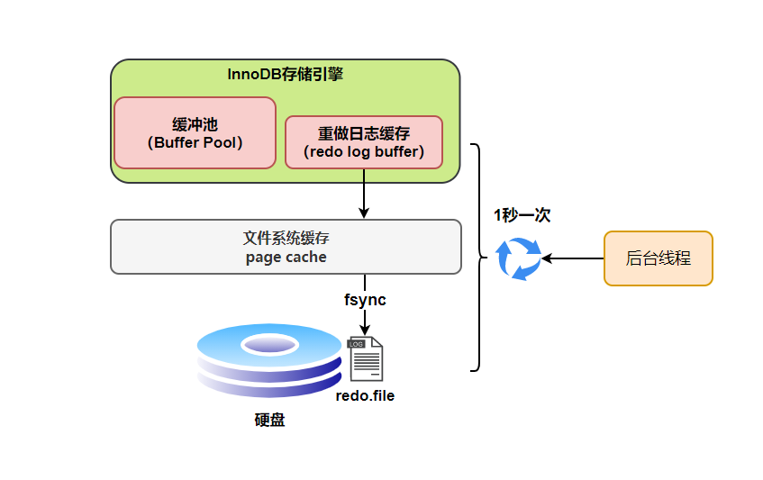
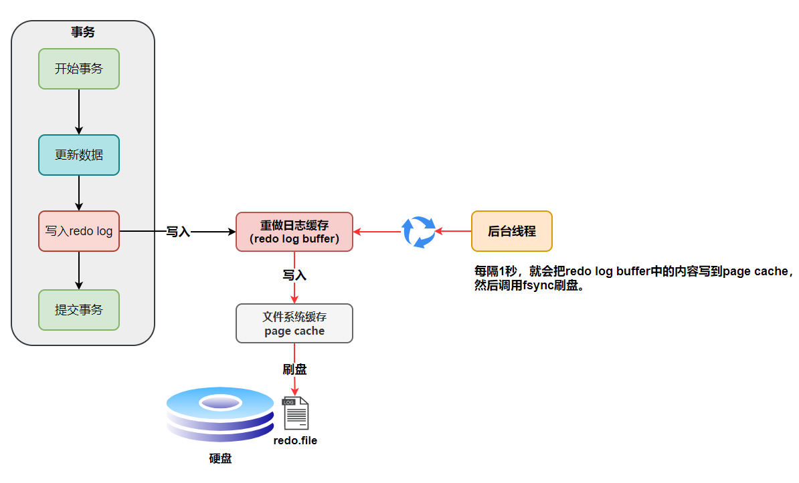
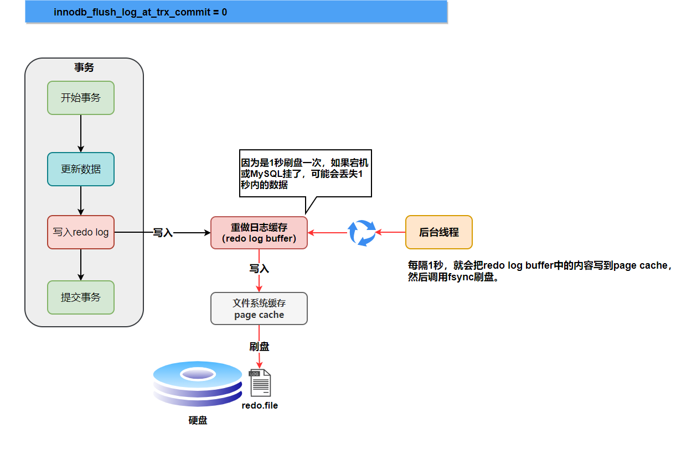
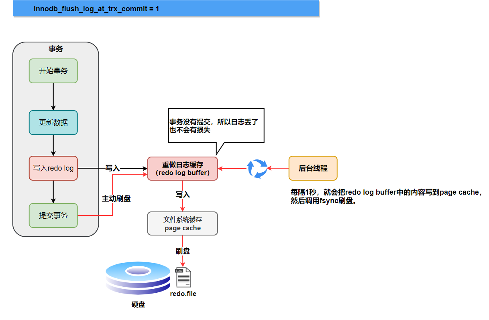
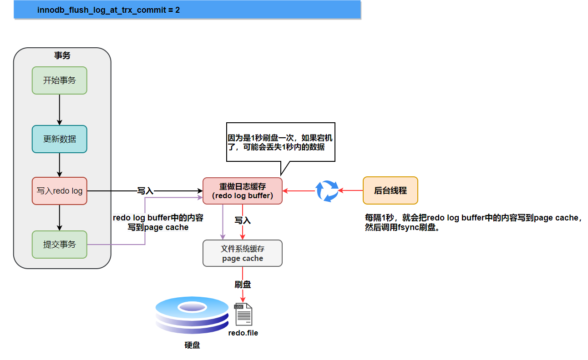
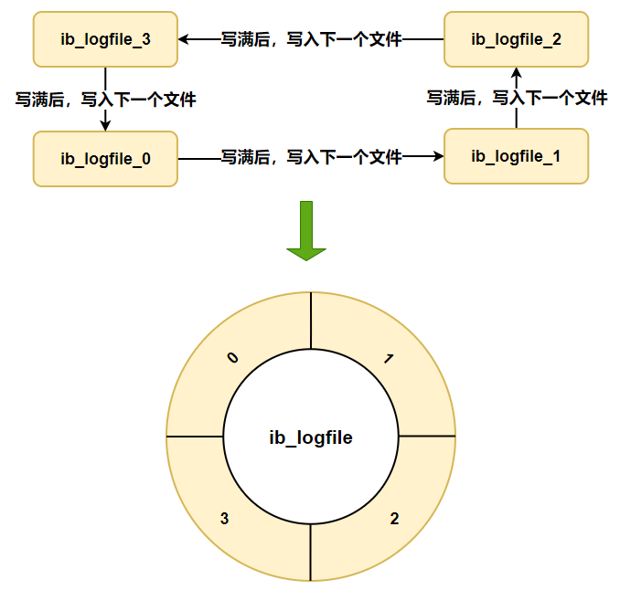
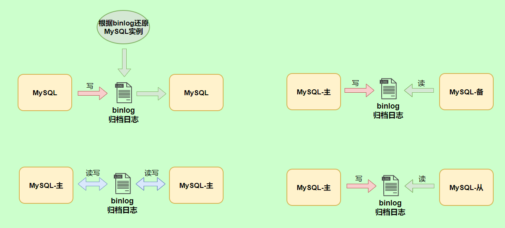
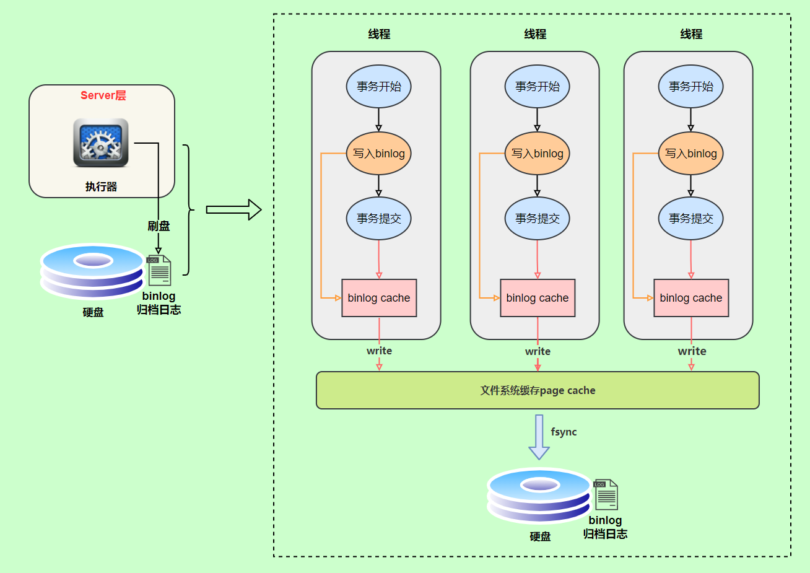

# 综述
MySQL日志主要包括错误日志、查询日志、慢查询日志、事务日志、二进制日志几大类。其中，比较重要的还要属二进制日志binlog（归档日志)和事务日志 redo log(重做日志)和undo log（回滚日志)。如图所示:

*Buffer Pool -- MySQL并不是直接和硬盘打交道*

MySQL中数据是以页为单位，查询一条记录，会从硬盘把一页的数据加载出来，加载出来的数据叫数据页，会放入到**Buffer Pool**中。

后续的查询都是先从**Buffer Pool**中找，没有命中再去硬盘加载，减少硬盘 IO开销，提升性能。

更新表数据的时候，也是如此，发现**Buffer Pool**里存在要更新的数据，就直接在**Buffer Pool**里更新。

然后会把“在某个数据页上做了什么修改”记录到重做日志缓存（redo log buffer）里，接着刷盘到 redo log 文件里。

PS: 这个其实和MyBatis里面的第一级缓存比较类似.

# redo log

## 简述
redo log是**InnoDB**存储引擎特有, 让MySQL有了崩溃恢复.

在MySQL实例挂了后重启,InnoDB存储引擎会使用redo log恢复数据，保证数据的持久性与完整性。

之前提到过,MySQL并不直接和硬盘打交道,而是有**Buffer Pool**, 今天讨论Buffer Pool何时把内容刷入硬盘:

redo log的刷盘策略有:

- 0: 事务提交时不进行刷盘操作
- 1: **每次事务提交时都将进行刷盘操作（默认值）**
- 2: 每次事务提交时都只把 redo log buffer 内容写入 page cache

`innodb_flush_log_at_trx_commit` 参数默认为 1,即上述第二种默认方法 ，也就是说当事务提交时会调用 fsync 对 redo log 进行刷盘.

另外，InnoDB 存储引擎还有一个后台线程，每隔`1`秒，就会把`redo log buffer`中的内容写到文件系统缓存（page cache），然后调用 fsync 刷盘.
**也就是说，一个没有提交事务的 redo log 记录，也可能会刷盘。**

所谓**一个没有提交事务的redo log记录也可能会刷盘**, 是因为**在事务执行过程中**redo log记录是会写入redo log buffer 中，这些redo log记录会被后台线程刷盘:

除了后台线程每秒1次的轮询操作，还有一种情况，**当 redo log buffer 占用的空间即将达到 innodb_log_buffer_size 一半的时候，后台线程会主动刷盘。**

## redo log刷盘时机
1. **第一类刷盘:事务提交时不进行刷盘操作:** 如果MySQL挂了或宕机可能会有1秒数据的丢失。

2. **第二类刷盘:每次事务提交时都将进行刷盘操作:** 只要提交了事务,就不会丢失数据. 

2. **第三类刷盘:每次事务提交时都只把 redo log buffer 内容写入 page cache:** 如果仅仅只是MySQL服务线程挂了不会有任何数据丢失，但是整个儿宕机可能会有1秒数据的丢失。

## redo log文件存储形式 -- 日志文件组
硬盘上存储的 redo log 日志文件不只一个，而是以一个日志文件组的形式出现的，每个的redo日志文件大小都是一样的。

比如可以配置为一组4个文件，每个文件的大小是 1GB，整个 redo log 日志文件组可以记录4G的内容。

它采用的是环形数组形式，从头开始写，写到末尾又回到头循环写，如下图所示:

## redo log小结

redo log是物理日志，记录内容是“在某个数据页上做了什么修改”，属于 InnoDB 存储引擎。

redo log给予持久性保证.默认持久化策略能够保证提交的事务一定能被持久化. 一行记录可能就占几十Byte，只包含表空间号、数据页号、磁盘文件偏移量、更新值，再加上是顺序写，所以刷盘速度很快。

redo log在事务进行时就会被记录在redo log buffer中,有个后台线程会每秒把buffer中的写入文件系统缓存cache. 默认刷盘策略是,当提交的时候强迫调用fsync把所有内容一波送入硬盘. 可以降低为提交时不刷入盘, 或者是送入文件系统缓存cache中,等待后台线程把redo log刷入硬盘.

---

# bin log
## 简述
bin log 是逻辑日志，记录内容是语句的原始逻辑，类似于“给 ID=2 这一行的 c 字段加 1”，属于MySQL Server 层。

binlog会记录所有涉及更新数据的逻辑操作，并且是顺序写。

不管用什么存储引擎，**只要发生了表数据更新，都会产生 bin log 日志.**

MySQL数据库的数据备份、主备、主主、主从都离不开binlog，需要依靠bin log来同步数据，**保证数据一致性**。

## bin log 记录格式
binlog 日志有三种格式，可以通过binlog_format参数指定。

- statement: 记录的内容是一条SQL语句原文;
- row: 记录的内容不再是简单的SQL语句了，还包含操作的具体数据, 比如`update_time=now()`获取当前系统时间，使用statement格式直接执行会导致与原库的数据不一致。而row就能记录具体数据.
- mixed: 由于row可能需要更大容量存储结果,所以mixed会判断这条SQL语句是否可能引起数据不一致，如果是，就用row格式，否则就用statement格式。

## bin log 写入机制

binlog的写入时机也非常简单，事务执行过程中，先把日志写到binlog cache，事务提交的时候，再把binlog cache写到binlog文件中。

因为一个事务的binlog不能被拆开，无论这个事务多大，也要确保一次性写入，所以系统会给每个线程分配一个块内存作为binlog cache。

我们可以通过binlog_cache_size参数控制单个线程 binlog cache 大小，如果存储内容超过了这个参数，就要暂存到磁盘（Swap）。

bin log 刷盘策略:
- **0.默认: 表示每次提交事务都只写入到文件系统的文件系统缓存page cache**,这样比较快，由系统自行判断什么时候执行fsync。但是如果机器整个宕机,可能会丢数据.
- 1: 每次提交都要触发fsync刷盘. 可靠,耗IO.
- 2: 一段时间内积累N个事务完成后统一fsync从文件系统缓存刷入硬盘;这样顶多丢N个事务的bin log日志.

## bin log小结:
binlog（归档日志）保证了MySQL集群架构的数据一致性。其每次提交事务时,日志会进入文件系统缓存. 默认刷盘策略是随缘等fsync,可以提升为每次提交就刷盘,或者积累N个事务提交后一波刷盘.

# undo log
我们知道如果想要保证事务的**原子性**，就需要在异常发生时，对已经执行的操作进行回滚，在 MySQL 中，恢复机制是通过 回滚日志（undo log） 实现的，所有事务进行的修改都会先记录到这个回滚日志中，然后再执行相关的操作。

如果执行过程中遇到异常的话，我们直接利用undo log中的信息将数据回滚到修改之前的样子即可！

并且，**回滚日志undo log会先于数据持久化到磁盘上**。这样就保证了即使遇到数据库突然宕机等情况，当用户再次启动数据库的时候，数据库还能够通过查询回滚日志来回滚将之前未完成的事务。

undo log 和MVCC有关,请额外复习MVCC.

# Copyright

- 《MySQL 实战 45 讲》
- 《从零开始带你成为 MySQL 实战优化高手》
- 《MySQL 是怎样运行的：从根儿上理解 MySQL》
- 《MySQL 技术 Innodb 存储引擎》
- [《Java Guide》](https://javaguide.cn/database/mysql/mysql-logs/#undo-log)

