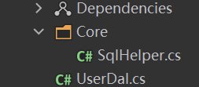

# 说明
仅仅只是个用于速查的快速开始代码示例，并不是工程最优实践。

# 示例结构


# 安装依赖
请安装`MySqlConnector`.


# 代码

**SqlHelper.cs**: 包含两个方法，第一个方法用于执行查询相关的sql，第二个用于执行非查询的sql
```c#
using System.Data;
using MySqlConnector;

namespace MyBBSWebApi.DAL.Core;

public class SqlHelper
{
    private static string ConnectionString { get; set; } = "Server=localhost;Database=MyBBSDb;Uid=root;Pwd=123456";

    public static DataTable ExecuteTable(string cmdText, params MySqlParameter[] sqlParameters)
    {
        using MySqlConnection conn = new MySqlConnection(ConnectionString);
        conn.Open();
        MySqlCommand cmd = new MySqlCommand(cmdText, conn);
        cmd.Parameters.AddRange(sqlParameters);
        MySqlDataAdapter sda = new MySqlDataAdapter(cmd);
        DataSet ds = new DataSet();
        sda.Fill(ds);
        return ds.Tables[0];
    }

    public static int ExecuteNonQuery(string cmdText, params MySqlParameter[] sqlParameters)
    {
        using MySqlConnection conn = new MySqlConnection(ConnectionString);
        conn.Open();
        MySqlCommand cmd = new MySqlCommand(cmdText, conn);
        cmd.Parameters.AddRange(sqlParameters);
        return cmd.ExecuteNonQuery();
    }
}
```

**UserDal.cs**: Data Access Layer示例代码。
```c#
using System.Data;
using MyBBSWebApi.MODEL;
using MySqlConnector;
using SqlHelper = MyBBSWebApi.DAL.Core.SqlHelper;

namespace WebApiDemo.Dal;

public class UserDal
{
    public User? GetUserByUserNoAndPassword(string userNo, string password)
    {
        DataTable res = SqlHelper.ExecuteTable("SELECT * FROM User WHERE UserNo = @UserNo AND Password = @Password",
            new MySqlParameter("@UserNo", userNo),
            new MySqlParameter("@Password", password));
        DataRow dataRow = null;
        if (res.Rows.Count > 0)
        {
            dataRow = res.Rows[0];
        }
        else
        {
            return null;
        }
        
        User user = new User();
            
        user.UserNo = dataRow["UserNo"].ToString();
        user.Password  = dataRow["Password"].ToString();
        user.Id = (int) dataRow["Id"];
        user.UserName = dataRow["UserName"].ToString();
        user.UserLevel = (int) dataRow["UserLevel"];

        return user;
    }
    
    public User? GetUserById(int id)
    {
        DataTable res = SqlHelper.ExecuteTable("SELECT * FROM User WHERE id = @Id",
            new MySqlParameter("@Id", id));
        DataRow dataRow = null;
        if (res.Rows.Count > 0)
        {
            dataRow = res.Rows[0];
        }
        else
        {
            return null;
        }
        
        User user = new User();
            
        user.UserNo = dataRow["UserNo"].ToString();
        user.Password  = dataRow["Password"].ToString();
        user.Id = (int) dataRow["Id"];
        user.UserName = dataRow["UserName"].ToString();
        user.UserLevel = (int) dataRow["UserLevel"];

        return user;
    }

    public int AddUser(User user)
    {
        return SqlHelper.ExecuteNonQuery(
            "INSERT INTO User (UserNo, UserName, UserLevel, Password) VALUES(@UserNo, @UserName, @UserLevel, @Password)",
            new MySqlParameter("@UserNo", user.UserNo),
            new MySqlParameter("@UserName", user.UserName),
            new MySqlParameter("@UserLevel", user.UserLevel),
            new MySqlParameter("@Password", user.Password)
        );
    }

    public int UpdateUser(User user)
    {
        User? prevUser = GetUserById(user.Id);
        if (prevUser != null)
        {
            user.Password = user.Password ?? prevUser.Password;
            user.UserLevel = user.UserLevel ?? prevUser.UserLevel;
            user.UserName = user.UserName ?? prevUser.UserName;
            user.UserNo = user.UserNo ?? prevUser.UserNo;
        }
        
        return SqlHelper.ExecuteNonQuery(
            "UPDATE User SET UserNo = @UserNo, UserName = @UserName, UserLevel = @UserLevel, Password = @Password WHERE id = @id",
            new MySqlParameter("@id", user.Id),
            new MySqlParameter("@UserNo", user.UserNo),
            new MySqlParameter("@UserName", user.UserName),
            new MySqlParameter("@UserLevel", user.UserLevel),
            new MySqlParameter("@Password", user.Password)
        );
    }

    public int RemoveUserById(int id)
    {
        return SqlHelper.ExecuteNonQuery(
            "DELETE FROM User WHERE id = @id",
            new MySqlParameter("@id", id)
        );
    }
    
}
```
