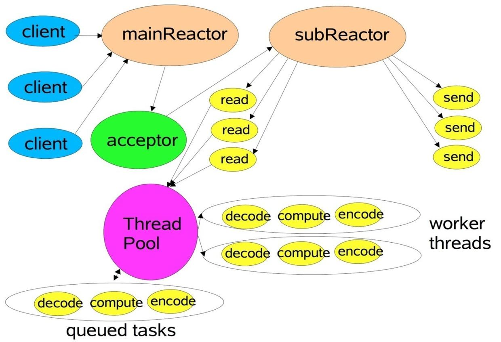
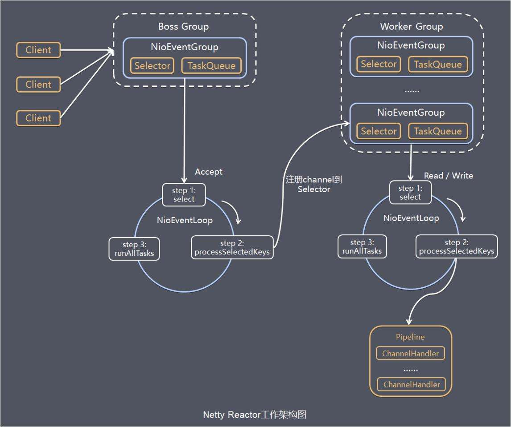

# 简介
## 对比于原生NIO
### Java原生包
- NIO的类库和API繁杂，使用麻烦，你需要熟练掌握Selector、ServerSocketChannel、SocketChannel、ByteBuffer等
- 需要具备其它的额外技能做铺垫，例如熟悉Java多线程编程，因为NIO编程涉及到Reactor模式，你必须对多线程和网路编程非常熟悉，才能编写出高质量的NIO程序
- 可靠性，开发工作量和难度都非常大。例如客户端面临断连重连、网络闪断、半包读写、失败缓存、网络拥塞和异常码流的处理等等，NIO编程的特点是功能开发相对容易，但是可靠性能力补齐工作量和难度都非常大
- JDK NIO的BUG，例如臭名昭著的epoll bug，它会导致Selector空轮询，最终导致CPU 100%。

### Netty
Netty的对JDK自带的NIO的API进行封装，解决上述问题，主要特点有：

- 设计优雅 适用于各种传输类型的统一API - 阻塞和非阻塞Socket 基于灵活且可扩展的事件模型，可以清晰地分离关注点 高度可定制的线程模型 - 单线程，一个或多个线程池 真正的无连接数据报套接字支持（自3.1起）
- 使用方便 详细记录的Javadoc，用户指南和示例 没有其他依赖项，JDK 5（Netty 3.x）或6（Netty 4.x）就足够了
- 高性能 吞吐量更高，延迟更低 减少资源消耗 最小化不必要的内存复制
安全 完整的SSL / TLS和StartTLS支持
- 社区活跃，不断更新 社区活跃，版本迭代周期短，发现的BUG可以被及时修复，同时，更多的新功能会被加入

# 模型
## 概述

Netty主要基于主从Reactors多线程模型，其中主从Reactor多线程模型有多个Reactor：MainReactor和SubReactor：


MainReactor负责客户端的连接请求，并将请求转交给SubReactor
SubReactor负责相应通道的IO读写请求;

非IO请求（具体逻辑处理）的任务则会直接写入队列，等待worker threads进行处理.

## 核心概念
   1、bootstrap、serverBootstrap：bootstrap的意思是引导，其主要作用是配置整个netty程序，将各个组件整合起来。serverBootstrap是服务器端的引导类。bootstrap用于连接远程主机它有一个EventLoopGroup ；serverBootstrap用于监听本地端口有两个EventLoopGroup。

　　2、eventLoop：eventLoop维护了一个线程和任务队列，支持异步提交执行任务。

　　3、eventLoopGroup：eventLoopGroup 主要是管理eventLoop的生命周期，可以将其看作是一个线程池，其内部维护了一组eventLoop，每个eventLoop对应处理多个Channel，而一个Channel只能对应一个eventLoop。

　　4、channelPipeLine：是一个包含channelHandler的list，用来设置channelHandler的执行顺序。

　　5、Channel：Channel代表一个实体（如一个硬件设备、一个文件、一个网络套接字或者一个能够执行一个或者多个不同的IO操作的程序组件）的开放链接，如读操作和写操作。

　　6、Futrue、ChannelFuture ：Future提供了另一种在操作完成时通知应用程序的方式。这个对象可以看作是一个异步操作结果的占位符；它将在未来的某个时刻完成，并提供对其结果的访问。netty的每一个出站操作都会返回一个ChannelFuture。future上面可以注册一个监听器，当对应的事件发生后会出发该监听器。

　　7、ChannelInitializer：它是一个特殊的ChannelInboundHandler,当channel注册到eventLoop上面时，对channel进行初始化

　　8、ChannelHandler：用来处理业务逻辑的代码，ChannelHandler是一个父接口，ChannelnboundHandler和ChannelOutboundHandler都继承了该接口，它们分别用来处理入站和出站。

　　9、ChannelHandlerContext:允许与其关联的ChannelHandler与它相关联的ChannlePipeline和其它ChannelHandler来进行交互。它可以通知相同ChannelPipeline中的下一个ChannelHandler，也可以对其所属的ChannelPipeline进行动态修改。

## 图解


- Netty抽象出两组线程池: 1. BossGroup负责接收客户端连接; 2. WorkerGroup负责网络Channel读写.
- 以上两Group都是NioEventLoopGroup, 主要管理eventLoop的生命周期，可以理解为一个线程池，内部维护了一组线程，每个线程(NioEventLoop)负责处理多个Channel上的事件，而一个Channel只对应于一个线程。NioEventLoopGroup可以有多个线程.
- NioEventLoop维护了一个线程和任务队列，支持异步提交执行任务，线程启动时会调用NioEventLoop的run方法，执行I/O任务和非I/O任务, 每个都有一个selector.
- Selector: Netty基于Selector对象实现I/O多路复用，通过 Selector, 一个线程可以监听多个连接的Channel事件, 当向一个Selector中注册Channel 后，Selector 内部的机制就可以自动不断地查询(select) 这些注册的Channel是否有已就绪的I/O事件(例如可读, 可写, 网络连接完成等)，这样程序就可以很简单地使用一个线程高效地管理多个 Channel。
- ChannelPipline: 保存ChannelHandler的List，用于处理或拦截Channel的入站事件和出站操作。 ChannelPipeline实现了一种高级形式的拦截过滤器模式，使用户可以完全控制事件的处理方式，以及Channel中各个的ChannelHandler如何相互交互。

# Boss Group下的NioEventGroup执行:
1. 轮询accept事件;
2. 监听到accept, 与client建立连接, 生成NioSocketChannel, 并将其注册到某个worker的NioEventLoop上的selector;
3. 处理任务, runAllTasks.

# Worker Group下的NioEventGroup执行:
1. 轮询read, write事件;
2. 监听到I/O, 在NioSocketChannel上进行处理;
3. 处理任务, runAllTasks.

# 一些自带的解码/编码器

以下东西用在给pipeline里通过addLast()方法增加handler:

- DelimiterBasedFrameDecoder ：分隔符解码器，以设定的符号作为消息的结束解决粘包问题

- FixedLengthFrameDecoder　：定长解码器，作用于定长的消息

- LineBasedFrameDecoder　　：按照每一行进行分割，也就是特殊的分隔符解码器，它的分割符为\n或者\r\n。

- LengthFieldBasedFrameDecoder　　：通过消息中设置的长度字段来进行粘包处理。该解码器总共有5个参数

- LengthFieldBasedFrameDecoder(int maxFrameLength,　　单个包的最大大小

　　　　　　　　　　　　　　　　　int lengthFieldOffset,　　 定义长度的字段的相对包开始的偏移量

　　　　　　　　　　　　　　　　　int lengthFieldLength,　　定义长度字段所占字节数

　　　　　　　　　　　　　　　　　int lengthAdjustment,　　lengthAdjustment  = 数据长度字段之后剩下包的字节数 -  数据长度取值（也就是长度字段之后的所有非数据的其他信息）

　　　　　　　　　　　　　　　　　int initialBytesToStrip)　　从包头开始，要忽略的字节数

 

- HttpRequestDecoder　　：将字节解码为HttpRequest、HttpContent和LastHttpContent消息

- HttpResponseDecoder　　：将字节解码为HttpResponse、HttpContent和LastHttpContent消息

- ReplayingDecoder　　：一个特殊的ByteToMessageDecoder ，可以在阻塞的i/o模式下实现非阻塞的解码。 ReplayingDecoder 和ByteToMessageDecoder 最大的不同就是ReplayingDecoder 允许你实现decode()和decodeLast()就像所有的字节已经接收到一样，不需要判断可用的字节

- Base64Decoder 　　：Base64编码器

- StringDecoder　　：将接收到的ByteBuf转化为String

- ByteArrayDecoder　　：将接收到的ByteBuf转化为byte 数组

- DatagramPacketDecoder　　：运用指定解码器来对接收到的DatagramPacket进行解码

- MsgpackDecoder　　：用于Msgpack序列化的解码器

- ProtobufDecoder　　：用于Protobuf协议传输的解码器

- HttpObjectAggregator ：将http消息的多个部分聚合起来形成一个FullHttpRequest或者FullHttpResponse消息。
 

- LengthFieldPrepender　　:将消息的长度添加到消息的前端的编码器，一般是和LengthFieldBasedFrameDecoder搭配使用

- HttpServerCodec　　:相当于HttpRequestDecoder和HttpResponseEncoder

- HttpClientCodec　　:相当于HttpRequestEncoder和HttpResponseDecoder

- ChunkedWriteHandler　　：在进行大文件传输的时候，一次将文件的全部内容映射到内存中，很有可能导致内存溢出，ChunkedWriteHandler可以解决大文件或者码流传输过程中可能发生的内存溢出问题

# 代码示例
## 服务端
```java
package org.example.netty.simple;

import io.netty.bootstrap.ServerBootstrap;
import io.netty.channel.ChannelFuture;
import io.netty.channel.ChannelInitializer;
import io.netty.channel.ChannelOption;
import io.netty.channel.EventLoopGroup;
import io.netty.channel.nio.NioEventLoopGroup;
import io.netty.channel.socket.SocketChannel;
import io.netty.channel.socket.nio.NioServerSocketChannel;
import io.netty.channel.socket.nio.NioSocketChannel;

/**
 * @author 996Worker
 * @description
 * @create 2022-02-21 13:18
 */
public class NettyServer {

    public static void main(String[] args) throws InterruptedException {
        // create BossGroup and WorkerGroup
        EventLoopGroup bossGroup = new NioEventLoopGroup();
        EventLoopGroup workerGroup = new NioEventLoopGroup();

        try {
            // configuration
            ServerBootstrap boot = new ServerBootstrap();

            boot.group(bossGroup, workerGroup)
                    .channel(NioServerSocketChannel.class) // 服务端channel实现
                    .option(ChannelOption.SO_BACKLOG, 128) // thread queue size
                    .childOption(ChannelOption.SO_KEEPALIVE, true) // keep connection alive
                    .childHandler(new ChannelInitializer<SocketChannel>() {
                        // set handler for pipeline
                        @Override
                        protected void initChannel(SocketChannel socketChannel) throws Exception {
                            socketChannel.pipeline().addLast(new MyNettyServerHandler());
                        }
                    });
            System.out.println("Server is ready");
            // set port
            // 绑定一个端口并同步, 生成一个ChannelFuture对象
            ChannelFuture sync = boot.bind(6668).sync();
            System.out.println("server started at 6668");

            // 对关闭通道的监听
            sync.channel().closeFuture().sync();
        } finally {
            bossGroup.shutdownGracefully();
            workerGroup.shutdownGracefully();
        }
    }
}
```

对pipeline需要的handler的定义:
```java
package org.example.netty.simple;

import io.netty.buffer.ByteBuf;
import io.netty.buffer.Unpooled;
import io.netty.channel.ChannelHandlerContext;
import io.netty.channel.ChannelInboundHandlerAdapter;
import io.netty.util.CharsetUtil;

/**
 * @author 996Worker
 * @description
 * @create 2022-02-21 13:35
 */

// 入站请求的handler
public class MyNettyServerHandler extends ChannelInboundHandlerAdapter {

    // 读取数据
    // ctx: 含有pipeLine, channel
    // msg: 客户端发送的数据
    @Override
    public void channelRead(ChannelHandlerContext ctx, Object msg) throws Exception {

        // msg to byteBuffer
        ByteBuf buf = (ByteBuf) msg;
        System.out.println("Received msg from: " + ctx.channel().remoteAddress());
        System.out.println("Client says: " + buf.toString(CharsetUtil.UTF_8));

    }

    // after数据读完
    @Override
    public void channelReadComplete(ChannelHandlerContext ctx) throws Exception {

        ctx.writeAndFlush(Unpooled.copiedBuffer("hello, I've received your message.", CharsetUtil.UTF_8));
    }

    // 处理异常

    @Override
    public void exceptionCaught(ChannelHandlerContext ctx, Throwable cause) throws Exception {
        System.out.println("An exception occurred, close the chan.");
        ctx.channel().close();
    }
}
```

## 客户端
```java
package org.example.netty.simple;

import io.netty.bootstrap.Bootstrap;
import io.netty.channel.ChannelFuture;
import io.netty.channel.ChannelInitializer;
import io.netty.channel.EventLoopGroup;
import io.netty.channel.nio.NioEventLoopGroup;
import io.netty.channel.socket.SocketChannel;
import io.netty.channel.socket.nio.NioSocketChannel;

/**
 * @author 996Worker
 * @description
 * @create 2022-02-21 15:52
 */
public class NettyClient {

    public static void main(String[] args) throws InterruptedException {
        // 客户端需要一个时间循环组

        EventLoopGroup eventExecutors = new NioEventLoopGroup();

        // 客户端使用Bootstrap启动对象, 不是ServerBootStrap
        Bootstrap bootstrap = new Bootstrap();

        try {
            // 设置相关参数
            bootstrap.group(eventExecutors)
                    .channel(NioSocketChannel.class) // 客户端Channel实现
                    .handler(new ChannelInitializer<SocketChannel>() {
                        @Override
                        protected void initChannel(SocketChannel socketChannel) throws Exception {
                            socketChannel.pipeline().addLast(new MyNettyClientHandler()); // 定义handler逻辑
                        }
                    });

            System.out.println("客户端Ok");
            ChannelFuture channelFuture = bootstrap.connect("127.0.0.1", 6668).sync();
            channelFuture.channel().closeFuture().sync();

        } finally {
            eventExecutors.shutdownGracefully();
        }
    }
}
```

对所需handler的定义:
```java
package org.example.netty.simple;

import io.netty.buffer.ByteBuf;
import io.netty.buffer.Unpooled;
import io.netty.channel.ChannelHandlerContext;
import io.netty.channel.ChannelInboundHandlerAdapter;
import io.netty.util.CharsetUtil;

/**
 * @author 996Worker
 * @description
 * @create 2022-02-21 16:02
 */
public class MyNettyClientHandler extends ChannelInboundHandlerAdapter {

    // 当CHnnel就绪就会触发的钩子函数
    @Override
    public void channelActive(ChannelHandlerContext ctx) throws Exception {
        System.out.println("client: " + ctx);
        ctx.writeAndFlush(Unpooled.copiedBuffer("hello, server!", CharsetUtil.UTF_8));
    }

    // 当Channel能读时触发
    @Override
    public void channelRead(ChannelHandlerContext ctx, Object msg) throws Exception {
        ByteBuf buf = (ByteBuf) msg;
        System.out.println("Server says: " + buf.toString(CharsetUtil.UTF_8));
        System.out.println("Server address: " + ctx.channel().remoteAddress());
    }

    @Override
    public void exceptionCaught(ChannelHandlerContext ctx, Throwable cause) throws Exception {
        System.out.println("An exception occurred in client, close the chan.");
        ctx.channel().close();
    }
}
```
# Pipeline用法简介
[netty源码分析之pipeline(一)](https://www.jianshu.com/p/6efa9c5fa702)
