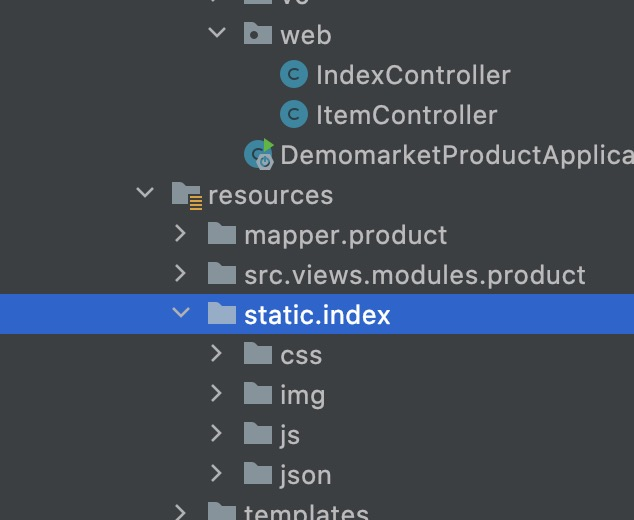
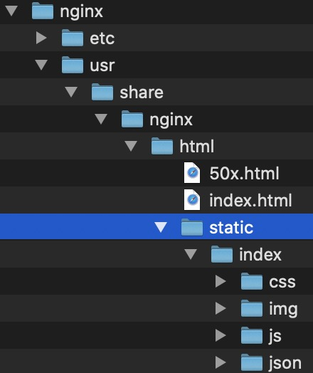
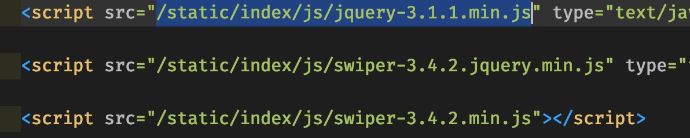
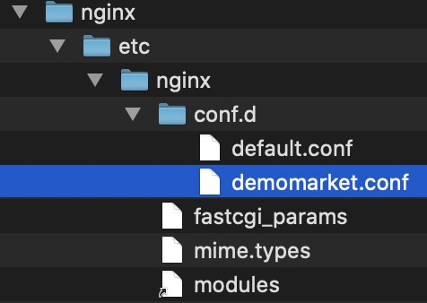

# 起因

我平时做项目,如果不是严格的前后端分离项目,静态资源会放在如图所示的地方:



当使用Nginx时,其实可以把静态资源放到Nginx目录下,再配置反向代理即可.

这样做的意义,是能够提升静态请求的吞吐效率,不用让Servlet容器每次都负责搬运静态资源,使其专注于动态部分就好了,而Nginx就负责应付静态资源的请求.

# 经过

1. 搬家静态目录,使其放到Nginx的`usr/share/nginx/html`目录下: 



2. 配置网页html, 给所有静态资源路径前加上`static`, 例如:

`<script src="/static/index/js/swiper-3.4.2.min.js"></script>`




3. 配置Nginx里对应网站的conf文件:

假设网站是使用`demomarket.conf`存储反向代理配置:


打开文件后, 如此书写配置: *注意资源托管注释位置*
```json
server {
    listen       80;
    listen  [::]:80;
    server_name  demomarket.com;

    # static 资源托管
    location /static/ {
        root /usr/share/nginx/html;
    }

    #access_log  /var/log/nginx/host.access.log  main;

    location / {
        proxy_set_header Host $host;
        proxy_pass http://demomarket;
    }

# 以下省略...
}
```

# 结果

经试验,成功地把静态资源从后端分离出来放到Nginx,实现了Nginx负责应付静态请求, 后台servlet容器专注动态请求.
