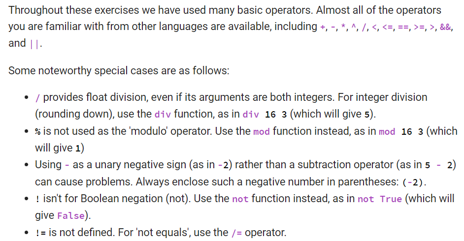
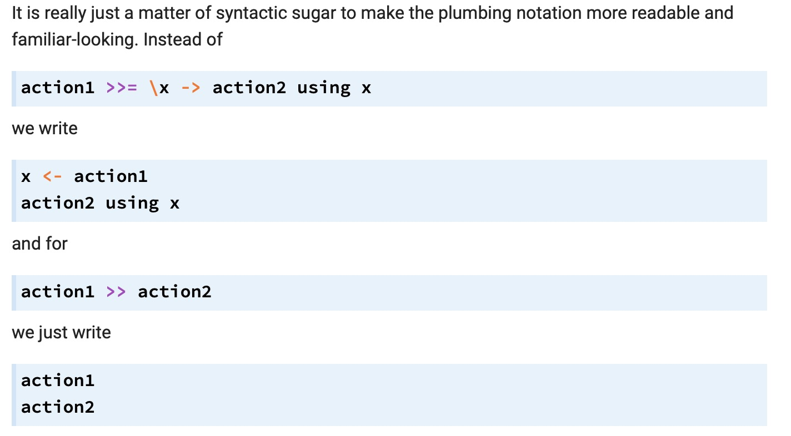
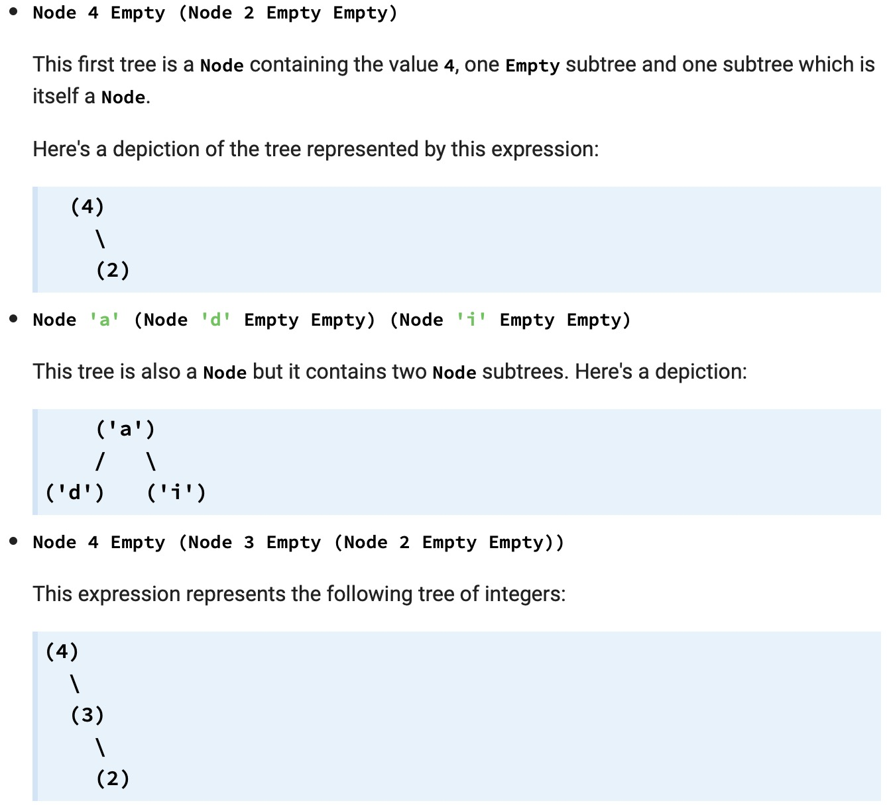

# Cheat Sheet
https://jutge.org/doc/haskell-cheat-sheet.pdf
https://wiki.haskell.org/H-99:_Ninety-Nine_Haskell_Problems

# Syntax
## basic
```
f :: Int -> Int
-- definition of f here
f x = x ^ 2 + 2 * x + 4

g :: Int -> (Int -> Int)
g x y = x * y
```

## types
We have already seen a few of Haskell's built-in basic types:

- Int,
- Integer, and
- Bool.
There are many more which you might expect, including:

- Char,
- String,
- Float, and
- Double.
You may have noticed that all these types begin with a capital letter. This is actually a general rule, with only a small number of exceptions.
- list: [Int]
- tuple: (Int,Char) is the type 'pairs of one integer and one character'. a list lets you store any number of values of one type a tuple lets you store a fixed number of values of different (but fixed) types

## type equivals
```
type Pair = (Int,Int)
```

- String is a type synonym for [Char]

e.g.
```
type Message = ([Char], Int)

valid :: Message -> Bool
valid (msg, mID) = correctLength && noSpaces && validID
    where
        correctLength = (length msg <= 140)
        noSpaces      = not (elem ' ' msg)
        validID       = mID >= 1000 && mID <= 9999
```

## type variables
```
qsort :: Ord a => [a] -> [a]
qsort [] = []
qsort (pivot:others) = (qsort lowers) ++ [pivot] ++ (qsort highers)
    where lowers  = filter (<pivot)  others
          highers = filter (>=pivot) others
```

## guard
```
fact :: Integer -> Integer
fact n
    | n < 0     = 0
    | n == 0    = 1
    | otherwise = n * fact (n-1)
```

## let in
在一个表达式里赋值，类似于`where`. 在let 分句定义变量，最后结果以in后的表达式为准。
```
pack (x:xs) = let (first,rest) = span (==x) xs
               in (x:first) : pack rest
pack [] = []
```

## operators


## lists
- range [1,2..6] gives [1,2,3,4,5,6]
- brutal range
```
range_list :: Int -> Int -> [Int]
range_list min max
  | min > max = []
  | otherwise = min : range_list (min+1) max
```

- recursive list
```
sum :: [Int] -> Int
sum []     = 0
sum (x:xs) = x + sum xs
```

## data
```
data MyBool = MyTrue | MyFalse

mynot :: MyBool -> MyBool
mynot MyTrue = MyFalse
mynot MyFalse = MyTrue

data Point = Pt Float Float

-- invert: reflect a point (x,y) in the line x = y
invert :: Point -> Point
invert (Pt x y) = Pt y x

data Font_Color
    = Name String | Hex Int | RGB Int Int Int
data Font_Attribute = Font_Size Int | Font_Face String | Font_Color Font_Color

data Font_tag = [Font_Attribute]
```

## recursive data type
```
data List a = ListNode a (List a) | ListEnd

-- define your function here
-- don't forget the type signature!

mymaximum  :: Ord a => List a -> a
mymaximum (ListNode a ListEnd) = a
mymaximum  (ListNode x xs)
 | (mymaximum  xs) > x = mymaximum  xs
 | otherwise = x
```

- derive
```
data MyBool = MyTrue | MyFalse
    deriving (Eq, Show)

data List a = ListNode a (List a) | ListEnd
    deriving (Eq, Show)
```
`show` *converts from values to string representations, and is used when ghci prints out the result of a function call for you*

## Maybe
```
maybeApply :: (a -> b) -> Maybe a -> Maybe b
maybeApply f Nothing = Nothing
maybeApply f (Just x) = Just (f x)
```

working:
```
maybeApply (+1) (Just 41)
maybeApply (+1) Nothing
```

**To remove the Just from the head of a string result, use IO:**
```
data ChessPiece = ChessPiece PieceColour PieceRank
toPieceColour :: Char -> Maybe PieceColour
toPieceColour 'B' = Just Black
toPieceColour 'W' = Just White
toPieceColour _   = Nothing

toPieceRank :: Char -> Maybe PieceRank
toPieceRank 'K' = Just King
toPieceRank 'Q' = Just Queen
toPieceRank 'R' = Just Rook
toPieceRank 'B' = Just Bishop
toPieceRank 'N' = Just Knight
toPieceRank 'P' = Just Pawn
toPieceRank _   = Nothing

-- 不报错
-- toChessPiece :: String -> Maybe ChessPiece
-- toChessPiece str =
--     case filter (/=' ') str of
--       [c,r] -> do
--         colour <- toPieceColour c
--         rank   <- toPieceRank r
--         return $ ChessPiece colour rank
--       _ -> Nothing

-- 报错 expected type ‘PieceColour’ with actual type ‘Maybe PieceColour’
toChessPiece str =
    case filter (/=' ') str of
      [c,r] -> 
        ChessPiece (toPieceColour c) (toPieceRank r)
      _ -> Nothing
```

## Alpha expression
```
linearEqn :: Num a => a -> a -> [a] -> [a]
linearEqn m n list = map (\x -> m*x + n) list
```

## simulate while loop
```
int mccarthy_91(int n)
{
    int c = 1;
    while (c != 0) {
        if (n > 100) {
            n = n - 10;
            c--;
        } else {
            n = n + 11;
            c++;
        }
    }
    return n;
}
```

```
-- The main challenge is the while loop. For the sake of illustration we
-- will solve a more general problem. Consider the following generic while
-- loop in C which updates variable x in each iteration:
-- while (cond(x))
--    x = next_version_of(x);
-- x = final_version_of(x);

-- It can be translated into Haskell as follows

mywhile x =
  if cond x then mywhile (next_version_of x)
  else final_version_of x

-- In the C code there are two variables, so we can make x a pair and use
-- the follo wing definitions of cond, next_version_of and final_version_of:

cond (c,n) = c /= 0
next_version_of (c,n) =
  if n > 100 then (c-1, n-10) else (c+1, n+11)

-- We simply have to call mywhile with the initial versions of c and n:

final_version_of (c,n) = n

mccarthy_91 :: Int -> Int
mccarthy_91 n = mywhile (1, n)
```

## IO
### out
```
putStr :: String -> IO ()
putStrLn :: String -> IO ()
print :: Show a => a -> IO ()
return :: a -> IO a
```
### in
```
getChar :: IO Char
getLine :: IO String
```

### File IO
```
main 
  = readFile "inp"                     >>= \s -> 
    writeFile "outp" (filter isAscii s) >> 
    putStr "Filtering successful\n"
```

### Do Notation
```
import Data.Char(isAscii)

main 
  = do
      putStr "Input file: "
      ifile <- getLine
      putStr "Output file: "
      ofile <- getLine
      s <- readFile ifile
      writeFile ofile (filter isAscii s)
      putStrLn "All done"
```

To ignore indentation:
```
import Data.Char(isAscii)
main 
  = do
      { putStr "Input file: "
      ; ifile <- getLine
      ; putStr "Output file: "
      ; ofile <- getLine
      ; s <- readFile ifile
      ; writeFile ofile (filter isAscii s)
      ; putStrLn "All done"
      }
```

other example
```
module Main where

import Data.Char
import System.Random

--  'main' selects a word to be guessed, then enters a dialogue with the
--  user to help them determine the secret word:
main :: IO ()
main
  = do
      dict <- readFile "words.txt"   -- get contents of file "words.txt"
      let words = lines dict         -- separate it into lines (here: words)
      let len = length words         -- count how many words we have
      play words len                 -- now play the game

--  The function 'play' allows the user to play again and again:
play :: [String] -> Int -> IO ()
play words n
  = do
      putStr "Want a challenge (y/n)? "
      answer <- getLine
      if (head answer) == 'y'
      then 
        do
          putStrLn "Okay, here it is:"
          ran <- getStdRandom (randomR (0,n-1))  -- random number in range
          let w = words!!ran                     -- w is the secret word;
          solve w []                             -- [] initial list of guesses
          play words n
      else 
        do
          putStrLn "Okay, bye"
          return ()

--  The interactive solver loop:
solve :: String -> String -> IO ()
solve word guesses
  = do
      let indic = indicator word guesses
      putStr ("         " ++ indic)
      if (all isAlpha indic)
        then putStrLn ("   " ++ show (length guesses) ++ " guesses")
        else do
               putStrLn ""
               guess <- response
               solve word (guess:guesses)

indicator :: String -> String -> String
indicator w gs
  = [if c `elem` gs then c else '-' | c <- w]

--  Handling the user's input may also require a loop (if input is invalid):
response :: IO Char
response
  = do
      putStr "guess> "
      gs <- getLine
      if length gs == 1 && isAlpha (head gs)
        then return (toLower (head gs))
        else do
              putStrLn "Just a single letter!"
              response
```

## >> and >>=
```
main 
  = readFile "inp"                     >>= \s -> 
    writeFile "outp" (filter isAscii s) >> 
    putStr "Filtering successful\n"
```

**Note: Do notation is grammar sugar for >> and >>=.**



## Random
Extract a given number of randomly selected elements from a list.
```
λ> rnd_select "abcdefgh" 3 >>= putStrLn
eda
```

```
rnd_select xs n = do
    gen <- getStdGen
    return $ take n [ xs !! x | x <- randomRs (0, (length xs) - 1) gen]
```

## show
```
module ChessPiece (ChessPiece, toChessPiece) where

data ChessPiece = ChessPiece PieceColour PieceRank

data PieceColour = Black | White

data PieceRank = King | Queen | Rook | Bishop | Knight | Pawn

instance Show ChessPiece where
    show (ChessPiece c r) = show c ++ show r

instance Show PieceColour where
    show Black = "B"
    show White = "W"

instance Show PieceRank where
    show King   = "K"
    show Queen  = "Q"
    show Rook   = "R"
    show Bishop = "B"
    show Knight = "N"
    show Pawn   = "P"

toChessPiece :: String -> Maybe ChessPiece
toChessPiece str =
    case filter (/=' ') str of
      [c,r] -> do
        colour <- toPieceColour c
        rank   <- toPieceRank r
        return $ ChessPiece colour rank
      _ -> Nothing

toPieceColour :: Char -> Maybe PieceColour
toPieceColour 'B' = Just Black
toPieceColour 'W' = Just White
toPieceColour _   = Nothing

toPieceRank :: Char -> Maybe PieceRank
toPieceRank 'K' = Just King
toPieceRank 'Q' = Just Queen
toPieceRank 'R' = Just Rook
toPieceRank 'B' = Just Bishop
toPieceRank 'N' = Just Knight
toPieceRank 'P' = Just Pawn
toPieceRank _   = Nothing
```

# Data structure
## list
see previous.

### Generators
- [x^2 | x <- [1..6]]
- [(-x) | x <- [1..6]]
- [even x | x <- [1..6]]

```
    [    x^2   | x <- [1..6] ]
     '--------' '----------'
     expression  generator
```

mymap:
```
myMap :: (a -> b) -> [a] -> [b]
-- define your function here!
myMap f xs = [f x |x <- xs]
```

### Filters
- [x^2 | x <- [1..12], even x]
```
    [    x^2   | x <- [1..12], even x ]
     '--------' '-----------' '------'
     expression   generator    filter
```

应用:
```
checkPair :: Char -> Char -> Bool
checkPair x y
  | (x == 'A' && y == 'T') || (x == 'T' && y == 'A') = True
  | (x == 'C' && y == 'G') || (x == 'G' && y == 'C') = True
  | otherwise = False

compDNA :: String -> String -> Bool
compDNA str1 str2 = (==) (length str1) (length [x | (x,y) <- zip str1 str2, checkPair x y]) 
```

- Nesting filters
```
l = [ x++" "++y
    | x <- ["hello", "fly away", "come back"]
    , length x > 7
    , y <- ["peter", "matthew", "paul"]
    , length y < 7
    ]
```
结果:
```
["fly away peter","fly away paul","come back peter","come back paul"]
```
是嵌套循环, 如果并行同时遍历需要用到zip. zip函数在之后介绍.
## set
```
import Set

same_letters :: String -> String -> Bool
same_letters word1 word2 = (set word1) == (set word2)

-- copy this function into the appropriate place
-- inside Set.hs

set_intersect :: Ord a => Set a -> Set a -> Set a
set_intersect (Set es) b
  = set (filter (`set_elem` b) es)
```

## tree
```
data Tree a = Node a (Tree a) (Tree a) | Empty
```



### size of tree
how many nodes
```
data Tree a = Node a (Tree a) (Tree a) | Empty

size :: Tree a -> Int
size Empty = 0
size (Node x l r) = 1 + size l + size r
```

### height of tree
height which takes a binary tree and calculates its height: the number of nodes in the longest path from root to leaf.
```
data Tree a = Node a (Tree a) (Tree a) | Empty

-- define your function here
-- don't forget the type signature!
height :: Tree a -> Int
height Empty    = 0
height (Node x l r) = 1 + (max (height l) (height r))
```

### inorder traverse into a list
```
data Tree a = Node a (Tree a) (Tree a) | Empty

-- define your function here
-- don't forget the type signature!

elements :: Tree a -> [a]
elements Empty    = []
elements (Node x l r)  = (elements l) ++ [x] ++ (elements r)
```

### Binary search
be kept in the usual **binary search tree** order
```
data Tree a = Node a (Tree a) (Tree a) | Empty

search :: Ord a => a -> Tree a -> Bool
search x Empty = False
search x (Node y l r)
 | x == y = True
 | x < y = search x l
 | x > y = search x r
```

### Binary insert
```
data Tree a = Node a (Tree a) (Tree a) | Empty
    deriving Show

-- define your function here
-- don't forget the type signature!
insert :: Ord a => a -> Tree a -> Tree a
insert y Empty = (Node y Empty Empty)
insert y (Node x l r)
 | y == x    = (Node x l r)
 | y < x     = (Node x (insert y l) r)
 | otherwise = (Node x l (insert y r))
```

### Binary build tree
e.g.
```
Main> buildtree [4,2,6]
Node 6 (Node 2 Empty (Node 4 Empty Empty)) Empty
```

```
data Tree a = Node a (Tree a) (Tree a) | Empty
    deriving Show

-- copy over your solution to the previous exercise,
-- so that you have access to the 'insert' function
insert :: Ord a => a -> Tree a -> Tree a
insert y Empty = (Node y Empty Empty)
insert y (Node x l r)
 | y == x    = (Node x l r)
 | y < x     = (Node x (insert y l) r)
 | otherwise = (Node x l (insert y r))

-- define your function here
-- don't forget the type signature!
buildtree :: Ord a => [a] -> Tree a
buildtree [] = Empty
buildtree (x:xs) = insert x (buildtree xs)
```

## Construct Binary tree
```
data Tree a = Empty | Branch a (Tree a) (Tree a) deriving (Show, Eq)
leaf x = Branch x Empty Empty

main = putStrLn $ concatMap (\t -> show t ++ "\n") balTrees
    where balTrees = filter isBalancedTree (makeTrees 'x' 4)

isBalancedTree :: Tree a -> Bool
isBalancedTree Empty = True
isBalancedTree (Branch _ l r) = abs (countBranches l - countBranches r) <= 1
                                && isBalancedTree l && isBalancedTree r
isBalancedTree _ = False

countBranches :: Tree a -> Int
countBranches Empty = 0
countBranches (Branch _ l r) = 1 + countBranches l + countBranches r

-- makes all possible trees filled with the given number of nodes
-- and fill them with the given value
makeTrees :: a -> Int -> [Tree a]
makeTrees _ 0 = []
makeTrees c 1 = [leaf c]
makeTrees c n = lonly ++ ronly ++ landr
    where lonly  = [Branch c t Empty | t <- smallerTree]
          ronly = [Branch c Empty t | t <- smallerTree]
          landr = concat [[Branch c l r | l <- fst lrtrees, r <- snd lrtrees] | lrtrees <- treeMinusTwo]
          smallerTree = makeTrees c (n-1)
          treeMinusTwo = [(makeTrees c num, makeTrees c (n-1-num)) | num <- [0..n-2]]
```

## Expression Tree
e.g.
```
           (x)
         /     \
      (-)       (+)
     /   \     /   \
   (x)   (3) (1)   (1)
  /   \
(4)   (6)
```

```
data Expr
    = Number Int
    | Plus   Expr Expr
    | Minus  Expr Expr
    | Times  Expr Expr
    | Divide Expr Expr
```

### evaluate 
```
data Expr
    = Number Int
    | Plus   Expr Expr
    | Minus  Expr Expr
    | Times  Expr Expr
    | Divide Expr Expr

-- define your function here
-- don't forget the type signature!
evaluate :: Expr -> Int
evaluate (Number x) = x
evaluate (Plus x y) = evaluate x + evaluate y
evaluate (Minus x y) = evaluate x - evaluate y
evaluate (Times x y) = evaluate x * evaluate y
evaluate (Divide x y) = div (evaluate x) (evaluate y)
```

# Functions
## fib
```
fib :: Int -> Int
-- define fib function here
fib 0 = 0
fib 1 = 1
fib x = fib (x - 1) + fib (x - 2)
```

## fact
```
fact :: Integer -> Integer
fact n
    | n < 0     = 0
    | n == 0    = 1
    | otherwise = n * fact (n-1)
```

## leap year
```
leap :: Int -> Bool
leap year
    | year `mod` 4   /= 0 = False
    | year `mod` 100 /= 0 = True
    | year `mod` 400 /= 0 = False
    | otherwise           = True
```

## xor
```
-- 'xor' is really just the same as
-- 'not equals' for Booleans:

xor :: Bool -> Bool -> Bool
xor x y = x /= y

-- That was too easy!
-- Here are some alternative solutions:

-- By enumerating all patterns:

xor' False False = False
xor' False True  = True
xor' True  False = True
xor' True  True  = False
```

## head
built-in

```
-- Define your myHead and myTail functions here
myHead [] = error "no head for null"
myHead (x:_) = x

myTail [] = error "no tail for null"
myTail (_:xs) = xs
```

## last
```
last [x] = x

last (x:xs) = last xs
```

## append
```
append [] lst = lst
append (e:es) lst = e : append es lst
```

## reverse
```
-- Define your myReverse function here
append [] lst = lst
append (e:es) lst = e:append es lst

myReverse []    = []
myReverse (x:xs) = append (myReverse xs) [x]
```

## getNthElem
Implement a function getNthElem which takes an integer n and a list, and returns the nth element of the list.
```
getNthElem n [] = error "n was too big in getn"
getNthElem n (x:xs)
   | n > 1     = getNthElem (n-1) xs
   | n == 1    = x
   | otherwise = error "n was too small in getn"
```

## isEven
```
isEven 0 = True
isEven 1 = False
isEven (n + 2) = isEven n

-- or
evn :: Int -> Bool
evn x = (x `mod` 2 == 0)
```

## maximum
```
maximum :: [Int] -> Int
maximum [x] = x
maximum (x:xs)
    | x > maxxs = x
    | otherwise = maxxs
    where maxxs = maximum xs
```

## search
```
search :: Int -> [Int] -> Bool
search x [] = False
search x (y:ys)
    | x == y    = True
    | otherwise = search x ys
```

## bsearch
```
bsearch :: Int -> [Int] -> Bool
bsearch x [] = False
bsearch x list
    | x == mid_val    = True
    | x < mid_val     = bsearch x (take mid_index list)
    | otherwise       = bsearch x (drop (mid_index + 1) list)
    where mid_index = div (length list) 2
          mid_val = list !! mid_index
```

## qsort
```
qsort :: [Int] -> [Int]
qsort [] = []
qsort (pivot:others) = (qsort lowers) ++ [pivot] ++ (qsort highers)
    where lowers  = filter (<pivot)  others
          highers = filter (>=pivot) others
```

## merge sort, msort
```
msort :: [Int] -> [Int]
msort [] = []
msort [x] = [x]
msort xs = merge (msort lefts) (msort rights)
    where lefts = take mid_index xs
          rights = drop mid_index xs
          mid_index = (length xs) `div` 2

merge :: [Int] -> [Int] -> [Int]
merge [] ys = ys
merge xs [] = xs
merge (x:xs) (y:ys)
    | x < y    = x:merge xs (y:ys)
    | otherwise  = y:merge (x:xs) ys
```

## treesort
```

data Tree a = Empty | Node (Tree a) a (Tree a)

treesort::  Ord a => [a] -> [a]
treesort xs = tree_inorder (list_to_bst xs)

list_to_bst:: Ord a => [a] -> Tree a
list_to_bst [] = Empty
list_to_bst (x:xs) = bst_insert x (list_to_bst xs)

bst_insert:: Ord a => a  -> Tree a -> Tree a
bst_insert i Empty = Node Empty i Empty
bst_insert i (Node l v r)
        | i <= v = (Node (bst_insert i l) v r)
        | i  > v = (Node l v (bst_insert i r))

tree_inorder:: Tree a -> [a]
tree_inorder Empty = []
tree_inorder (Node l v r) = tree_inorder l ++ (v:(tree_inorder r))
```

## set equal
takes two lists of integers and checks if they are made from the same set of distinct elements.
```
import Data.List

setEq :: [Int] -> [Int] -> Bool
setEq xs ys = sort (nub xs) == sort (nub ys)
```

## freqs
e.g.
```
Main> freqs [2,2,1,3,4,4,4]
[1,2,1,3]
```

```
import Data.List

freqs :: [Int] -> [Int]
freqs xs = map length group_res
    where group_res = group (sort xs)
```

## longestPrefix
returns the longest common prefix of two lists. 
ie: When applied to "extras" and "extreme", the function should return "extr".
```
longestPrefix :: Eq a => [a] -> [a] -> [a]
longestPrefix [] _ = []
longestPrefix _ [] = []
longestPrefix (x:xs) (y:ys)
  | x == y    = x:(longestPrefix xs ys)
  | otherwise = []
```

## list built-ins
- `length` computes the number of elements in a list
- `reverse` reverse a list
- `null` returns True if a list is empty, and False otherwise
- the `!!` operator gets the nth element of a list, as in `[1,2,3,4] !! 2`, which gives us `3` (note zero-based list indexing).
- the `++` operator joins two lists together, as in `[1,2] ++ [3,4]`, which gives us `[1,2,3,4]`

`head` and `tail` separate a list into its first and remaining elements:

```
       1  [2,  3,  4,  5,  6,  7,  8,  9,  10]
head --'   <--------------tail-------------->
```
`last` and `init` do just the opposite:
```
[1,  2,  3,  4,  5,  6,  7,  8,  9]  10
 <---------------init------------>   '-- last
 ```
`take n` and `drop n` split the list at an arbitrary point. For example, using 4 for n:
```
[1,  2,  3,  4] [5,  6,  7,  8,  9,  10]
 <--take 4--->   <-------drop 4------->
 ```
 ### zip
 已集成。 `zip :: [a] -> [b] -> [(a, b)]`
`zip` takes two lists and returns a list of pairs of elements, where the elements in each pair share the same list index.
```
dot xs ys = sum [x*y | (x, y) <- zip xs ys]
```

### concat
```
concat [[1, 2, 3], [4, 5], [6], []]
```

### replicate
`replicate :: Int -> a -> [a]`
```
replicate 4 True
[True,True,True,True]
```

### concatMap
```
>>> concatMap (take 3) [[1..], [10..], [100..], [1000..]]
[1,2,3,10,11,12,100,101,102,1000,1001,1002]
```

 ## Data.List built-ins
 ```
 import Data.List
 ```
- `group` separates a list into sublists of adjacent, matching numbers. For example, `group [1,1,3,3,2,1]` gives `[[1,1],[3,3],[2],[1]]`.
- `nub` removes all duplicates from a list. That is, `nub [1,1,3,3,2,1]` gives `[1,3,2]`.
- `delete x` removes **the first occurrence of x** from a list. For example, `delete 3 [2,3,4,3]` gives `[2,4,3]`.
- The operator `\\` deletes each of the elements of one list from another list: `[1,2,3,2] \\ [2,1]` gives `[3,2]`.
- `map`
```
map (\e -> e*e) x
```
- `dropWhile`
dropWhile p xs returns the suffix remaining after takeWhile p xs.
**Warning: 一旦条件不满足，则dropWhile的drop操作停止，其余的不做判断全部返回**
```
>>> dropWhile (< 3) [1,2,3,4,5,1,2,3]
[3,4,5,1,2,3]
>>> dropWhile (< 9) [1,2,3]
[]
>>> dropWhile (< 0) [1,2,3]
[1,2,3]
```

- span
基于一个条件，分离一个list成为两个表的元组，不成立的在后.
```
>>> span (< 3) [1,2,3,4,1,2,3,4]
([1,2],[3,4,1,2,3,4])
>>> span (< 9) [1,2,3]
([1,2,3],[])
>>> span (< 0) [1,2,3]
([],[1,2,3])
```

### 排列组合
**Combination**
```
λ> combinations 3 "abcdef"
["abc","abd","abe",...]
```

```
combinations :: Int -> [a] -> [[a]]
combinations 0 _ = [[]]
combinations n xs = [ xs !! i : x | i <- [0..(length xs)-1] 
                                  , x <- combinations (n-1) (drop (i+1) xs) ]
```

数学:
```
import Prelude
choose :: Integer -> Integer -> Integer
choose x y = div (product [1..x]) ((product [1..y]) * (product [1..(x - y)]))
```
用法:
```
Main> choose 6 3
20
```

### Sort By
Sorting a list of lists according to length of sublists
```
λ> lsort ["abc","de","fgh","de","ijkl","mn","o"]
["o","de","de","mn","abc","fgh","ijkl"]
```

```
import List

lsort :: [[a]] -> [[a]]
lsort = sortBy (\xs ys -> compare (length xs) (length ys))
```
