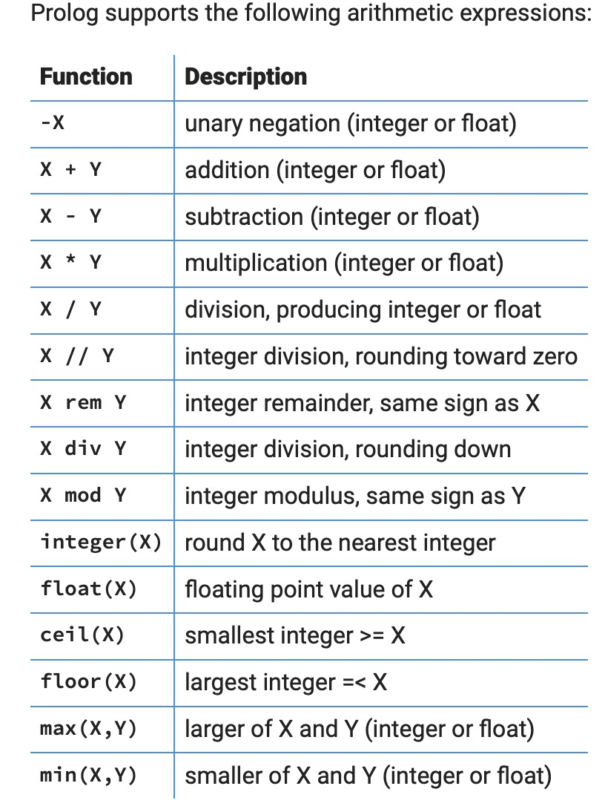
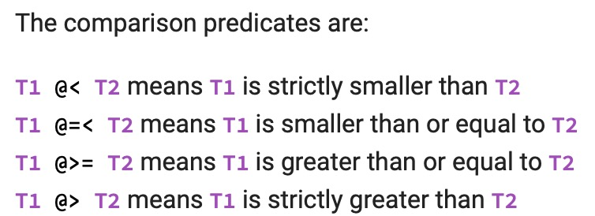
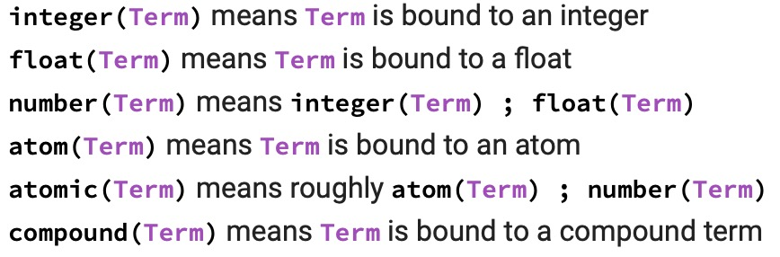
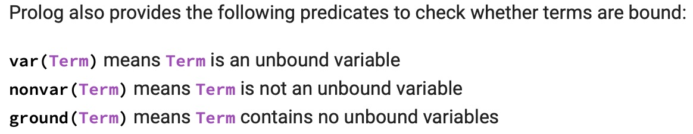
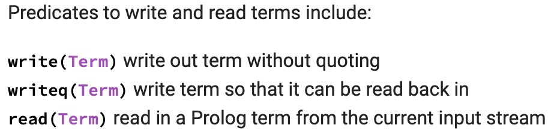
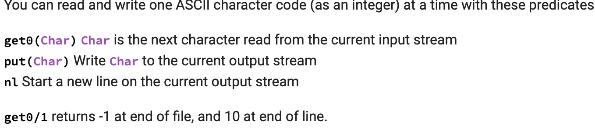

# Intro

Fast notes for preparing exam

# links
https://kalabovi.org/pitel:flp:99pl
https://www.ic.unicamp.br/~meidanis/courses/mc336/2009s2/prolog/problemas/

# Prolog

## syntac
- Atom: A string of characters, butch , big_kahuna_burger; An arbitrary sequence of characters enclosed in single quotes, ’ Vincent ’, ’ The  Gimp ’;  A string of special characters, @= and ====> and ; and :- are all atoms.
- Numbers: 23 , 1001 , 0 , -365
- Variables: X , Y , Variable , _tag , X_526 , List , List24 , _head , Tail , _input and Output are all Prolog variables.
- Compound terms:  A compound term begins with a **functor**, which is an atom, and follows with one or more terms as arguments, enclosed within parentheses and separated by commas: `card(clubs, 3)`.
- Facts: The clauses simply say some relationship holds.
- Rules: The rule specifies that the relationship in the head holds if the body holds: `classmates(X, Y) :- enrolled(X, Class), enrolled(Y, Class).`
- List: `[E|Es]`, `[E1,E2,E3|Es]`.
- Import package: `:- ensure_loaded(borders).`

## logic

- And: `enrolled(S, maths), enrolled(S, logic).`
- Or: `enrolled(S, logic) ; enrolled(S, maths).`
- Negation: `enrolled(S, logic), \+ enrolled(S, maths).`
- Disequality: Prolog also defines a not equal predicate, spelled \=, for convenience. `X \= Y` always behaves **the same as**` \+ X = Y`
 	- **++Note++:**  Negations, including `\=`, should be written **after goals that bind all the variables used in the negation**: `X = bob, Y = alice, X \= Y.`

## Unification
Two terms can be unified roughly like this:

1. If one of the terms to be unified is a variable, it is bound to the other term; unification succeeds. 如果一个项是变量, 绑定至另一个任意项,则可继续unify, 否则挂.
2. If the two terms are identical atomic terms, the unification succeeds. 如果两项是相同的atom, 则可继续unify;
3. If the two terms are both compound, with the same functor, the arguments of the two terms are unified pairwise; unification succeeds if and only if all the pairs of arguments can be unified. 如果两项是compound, 并且两项functor相同, 当且仅当两项的argument也必须能两两对应unify, 则可继续unify,否则挂.
4. otherwise, the unification fails. 其他情况均挂.


## 算数 Arithmetic
Arithmetic in Prolog works through the special is/2 predicate, **which evaluates expressions**:
```
?- X is 6*7.
X = 42.

?- X = 6*7.
X = 6*7.
```
++Note: the right argument of is/2 must be a ground term.++


| Predicates | Desc                                      |
| ---------- | ----------------------------------------- |
| V is Expr  | Unify V with the value of expression Expr |
|      Expr1 =:= Expr2      |                    Succeeds if the values of Expr1 and Expr2 are equal                       |
|       Expr1 =\= Expr2     |                 Succeeds if the values of Expr1 and Expr2 are different                          |
|         Expr1 < Expr2   |                          <                 |
|       Expr1 =< Expr2     |                  =<                         |
|          Expr1 > Expr2  |                     >                      |
|      Expr1 >= Expr2      |                     >=                      |

In all of these cases, **arithmetic expressions must be ground at the time of the predicate call.**



## Terms Comparation
- Numbers are always considered smaller than atoms, and both are smaller than compound terms. 
- A compound term A is smaller than compound term B if the arity of A is smaller than the arity of B. 
- If their arities are the same, the compound term with the smaller functor is smaller. 
- If their arities and functors are the same, then the term with the smaller first argument is smaller. 
- If arities, functors and first arguments are the same, the second argument is considered, and so on.
- Variables are smaller than any bound term.



```
?- a @< b.
true.

?- a @>= 3.
true.

?- f(2) @< f(1,2).
true.

?- f(2,1) @< f(1,2).
false.

?- X @< a.
true.

?- X @< a, X = b.
X = b.
```

Prolog has predicates to test if two terms are identical, including the variables, without binding any variables.
```
X == Y
X \== Y
```
These check for indentity without binding variables
```
?- X == Y.
false.

?- X = Y, X == Y.
X = Y.

?- X \== Y.
true.

?- X \== Y, X = Y.
X = Y.

?- X = f(A,B,3), Y = f(A,B,3), X == Y.
X = Y, Y = f(A, B, 3).

?- X = f(A,B,3), Y = f(p,B,3), X == Y.
false.
```

## Type Testing

As usual, these goals reflect the state of the argument when they are executed. This means they are sensitive to goal order
```
?- X = 42, integer(X).
X = 42.

?- integer(X), X = 42.
false.
```



## IO

```
?- write('Hello, world!').
Hello, world!
true.

?- writeq('Hello, world!').
'Hello, world!'
true.

?- write(f(X,g(X),'a b c')).
f(_18534,g(_18534),a b c)
true.

?- read(X).
|: f(_18534,g(_18534),'a b c').

X = f(_20192, g(_20192), 'a b c').
```



## 常用函数/算法
### append
`append/3`, 已集成.
```Prolog
append([], Ys, Ys).
append([X|Xs], Ys, [X|Zs]) :-
        append(Xs, Ys, Zs).
```
使用
```prolog
?- append([1,2], [3,4,5], List).
List = [1, 2, 3, 4, 5].

?- append([1,2], List, [1,2,3,4,5]).
List = [3, 4, 5].

?- append([3,4], List, [1,2,3,4,5]).
false.

?- Front = [_,_], append(Front, Back, [1,2,3,4,5]).
Front = [1, 2],
Back = [3, 4, 5].
```
### sort
已集成
`sort(List0, List)`
`List` contains all the elements of `List0` in sorted order **with duplicates removed**. Because duplicates are removed, this is not usually the sorting predicate you want.

`msort(List0, List)`
`List` contains all the elements of `List0` in sorted order **without removing duplicates**. This is usually the sorting predicate you want.

`keysort(List0, List)`
`List0` is a list of Key-Value pairs, and `List` is a list of the same pairs sorted by the Keys, but not by the Values. This is a stable sort, so pairs with the same value will appear in List in the same relative order they appear in List0. For example:
```
?- keysort([a-2,b-3,a-1], L).
L = [a-2, a-1, b-3].
```

### length
已集成
```prolog
?- length([a,b,c], Len).
Len = 3.

?- length(List, 3).
List = [_7224, _7230, _7236].
```

### take
取出前几个元素
```
take(N, List, Front) :-
        length(Front,N),
        append(Front, _, List).
        
% mode-sensitive的实现方法
take(N, List, Front) :-
    (   nonvar(N)
    ->  length(Front, N),
        append(Front, _, List)
    ;   append(Front, _, List),
        length(Front, N)
    ).
```

### member
已集成, member(E, List) holds when E is one of the elements of List.
```
?- member(c, [a,b,c,d,e]).
true ;
false.

?- member(X, [a,b,c]).
X = a ;
X = b ;
X = c.
```

### select
已集成, select(Elem, List1, List2) is like member(Elem, List1), except that List2 is everything in List1 other than Elem. You can use this to **remove a single occurrence of Elem from List1**, or to **insert Elem in any place in List2**, or to select an element of List1, producing one element plus the rest of the list. 
```
?- select(c, [a,b,c,d,e], List).
List = [a, b, d, e] ;
false.

?- select(x, List, [a,b,c]).
List = [x, a, b, c] ;
List = [a, x, b, c] ;
List = [a, b, x, c] ;
List = [a, b, c, x] ;
false.

?- select(Elem, [a,b,c], Rest).
Elem = a,
Rest = [b, c] ;
Elem = b,
Rest = [a, c] ;
Elem = c,
Rest = [a, b].
```

### nth0(Index, List, Elem)
已集成, inds the nth element of List, where n counts from 0. But it can also determine at what position Elem appears in List, and can even produce the elements of List together with their positions.
```
?- nth0(3, [a,b,c,d,e], Elem).
Elem = d.

?- nth0(N, [a,b,c,d,e], d).
N = 3 ;
false.

?- nth0(N, [a,b,c], Elem).
N = 0,
Elem = a ;
N = 1,
Elem = b ;
N = 2,
Elem = c.
```

### nth0(N, List, Elem, Rest) 
It can be used to remove an element from a list by position, or by value while providing the position, or to insert an element into a list in a particular position.
```
?- nth0(3, [a,b,c,d,e], Elem, Rest).
Elem = d,
Rest = [a, b, c, e].

?- nth0(N, [a,b,c,d,e], d, Rest).
N = 3,
Rest = [a, b, c, e] ;
false.
```

### all_in
```
all_in([], _).
all_in([E|Es], L) :-
    member(E, L),
    all_in(Es, L).
```

### same_elements
ll elements of list L1 are in L2 and vice versa, though **they may be in different orders and have different numbers of occurrences of the elements. **
```
same_elements(L1, L2) :-
    all_in(L1, L2),
    all_in(L2, L1).

all_in([], _).
all_in([E|Es], L) :-
    member(E, L),
    all_in(Es, L).
    
% n log(n) time implementation
same_elements(L1, L2) :-
    sort(L1, Sorted),
    sort(L2, Sorted).
```

### all_same
```
listof(_, []).
listof(Elt, [Elt|List]) :-
	listof(Elt, List).

all_same(List) :-
	listof(_, List).
```

### adacent
Implement the predicate adjacent(E1, E2, List) such that E1 appears immediately before E2 in List. 
```
adjacent(E1, E2, List) :- 
    append(_, [E1, E2|_], List).
    
% 递归解法
adjacent(E1, E2, [E1,E2|_]).
adjacent(E1, E2, [_|Tail]) :- 
    adjacent(E1, E2, Tail).
```

### before
 E1 and E2 are both elements of List, where E2 occurrs after E1 on List. 
```
before(E1, E2, [E1|List]) :-
	member(E2, List).

% 递归解法
before(E1, E2, [_|List]) :-
	before(E1, E2, List).
```

### sumlist
```
sumlist([], 0).
sumlist([X|Xs], Sum) :-
    sumlist(Xs, S1),
    Sum is X + S1.
    
% 尾递归
% tail recursive
sumlist(List, Sum) :-
	sumlist(List, 0, Sum).

sumlist([], Sum, Sum).
sumlist([N|Ns], Sum0, Sum) :-
	Sum1 is Sum0 + N,
	sumlist(Ns, Sum1, Sum).
```

### replace
this holds when list L1 is the same as L2, except that in one place where L1 has the value E1, L2 has E2.

replace(2,[1,2,3,4],5,X) should have only the solution X = [1,5,3,4].

replace(2,[1,2,3,2,1],5,X) should backtrack over the solutions X = [1,5,3,2,1] and X = [1,2,3,5,1].

```
replace(E1,[E1|Xs],E2,[E2|Xs]).

replace(E1,[H|Hs],E2,[H|Ts]):-
  replace(E1,Hs,E2,Ts).
```

### zip
zip(As, Bs, ABs)

zip([1,2,3,4],[a,b,c,d],L) should have only the solution L=[1-a,2-b,3-c,4-d]].

zip(X,Y,[1-a,2-b,3-c,4-d]) should have only the solution X=[1,2,3,4], Y=[a,b,c,d].

```
zip([],[],[]).
zip([H|T],[H1|T1],[H-H1|T2]) :- 
    zip(T,T1,T2).
```

### setof(Template, Goal, List)
`setof(Template, Goal, List)`
`List` is a list of all the instances of Template that satisfy Goal. **List is sorted (using @=</2 order)**, **with duplicates removed**; thus List is really **a set of solutions in a canonical order**.
```
?- setof(S, enrolled(alice, S), Subjects).
Subjects = [logic, maths].

?- setof(D-T, class(logic, D, T), Lectures).
Lectures = [monday-10, wednesday-10].

?- setof(S, enrolled(Student, S), Subjects).
Student = alice,
Subjects = [logic, maths] ;
Student = bob,
Subjects = [maths] ;
Student = claire,
Subjects = [physics] ;
Student = don,
Subjects = [art_history, logic].
```
### bagof
which is just like setof/3, except that it **does not sort and remove duplicates**. The order Prolog returns solutions and the number of times it returns a solution are not supposed to be significant, and bagof/3 is sensitive to these things, so setof/3 is a more logical predicate.

### findall
indall/3 which is similar to bagof/3, except that any variable appearing in the Goal but not the Template is implicitly existentially quantified. Also findall/3 produces an empty list if there are no solutions to the Goal
```
?- findall(S, enrolled(Student, S), Subjects).
Subjects = [logic, maths, maths, physics, logic, art_history].

?- findall(S, enrolled(ted, S), Subjects).
Subjects = [].
```

### sublist
sublist(Xs, Ys).
this holds when Xs is a list containing some of the elements of Ys, in the same order they appear in the list Ys. 
```
sublist([], _).
sublist([H| Rest1], [H| Rest2]) :- 
    sublist(Rest1, Rest2).
sublist(H, [_ | Rest2]) :- 
    sublist(H, Rest2).
```

### reverse
```
reverse([], Acc, Acc).
reverse([X|Rest], Acc0, Acc1) :- 
    reverse(Rest, [X|Acc0], Acc1).
```

### ints_between
```
ints_between(N, N, [N]).
ints_between(N0, N, [N0|List]) :-
        N0 < N,
        N1 is N0 + 1,
        ints_between(N1, N, List).
        
%  使用if else
ints_between(N0, N, List) :-
        (   N0 < N
        ->  List = [N0|List1],
            N1 is N0 + 1,
            ints_between(N1, N, List1)
        ;   N0 = N,
            List = [N]
        ).
```

### maplist
已集成
`maplist(+Pred, +List)`
holds if Pred succeeds for each element of List. 

```
?- maplist(student, [bob,claire,don]).
true.

?- maplist(enrolled(Student), [X,Y]), X\=Y.
Student = alice,
X = logic,
Y = maths ;
Student = alice,
X = maths,
Y = logic ;
Student = don,
X = logic,
Y = art_history ;
Student = don,
X = art_history,
Y = logic ;
false.
```

`maplist(+Pred, ?List1, ?List2)`
holds if Pred succeeds for corresponding elements of List1 and List2. This is similar to the Haskell `map` function. For example:
```
?- maplist(enrolled, [alice,claire,don], Subjects).
Subjects = [logic, physics, logic] ;
Subjects = [logic, physics, art_history] ;
Subjects = [maths, physics, logic] ;
Subjects = [maths, physics, art_history].

?- maplist(enrolled, Students, [logic,art_history]).
Students = [alice, don] ;
Students = [don, don].
```
### tree
二叉搜索树相关
`intset_member(N, Set)` such that N is a member of integer set Set.
`intset_insert(N, Set0, Set)` such that Set is the same as Set0, except that Set has N as a member.
```
intset_member(N, tree(_,N,_)).
intset_member(N, tree(L,N0,_)) :-
	N < N0,
	intset_member(N, L).
intset_member(N, tree(_,N0,R)) :-
	N > N0,
	intset_member(N, R).

intset_insert(N, empty, tree(empty,N,empty)).
intset_insert(N, tree(L,N,R), tree(L,N,R)).
intset_insert(N, tree(L0,N0,R), tree(L,N0,R)) :-
	N < N0,
	intset_insert(N, L0, L).
intset_insert(N, tree(L,N0,R0), tree(L,N0,R)) :-
	N > N0,
	intset_insert(N, R0, R).
```

### more tree

Given a binary tree defined to satisfy the predicate tree/1 
```
tree(empty).
tree(node(Left,_,Right)) :-
    tree(Left),
    tree(Right).
```

二叉树中序遍历
```
tree_list(empty, []).
tree_list(node(Left,Elt,Right), List) :-
	tree_list(Left, List1),
	tree_list(Right, List2),
	append(List1, [Elt|List2], List).
    
% 尾递归版本
% implement your tree_list(Tree, List) predicate
tree_list(Tree, List) :-
	tree_list(Tree, List, []).

tree_list(empty, List, List).
tree_list(node(Left,Elt,Right), List, List0) :-
	tree_list(Left, List, List1),
	List1 = [Elt|List2],
	tree_list(Right, List2, List0).
```

平衡树
Write a predicate `list_tree(List, Tree)` that holds when Tree is a balanced tree whose elements are the elements of List, in the order they appear in List.
```
list_tree([], empty).
list_tree([E|List], node(Left,Elt,Right)) :-
	length(List, Len),
	Len2 is Len // 2,
	length(Front, Len2),
	append(Front, [Elt|Back], [E|List]),
	list_tree(Front, Left),
	list_tree(Back, Right).
```

## More built-ins, cheatlist
- https://www.cs.oswego.edu/~odendahl/coursework/notes/prolog/synopsis/con.html
