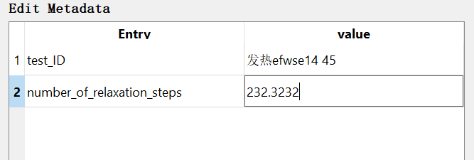

# Requirement
We have a QTableWidget, and several rows can only take numeric inputs, for example:



# Solution

Use a Helper Delegate Class:
```python
class NumericDelegate(QStyledItemDelegate):
    """
    Delegate class to only take number input for table view
    """
    def createEditor(self, parent, option, index):
        editor = super(NumericDelegate, self).createEditor(parent, option, index)
        if isinstance(editor, QLineEdit):
            reg_ex = QRegExp("[0-9]+.?[0-9]{,12}")
            validator = QRegExpValidator(reg_ex, editor)
            editor.setValidator(validator)
        return editor
```

Then use it in the row you needed:
```python
# value column
            type_text = metadata_dict['type'].lower()
            if type_text == NUMBER_METADATA_TYPE:
                value_item = QTableWidgetItem('0')

                # set item only take numerical inputs
                num_input_delegate = NumericDelegate(self.__ui.metadataTableWidget)
                self.__ui.metadataTableWidget.setItemDelegateForRow(i, num_input_delegate)

            else:
                value_item = QTableWidgetItem('none')

            value_item.setFlags(Qt.ItemIsEnabled | Qt.ItemIsSelectable | Qt.ItemIsEditable)
            self.__ui.metadataTableWidget.setItem(i, 1, value_item)
```
