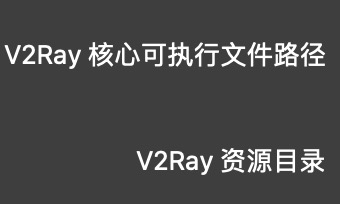
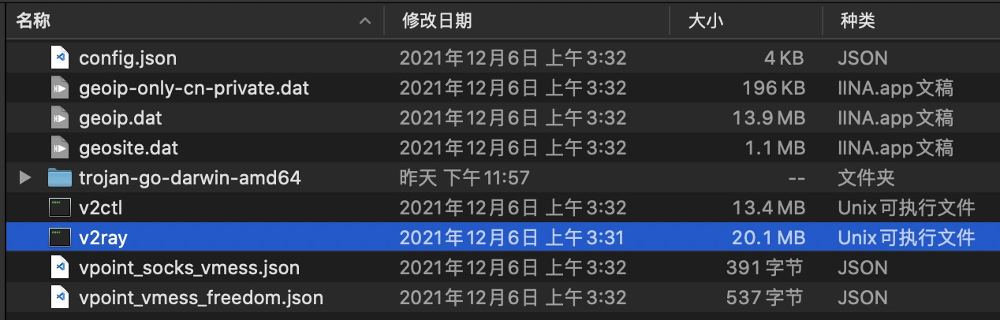
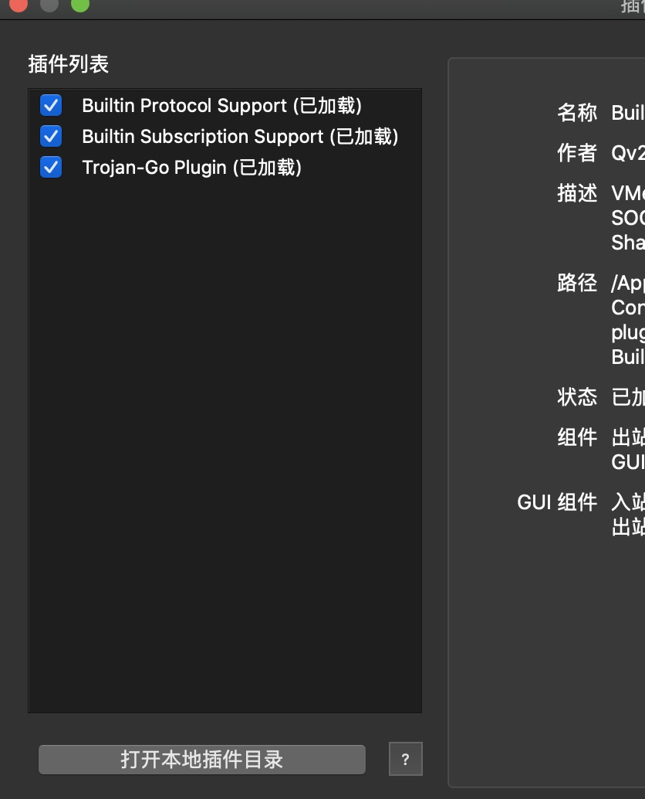
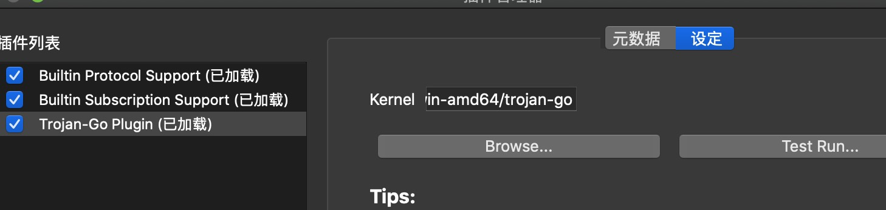
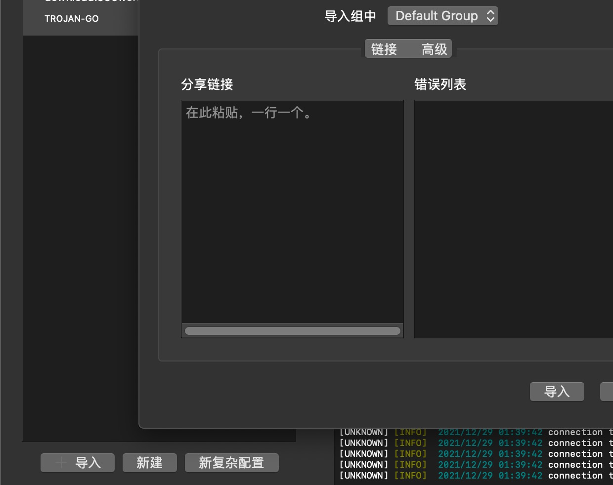

# 敬告读者

使用Trojan-go技术网上冲浪只为海外学子在凶险可怖的西方国家居住时,提供如同国内一般安全祥和的网络学习环境, 请勿将其用作非法获得海外数据的手段, 或者发布, 传播与居住地区法规相悖的信息. 

中国大陆用户请严格遵守中华人民共和国政府颁布的《互联网信息服务管理办法》第十五条「九不准」规定以及「七条底线」等相关法律法规。对于含有以下内容的信息，必须予以杜绝：

>反对宪法所确定的基本原则的；
危害国家安全，泄露国家秘密，颠覆国家政权，破坏国家统一的；
损害国家荣誉和利益的；
煽动民族仇恨、民族歧视，破坏民族团结的；
侮辱、滥用英烈形象，否定英烈事迹，美化粉饰侵略战争行为的；
破坏国家宗教政策，宣扬邪教和封建迷信的；
散布谣言，扰乱社会秩序，破坏社会稳定的；
散布淫秽、色情、赌博、暴力、凶杀、恐怖或者教唆犯罪的；
煽动非法集会、结社、游行、示威、聚众扰乱社会秩序的；
侮辱或者诽谤他人，侵害他们合法权益的；
含有法律、行政法规禁止的其他内容的。

# 下载Qv2ray
在[Github Release](https://github.com/Qv2ray/Qv2ray/releases)上找所需的发行版本, 下载之.

# 安装V2ray核心
因为规定, Qv2ray只是个单纯的GUI界面, 需要V2ray核心使其能够进行业务.

同样请在[Github Release](https://github.com/v2fly/v2ray-core/releases)这里下载所需的发行版本.

# 配置核心
下载完核心压缩包, 解压出一个文件夹, 咱们可以给他改成一个好记的名字, 放在好记的目录里.

进入Qv2ray软件, 有个首选项(Preference), 进入后进入核心设置(Kernel啥啥的), 需要配置两个路径

- V2Ray核心可执行文件路径: 这就是你之前下载的核心文件包里所含的可执行程序的路径. Windows系统里这个可执行程序名一般叫`v2ray.exe`, Unix系的一般就是`v2ray`:

- V2Ray资源目录: 就是那个核心文件包的路径(整个文件夹).

**注意:**
核心可执行文件是**v2ray**, 别搞错成qv2ray了. qv2ray是那个GUI程序本体！设置成这样就会无穷递归打开Qv2ray.

# 插件
如你所见, qv2ray默认支持是v2ray, 其他的功能, 比如`trojan-go`, `SSR`还需要额外的插件.

qv2ray主界面有个插件(plugin)按钮, 点击进入插件页面, 再点击页面里的`打开本地插件目录`, 会弹出资源管理器里的plugin文件夹, 在这里面安插件.

今天我们安装`trojan-go`插件, 其下载地址https://github.com/Qv2ray/QvPlugin-Trojan-Go/releases/tag/v3.0.0

下载得到的文件（.dll / .dylib / .so）放入之前弹出的plugin文件夹里。重启qv2ray, 再到主界面里点击插件按钮, 就能发现插件出现了:

然后还要配置插件的核心kernel, 插件菜单有个设定, 进入后要设定一个kernel地址, 这个需要安装(就和之前安装v2ray核心差不多).

下载地址: https://github.com/p4gefau1t/trojan-go/releases
解压到一个好记得地址, 然后将设定里的路径指向那个可执行文件:

点击测试, 看能不能回显出可执行文件的相关信息.

完成以后在插件列表看看插件勾选了没有, 勾选上, 重启qv2ray.

# 配置导入
重启qv2ray后, 凭借插件你才能导入`trojan-go`的配置链接. 服务端配置正确的话, 使用了正确的分享链接, 是能够通过CDN进行ws连接的.

# 结束

接下来你就迈上了信息高速公路, 开始网上冲浪了.

