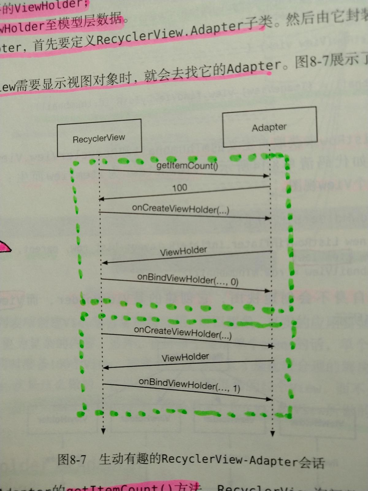

# 1.简介
用户滑动屏幕切换视图时，上一个视图会回收利用，RecyclerView所做的就是回收再利用，循环往复。

- ViewHolder
 ViewHolder的主要任务：**容纳View视图。**

- Adapter
 Adapter从模型层获取数据，然后提供给RecyclerView显示，是沟通的桥梁。Adapter主要的任务是：**创建ViewHolder**和**将模型层的数据绑定到ViewHolder上**。


*RecyclerView与Adapter交互*


首先，调用`Adapter.getItemCount()`方法，RecyclerView询问数组列表中包含多少个待展示的视图。

接着，RecyclerView调用`Adapter.onCreateViewHolder(ViewGroup, int)`创建ViewHolder。

最后，RecyclerView会传入ViewHolder及其位置，调用`onBindViewHolder(ViewHolder, int)`方法。Adapter会找到目标位置的数据并将其绑定到ViewHolder的视图上。

需要注意的是相对于`onBindViewHolder()`，`onCreateViewHolder()`方法调用并不频繁。一旦有了够用的ViewHolder，RecyclerView就会停止调用onCreateViewHolder()方法。随后，它会回收利用旧的ViewHolder以节约时间和内存。

---
# 2.ViewHolder

ViewHolder承载的是**每一个列表项item的视图**，所以当使用RecyclerView的时候需要先对ViewHolder进行初始化定义。e.g.

```java
private class CrimeHolder extends RecyclerView.ViewHolder {
          public CrimeHolder(LayoutInflater inflater, ViewGroup parent) {
            super(inflater.inflate(R.layout.list_item_crime, parent, false));
      }
}
```

---
3.Adapter

 当需要显示新创建的ViewHolder或让数据和已创建的ViewHolder关联时，就会用到Adapter。在Adapter中通常需要实现3个方法：


- onCreateViewHolder(ViewGroup parent, int viewType)
 当需要新的ViewHolder来显示列表项时，会调用onCreateViewHolder方法 去创建ViewHolder。

```java
public CrimeHolder onCreateViewHolder(ViewGroup parent, int viewType) {
      LayoutInflater layoutInflater = LayoutInflater.from(getActivity());
      return new CrimeHolder(layoutInflater, parent);
}
```


- onBindViewHolder(CrimeHolder holder, int position)
 将DTO数据绑定在ViewHolder上。

```java
public void onBindViewHolder(CrimeHolder holder, int position) {
        holder.bind(position);
}
```


- getItemCount()
 返回总共要显示的列表的数量(创建的ViewHolder数量比前者要小得多)。

```java
public int getItemCount() {
        return list.size();
}
```
