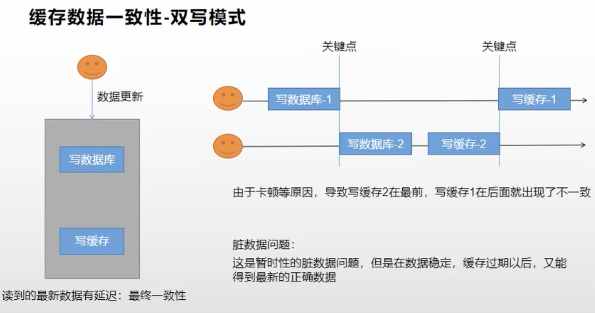
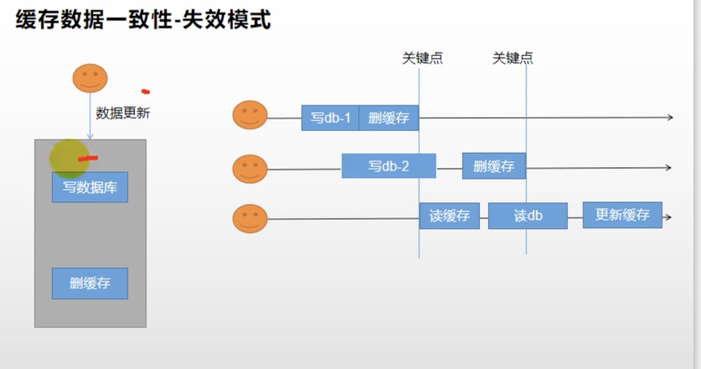
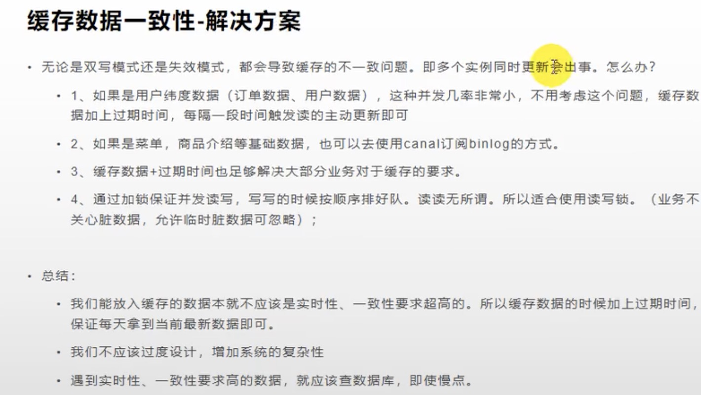

# 概述
[GayHub链接](https://github.com/redisson/redisson).

Redisson是一个在Redis的基础上实现的Java驻内存数据网格（In-Memory Data Grid）。


它不仅提供了一系列的分布式的Java常用对象，还提供了许多分布式服务。其中包括(BitSet, Set, Multimap, SortedSet, Map, List, Queue, BlockingQueue, Deque, BlockingDeque, Semaphore, Lock, AtomicLong, CountDownLatch, Publish / Subscribe, Bloom filter, Remote service, Spring cache, Executor service, Live Object service, Scheduler service) Redisson提供了使用Redis的最简单和最便捷的方法。

Redisson的宗旨是促进使用者对Redis的关注分离（Separation of Concern），从而让使用者能够将精力更集中地放在处理业务逻辑上。

# 使用

今天是在Java Spring Cloud下使用.

- 1.引入pom依赖
```xml
 <dependency>
          <groupId>org.redisson</groupId>
          <artifactId>redisson</artifactId>
          <version>3.12.0</version>
</dependency>
```

- 2.配置方法
今天讲程序化配置单节点模式的方法(Bean config方式). 也可以用配置文件配置. 按下图写配置Bean:

```java
@Configuration
public class MyRedissonConfig {

    /**
     * 所有对Redisson的使用都是通过RedissonClient
     * @return
     * @throws IOException
     */
    @Bean(destroyMethod="shutdown")
    public RedissonClient redisson() throws IOException {
        //1、创建配置
        Config config = new Config();

        // 单节点模式
        config.useSingleServer().setAddress("redis://127.0.0.1:6380");

        //2、根据Config创建出RedissonClient实例
        //Redis url should start with redis:// or rediss://
        return Redisson.create(config);
    }

}
```

# 分布式锁

里面的分布式锁实现了Java的JUC接口,用法和使用本地锁差不多.
以下记录两种主要锁的用法, 其余的可以去文档自查.

## 可重入锁
代码示例:
```java
@ResponseBody
    @GetMapping(value = "/hello")
    public String hello() {

        //1、获取一把锁，只要锁的名字一样，就是同一把锁
        RLock myLock = redisson.getLock("my-lock");

        //2、加锁
        myLock.lock();      //阻塞式等待。默认加的锁都是30s
        //1）、锁的自动续期，如果业务超长，运行期间自动锁上新的30s。不用担心业务时间长，锁自动过期被删掉
        //2）、加锁的业务只要运行完成，就不会给当前锁续期，即使不手动解锁，锁默认会在30s内自动过期，不会产生死锁问题
        // myLock.lock(10,TimeUnit.SECONDS);   //10秒钟自动解锁,自动解锁时间一定要大于业务执行时间
        //问题：在锁时间到了以后，不会自动续期
        //1、如果我们传递了锁的超时时间，框架底层就发送给redis执行脚本，进行占锁，默认超时就是 我们制定的时间
        //2、如果我们指定锁的超时时间，就使用 lockWatchdogTimeout = 30 * 1000 【看门狗默认时间】
        //只要占锁成功，就会启动一个定时任务【重新给锁设置过期时间，
        //新的过期时间就是看门狗的默认时间】,每隔10秒都会自动的再次续期，续成30秒
        // internalLockLeaseTime 【看门狗时间】 / 3， 10s
        try {
            System.out.println("加锁成功，执行业务..." + Thread.currentThread().getId());
            try { TimeUnit.SECONDS.sleep(20); } catch (InterruptedException e) { e.printStackTrace(); }
        } catch (Exception ex) {
            ex.printStackTrace();
        } finally {
            //3、解锁  假设解锁代码没有运行，Redisson会不会出现死锁
            System.out.println("释放锁..." + Thread.currentThread().getId());
            myLock.unlock();
        }

        return "hello";
    }
```

其加锁实际上就是在Redis里加一个锁信号量记录.(和我们在博文 [分布式系统中使用互斥锁解决缓存击穿问题](https://blog.996workers.icu/archives/fen-bu-shi-xi-tong-zhong-shi-yong-hu-chi-suo-jie-jue-huan-cun-ji-chuan-wen-ti) 手写的代码逻辑差不多)

不过其能够实现锁的超时时间自动续期, 就不用担心长时间任务执行期间锁过期.

默认加锁时间30sec.

## 读写锁 (ReadWriteLock)

**读**

```java
@GetMapping(value = "/read")
    @ResponseBody
    public String readValue() {
        String s = "";
        RReadWriteLock readWriteLock = redisson.getReadWriteLock("rw-lock");
        //加读锁
        RLock rLock = readWriteLock.readLock();
        try {
            rLock.lock();
            ValueOperations<String, String> ops = stringRedisTemplate.opsForValue();
            s = ops.get("writeValue");
            try { TimeUnit.SECONDS.sleep(10); } catch (InterruptedException e) { e.printStackTrace(); }
        } catch (Exception e) {
            e.printStackTrace();
        } finally {
            rLock.unlock();
        }

        return s;
    }
```


**写**
```java
/**
     * 保证一定能读到最新数据，修改期间，写锁是一个排它锁（互斥锁、独享锁），读锁是一个共享锁
     * 写锁没释放读锁必须等待
     * 读 + 读 ：相当于无锁，并发读，只会在Redis中记录好，所有当前的读锁。他们都会同时加锁成功
     * 写 + 读 ：必须等待写锁释放
     * 写 + 写 ：阻塞方式
     * 读 + 写 ：有读锁。写也需要等待
     * 只要有读或者写的存都必须等待
     * @return
     */
    @GetMapping(value = "/write")
    @ResponseBody
    public String writeValue() {
        String s = "";
        RReadWriteLock readWriteLock = redisson.getReadWriteLock("rw-lock");
        RLock rLock = readWriteLock.writeLock();
        try {
            //1、改数据加写锁，读数据加读锁
            rLock.lock();
            s = UUID.randomUUID().toString();
            ValueOperations<String, String> ops = stringRedisTemplate.opsForValue();
            ops.set("writeValue",s);
            TimeUnit.SECONDS.sleep(10);
        } catch (InterruptedException e) {
            e.printStackTrace();
        } finally {
            rLock.unlock();
        }

        return s;
    }
```

## 两个AQS锁使用
今天讲两个, 倒计时器(CountDownLatch)和信号量(Semaphore), 代码示例如下:
```java
/**
     * 车库停车
     * 3车位
     * 信号量也可以做分布式限流
     */
    @GetMapping(value = "/park")
    @ResponseBody
    public String park() throws InterruptedException {

        RSemaphore park = redisson.getSemaphore("park");
        park.acquire();     //获取一个信号、获取一个值,占一个车位
        boolean flag = park.tryAcquire();

        if (flag) {
            //执行业务
        } else {
            return "error";
        }

        return "ok=>" + flag;
    }

    @GetMapping(value = "/go")
    @ResponseBody
    public String go() {
        RSemaphore park = redisson.getSemaphore("park");
        park.release();     //释放一个车位
        return "ok";
    }


    /**
     * 放假、锁门
     * 1班没人了
     * 5个班，全部走完，我们才可以锁大门
     * 分布式闭锁
     */

    @GetMapping(value = "/lockDoor")
    @ResponseBody
    public String lockDoor() throws InterruptedException {

        RCountDownLatch door = redisson.getCountDownLatch("door");
        door.trySetCount(5);
        door.await();       //等待闭锁完成

        return "放假了...";
    }

    @GetMapping(value = "/gogogo/{id}")
    @ResponseBody
    public String gogogo(@PathVariable("id") Long id) {
        RCountDownLatch door = redisson.getCountDownLatch("door");
        door.countDown();       //计数-1

        return id + "班的人都走了...";
    }
```

其实就是和Java JUC下的锁的使用方法一致.

# 保证缓存数据一致性的两种模式
## 双写模式



## 失效模式




## 两种模式的问题


**以上两种模式将会在新文章里面结合Spring Cloud Cache讨论实例.**
# 一个真实应用示例

使用Redisson框架.

```java
/**
     * 缓存里的数据如何和数据库的数据保持一致？？
     * 缓存数据一致性
     * 1)、双写模式
     * 2)、失效模式
     * @return
     */

    public Map<String, List<Catelog2Vo>> getCatalogJsonFromDbWithRedissonLock() {

        //1、占分布式锁。去redis占坑
        //（锁的粒度，越细越快:具体缓存的是某个数据，11号商品） product-11-lock
        //RLock catalogJsonLock = redissonClient.getLock("catalogJson-lock");
        //创建读锁
        RReadWriteLock readWriteLock = redissonClient.getReadWriteLock("catalogJson-lock");

        RLock rLock = readWriteLock.readLock();

        Map<String, List<Catelog2Vo>> dataFromDb = null;
        try {
            rLock.lock();
            //加锁成功...执行业务
            dataFromDb = getDataFromDb();
        } finally {
            rLock.unlock();
        }
        //先去redis查询下保证当前的锁是自己的
        //获取值对比，对比成功删除=原子性 lua脚本解锁
        // String lockValue = stringRedisTemplate.opsForValue().get("lock");
        // if (uuid.equals(lockValue)) {
        //     //删除我自己的锁
        //     stringRedisTemplate.delete("lock");
        // }

        return dataFromDb;

    }
```

# 总结

这个框架实现分布式锁的本质, 就是在Redis里新建lock字段, 里面存储UUID,充当锁信号量, 再结合Lua脚本实现原子操作.

在开发过程中, 大多数情况下可以使用Redisson框架的分布式读写锁解决问题. 然后缓存数据加上过期时间, 过期了, 下次查询就触发主动更新缓存, 保证最终一致性.
