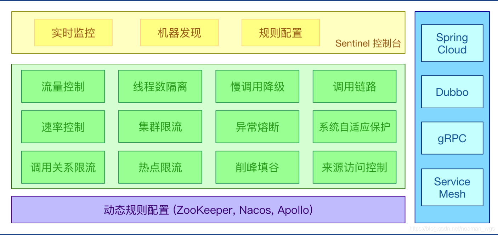

# 转载
sentinel基本概念
资源:
资源是sentinel的关键概念,它可以是Java应用程序中的任何内容,例如由应用程序提供的服务,或由应用程序调用其他应用提供的服务,甚至可以是一段代码.
规则:
围绕资源的实时状态设定的规则,可以包括流量控制规则,熔断降级规则,以及系统保护规则,所有规则都可以动态实时调整.

流量控制
流量控制在网络传输中是一个常用的概念,它用于调整网络包的发送数据. 流量控制(Flow Control)，原理是监控应用流量的QPS或并发线程数等指标，当达到指定阈值时对流量进行控制，避免系统被瞬时的流量高峰冲垮，保障应用高可用性。

sentinel流量控制设计理念
流量控制有内下几个角度:
1.资源的调用关系,例如资源的调用链路,资源和资源之间的关系
2.运行指标,例如QPS,线程池,系统负载等
3.控制的效果,例如直接限流,冷启动,排队

熔断降级
由于调用关系的复杂性，如果调用链路中的某个资源不稳定，最终会导致请求发生堆积。Sentinel 熔断降级会在调用链路中某个资源出现不稳定状态时（例如调用超时或异常比例升高），对这个资源的调用进行限制，让请求快速失败，避免影响到其它的资源而导致级联错误。当资源被降级后，在接下来的降级时间窗口之内，对该资源的调用都自动熔断（默认行为是抛出 DegradeException）。

熔断降级设计理念
在限制的手段上,sentinel和hystrix采取了完全不一样的方法.

Hystrix通过线程池的方式,来对依赖(对应sentinel中的资源)进行隔离.这样做的好处是资源和资源之间做到了最彻底的隔离.缺点是除了增加了线程切换的成本,还需要预先给各个资源做线程池大小的分配.

Sentinel有两种方式
1.通过并发线程数进行限制
Sentinel通过限制资源并发线程的数量,来减少不稳定资源对其他资源的影响.这样不但没有线程切换的损耗,也不需要预先分配线程池大小.当某个资源出现不稳定的情况下,例如相应时间变长,对资源的直接影响就是会造成线程数的逐步堆积.当线程数在特定资源上堆积到一定的数量之后,对该资源的新请求就会被拒绝.堆积的线程完成任务后才开始继续接受请求.
2.通过响应时间对资源进行降级
除了对并发线程数进行控制以外,sentinel还可以通过响应时间来快速降级不稳定的资源.当依赖的资源出现响应时间过长后,所有对资源的访问都会被直接拒绝,直接过了指定的时间之后才重新恢复.

系统负载保护
sentinel同时对系统的维度提供保护,防止雪崩.当系统负载较高的时候,如果还持续让请求进入,可能会导致系统崩溃,无法响应.在集群环境下,网络负载均衡会把本应这台机器承载的流量转发到其他机器上去.如果这个时候其它机器也处于一个边缘状态,这个增加的流量就会导致这台机器也崩溃,最后导致整个集群不可用.

# 推荐文章
[Sentinel介绍和使用](https://blog.csdn.net/noaman_wgs/article/details/103328793)

# Copyrights
作者：Audience0
链接：https://www.jianshu.com/p/6d94eb640fac
来源：简书
著作权归作者所有。商业转载请联系作者获得授权，非商业转载请注明出处。
