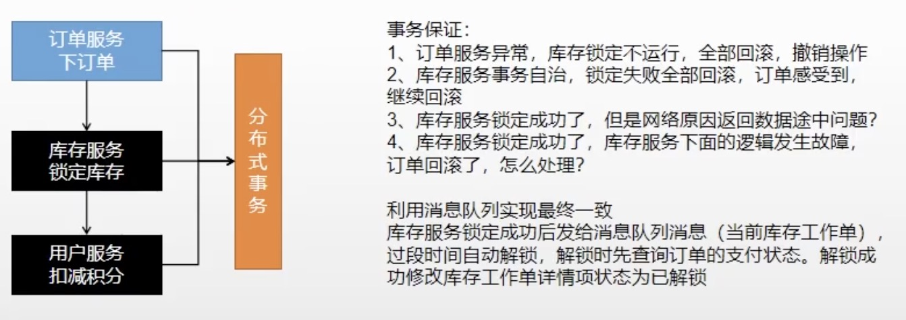
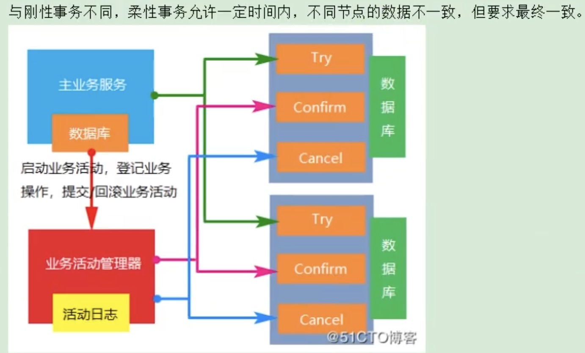
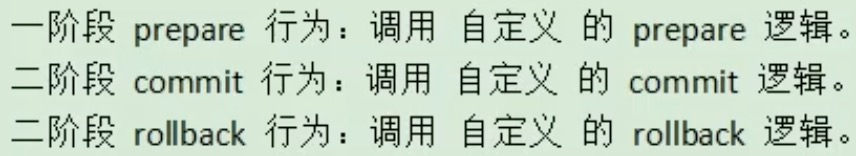

# 概念

其实和之前谈论的分布式锁一样. 在单个服务中的本地事务在微服务场景下不得劲(只能控制本地事务的回滚, 但控制不了其他服务). 以下是一个需要应用分布式事务的场景:



# 本地事务

几个关键词需要复习: ACID; 隔离级别; 传播行为; 本地事务失效问题.

## 本地事务失效/本类方法调用事务失效问题
须格外注意本地事务失效问题: 同一个对象内,事务方法互调默认失效. 原因方法调用没有经过代理对象, 而事务是要求通过代理对象实现的

解决: 引入一个aspectj, 这样能通过注解`@EnableAspectJAutoProxy(exposeProxy = true)`开启代理, 所有动态代理对象都是通过aspectj对外暴露代理对象.

示例:

首先, 在主程序入口方法头上注解: `@EnableAspectJAutoProxy(exposeProxy = true)`

然后, 在业务代码里:
```java
public class EmployeeService{
 @Transactional
 public void save(){
    try {      

        // 获取代理对象来调用带事务的方法  
        EmployeeService proxy =(EmployeeService) AopContext.currentProxy();
        proxy.a();
        proxy.b();
    }catch (Exception e){
        e.printStackTrace();
    }
 }

 @Transactional
 public void a(){
  ....
 }
 @Transactional
 public void b(){
  ...
 }
}
```

# 分布式事务

## 出现原因
分布式系统常出现异常: 实例宕机, 网络异常, 丢信息, 信息乱序, 信息错误. 微服务架构几乎无法避免分布式事务挑战, 因为其需要服务拆分.

## 理论基础
复习CAP和BASE.

### CAP
- 一致性(Consistency/Consensus): 分布式系统中所有数据副本在同一时刻, 访问时都有同样的值.
- 可用性(Availability): 集群中部分节点故障, 整体系统依旧能响应客户端读写请求.
- 分区容错性(Partition tolerance): 复习其含义得知, 大多数分布式系统有多个子网络, 叫做分区partition, 而分区间通信可能会失效. 比如大陆分区和美国分区, 两个之间因为国家防火墙导致无法访问的问题

一般认为CAP至多实现两个.
实际生产中, 往往分区容错无法避免,系统设计必须保证这个特性, 所以C或A只能选一样了.

分布式系统中有算法如Raft, 能实现一致性. 其原理包含了投票选举,主从复制.可复习参考Redis的哨兵机制.

**Raft分布式一致性算法简介**
作为主人, 要不断给从机发送心跳信息. 当一个从节点经过几百毫秒的自旋时间,发现没有主人的心跳了, 就自己变成候选人,然后给其他节点发送发起投票的信息, 投票通过(大多数节点通过)就成新领导.
如果两个节点都是候选人, 票数也一样, 出现投票分离现象, 那就反复多轮选举, 其实最终总能选出领导, 很神奇.

对于主从复制, 领导与客户通信, 领导会把改变的增量日志在每次心跳的过程中发给从机, 并且大多数节点会给领导回复.如果大多数节点没回复, 那领导会给客户说保存失败.
假设今天分区断网, 和领导断网的分区自己会选举,直到选出新领导. 假如分区突然恢复了, 老领导直接退位,遵循新领导, 老领导的下属立刻服从新领导, 这俩未提交的操作也立刻回滚和新领导的数据保证一致.

### BASE

实际生产中, 主机众多, 部署也是哪里便宜快速就部署哪里, 导致节点分区通信故障常见, 而又要保证搞可用性(N个9), 往往是AP, 舍弃C.

而BASE理论是延伸了CAP的思想, 其实C的标准没有必要整那么严, 只要一段可接受的时间后能够保证**最终一致**, 那也算一致性.

- BA (Basically Available): 允许损失部分可用性, 但是保证系统整体可用. 比如响应时间可接受地变慢, 或者购物高峰时降级处理
- S (Soft State): 软状态, 中间状态不影响整体可用性, 容忍了一定时间内分布式存储里有不同的数据副本. 比如Mysql异步复制.
- E (Eventual Consistency): 最终一致性系统中数据能在一段时间内最终达到数据一致.


# 解决方案

## 2PC模式 (two-phase commit二阶提交协议)
将事务提交分为两个阶段:
1. 阶段一: 事务管理器要求每个涉及到事物的数据库/微服务预提交此操作, 数据库要回应是否可以提交, 然后他们进入提交就绪状态.
2. 阶段二: 事务管理器要求每个数据库/微服务提交数据, 然后他们就能提交数据.

当有任何一个数据库否决此次提交, 所有数据库回滚到本事务前.
此协议比较简单, 但是性能吃得多, **不适合实际的高并发场景**.

## 柔性事务 - TCC事务补偿方案
阿里巴巴在一些业务里用的. 把代码按照接口拆成下述的几步.

概念:
- 刚性事务: ACID, 强调绝对一致;
- 柔性事务: BASE, 强调最终一致.




如若有任何人失败, 就会进入自定义的rollback行为.

>所谓TCC模式, 是支持把自定义的分支事务纳入到全局事务管理中.

[什么是TCC？](https://blog.csdn.net/vincent_wen0766/article/details/114089317)

## 柔性事务 - 最大努力通知方案
提供查询操作的接口, 确保通知能否成功. 此方案主要用于与第三方服务通讯, 比如调用第三方支付平台返回支付结果, 他们用的就是最大努力通知. 此方案可以用到消息队列的发布订阅模式.

## 柔性事务 - 可靠消息+最终一致性方案
妈的, 写了也记不住,不用假装努力. 自己查网络资料, 反正上述这两种柔性事务都能满足大并发场景. [通过消息队列实现分布式事务](https://blog.csdn.net/qq_41751237/article/details/108683932)

# 续

会有另一个笔记介绍Java里常用的分布式事务框架: **SpringCloud Alibaba的Seata**.


