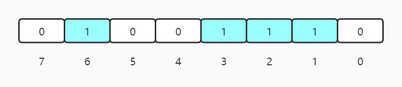
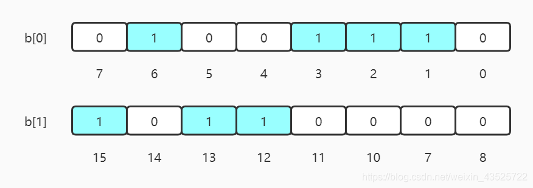
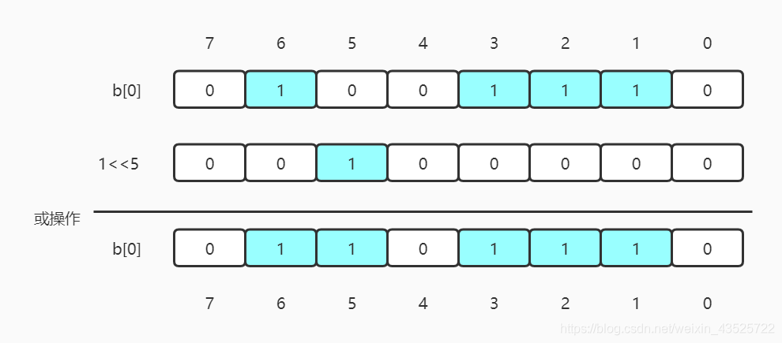
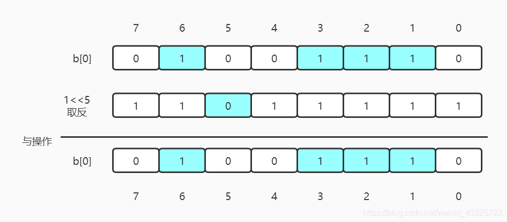
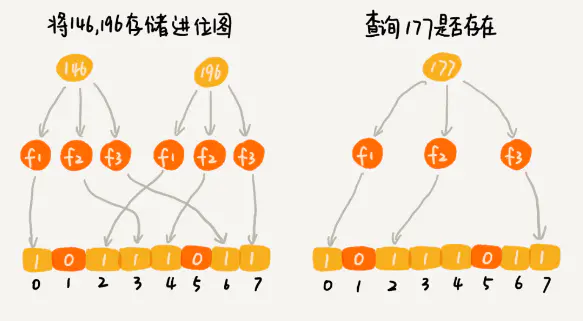

# Intro
>在20亿个随机整数中找出某个数是否存在其中，并假设32位操作系统，4G内存，你会怎么做？

我们知道在java中，一个int占4字节，1字节=8位（1 byte = 8 bit），如果每个数字用int存储，那就是20亿个int，因而占用的空间约为：
`200000000 * 4 / 1024 / 1024/ 1024 = 7.5 GB`

如果我们使用位存储标记20亿个数的有无:
`200000000 / 8 / 1024 / 1024 / 1024 = 230 MB`

所以能够省下来大量空间.

# Data Structure

BitMap的关键, 就是0 (不存在),和1(存在), 例如:

此位图存储了`{1, 2, 3, 6}`. 并且此位图总共8位, 为一个字节.
假设今天我们声明一个字节数组`byte[]`, 就可以表示超过7的数字, 例如:

此位图存储了`{1, 2, 3, 6, 12, 13, 15}`.

如果我们定义一个整型数组int[], Java中的int为32位, 此外知道我们需要存储的最大数字为N, 则需要申请int arr[N / 32 + 1]的空间, 其中:
```text
b[0]: 表示0~31;
b[1]: 32~63;
b[2]: 64~95;
etc...
```
如果要获知某个数n的位置, 通过`n / 32`获得分组, 通过`n % 32`获得该分组下的索引值.

# Insertion
>添加5进入位图.

今天使用byte[]数组. 给定任意整数N，那么N/8就得到下标，N%8就知道它在此下标b的哪个位置。首先，5/8=0，也是说它应该在b[0]，5%8=5，说明它应该在b[0]的第5个位置，那我们把1向左移动5位，然后与原数据按位或：

表达式为`b[0] = b[0] | (1 << 5)`;
公式推广`p + (i/8)|(1<<(i%8))`

# Deletion
与添加数据类似, 只是那个移动1的辅助数字按位取反, 再与位图按位与.


# Find
判断一个数存不存在就是判断该数所在的位是0还是1。假设，我们想知道6在不在，那么只需判断 `b[0] & (1<<6)` 如果这个值是0，则不存在，如果是1，就表示存在。

# Sort
位存储可用于**无重复**以及数据密集型排序.
>假设我们要对0-7内的5个元素(4,7,2,5,3)排序. 
可以采用Bit-map，要表示8个数，我们就只需要8个Bit,即1字节. 步骤:

1. 开辟1Byte的空间，将这些空间的所有Bit位都置为0，然后插入数据。
2. 顺序遍历，将该位是1的位的编号输出（2，3，4，5，7），这样就达到了排序的目的，时间复杂度O(n)。

# 与布隆过滤器比较

由于哈希碰撞, 布隆过滤器不能确保一个数是否真的存在, 只能保证该数据确实不存在, 适合用于大规模去重, 但是又允许小概率误差的情况. 下图为一个误判示例:



布隆过滤器和位图相比, 能够容纳更大规模的数据, 比如百亿量级. 不过, 布隆过滤器会带来小概率误判.


