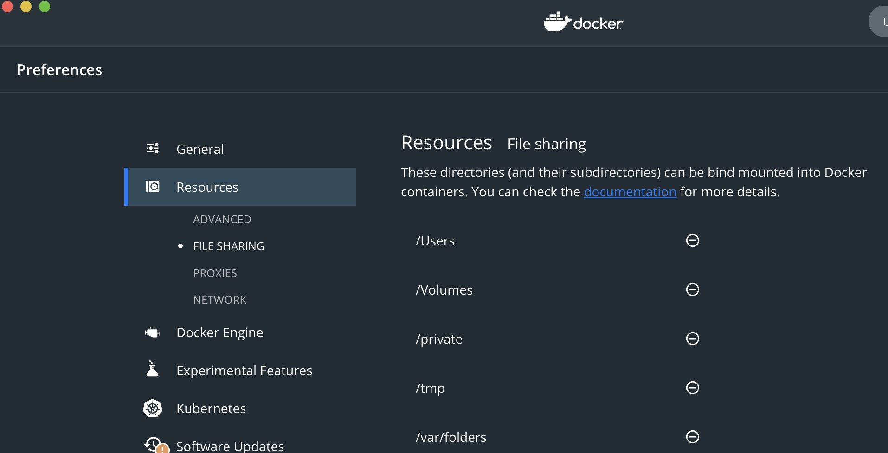

# 开端
煞笔苹果.

# 流程

## 1.Docker Desktop 配置数据卷文件分享的地址
只有配置了分享文件的地址后,在Mac上才能直接访问到文件,不然的话就要钻进docker的linux虚拟机里找数据卷,用`sudo screen ...... tty`这种一大堆傻逼东西访问数据,白痴啊. 

因为Mac内核是Darwin的,非Linux, 所以不配置这破东西,你就无法直接在Mac上访问数据卷的地址. 贼坑.




## 2.在分享文件的地址里做出需要数据卷分享的文件

1. 首先随便启动个nginx容器:
`docker run --name nginx-test -p 8080:8080 -d nginx`

2. 进入容器
`docker exec -it nginx-test bash`

3. 查看定位重要的目录
- 配置文件: `/etc/nginx`
- 静态资源: `/usr/share/nginx`

4. 在宿主机傻逼Mac上的预先设置的数据卷目录里造东西:

比如今天假设用Docker Desktop设置了一个分享地址在~/docker-volume,
我们就可以创建两个空目录`~/docker-volume/nginx/etc/nginx`和`~/docker-volume/nginx/usr/share/nginx`.

然后, 将docker nginx内的对应文件拷贝进来.
>坑点:如果不拷贝文件到宿主机,而直接挂载空的数据卷目录打开nginx容器, nginx容器会报错,因为配置文件是空的.

拷贝文件命令实例如下:
`docker cp nginx-test:/usr/share/nginx ~/docker-volume/nginx/usr/share/nginx`

5. 现在,这个工具人nginx容器可以删掉.
`docker rm -f nginx-test`

6. 新建带挂载数据卷的nginx容器,命令如下:

```shell
docker run -p 80:80 --name nginx-test \
> -v ~/docker-volume/nginx/etc/nginx:/etc/nginx \
> -v ~/docker-volume/nginx/usr/share/nginx:/usr/share/nginx \
> -d nginx
```

7. 能够跑起来了,然后在Mac上能够直接访问这个数据卷.

# 总结
- Mac内核是Darwin, Docker要求内核是Linux, 所以如果不配置分享目录,在Mac里就无法直接访问数据卷的地址,需要一大堆命令访问到docker自带虚拟机里的挂载点...真傻逼玩意儿.
- 设立挂载点后,里面文件为空也不行,需要一个工具人提供初始文件进去.
- 我是傻逼.


