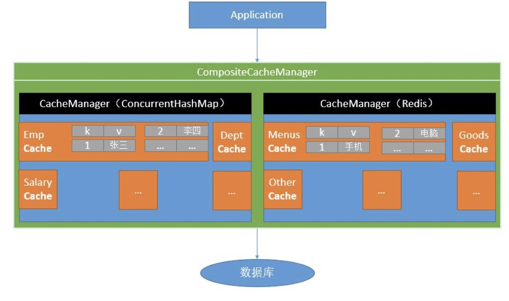
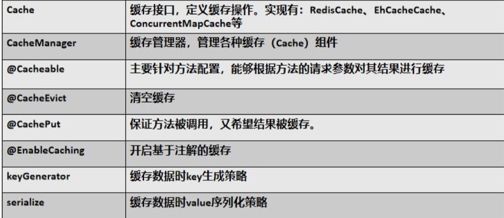
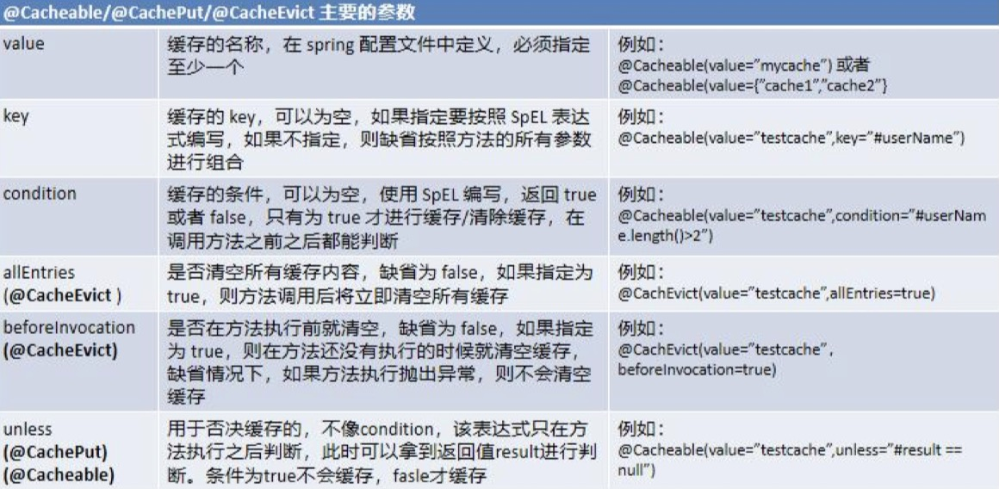
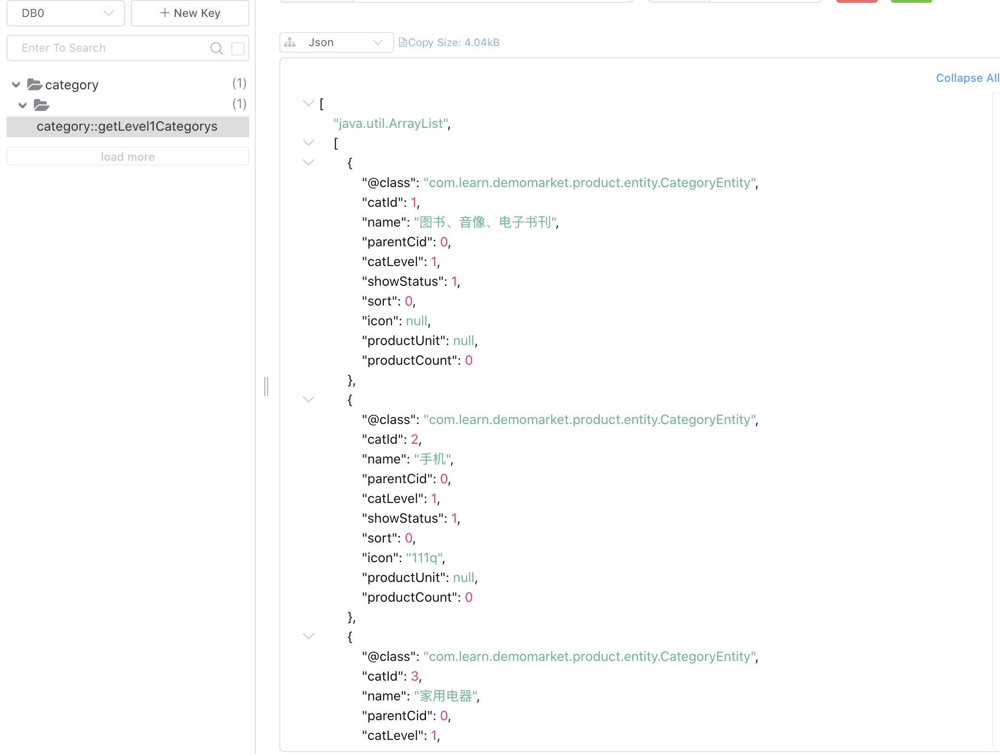

# 简介

- Spring 从 3.1 开始定义了 org.springframework.cache.Cache 和 org.springframework.cache.CacheManager 接口来统一不同的缓存技术； 并支持使用 JCache（JSR-107）注解简化我们开发；

- Cache 接口为缓存的组件规范定义，包含缓存的各种操作集合； Cache 接 口 下 Spring 提 供 了 各 种 xxxCache 的 实 现 ； 如 RedisCache ， EhCacheCache , ConcurrentMapCache 等: 
  - 每次调用需要缓存功能的方法时，Spring 会检查检查指定参数的指定的目标方法是否已 经被调用过；如果有就直接从缓存中获取方法调用后的结果，如果没有就调用方法并缓 存结果后返回给用户。下次调用直接从缓存中获取。

  - 使用 Spring 缓存抽象时我们需要关注以下两点； 
      1. 确定方法需要被缓存以及他们的缓存策略;   
      2. 从缓存中读取之前缓存存储的数据.




# Spring Cache常用注解


其中, 失效模式注解的参数:


# 使用

## 引依赖
```xml
 <dependency>
            <groupId>org.springframework.boot</groupId>
            <artifactId>spring-boot-starter-cache</artifactId>
</dependency>
```

## 写配置
```text
spring.cache.type=redis

spring.cache.redis.time-to-live=3600000

spring.cache.redis.use-key-prefix=true

spring.cache.redis.cache-null-values=true
```

## 加注解

1. 应用入口
```java
@EnableRedisHttpSession     //开启springsession
@EnableCaching      //开启缓存功能
@MapperScan("com.learn.demomarket.product.dao")
@EnableDiscoveryClient
@EnableFeignClients
@SpringBootApplication
public class DemomarketProductApplication {

    public static void main(String[] args) {
        SpringApplication.run(DemomarketProductApplication.class, args);
    }

}
```

2. 如果写自动配置类:
```java
@EnableConfigurationProperties(CacheProperties.class)
@Configuration
@EnableCaching
public class MyCacheConfig {

    // @Autowired
    // public CacheProperties cacheProperties;

    /**
     * 配置文件的配置没有用上
     * @return
     */
    @Bean
    public RedisCacheConfiguration redisCacheConfiguration(CacheProperties cacheProperties) {

        RedisCacheConfiguration config = RedisCacheConfiguration.defaultCacheConfig();
        // config = config.entryTtl();
        config = config.serializeKeysWith(RedisSerializationContext.SerializationPair.fromSerializer(new StringRedisSerializer()));
        config = config.serializeValuesWith(RedisSerializationContext.SerializationPair.fromSerializer(new GenericJackson2JsonRedisSerializer()));

        CacheProperties.Redis redisProperties = cacheProperties.getRedis();
        //将配置文件中所有的配置都生效
        if (redisProperties.getTimeToLive() != null) {
            config = config.entryTtl(redisProperties.getTimeToLive());
        }
        if (redisProperties.getKeyPrefix() != null) {
            config = config.prefixKeysWith(redisProperties.getKeyPrefix());
        }
        if (!redisProperties.isCacheNullValues()) {
            config = config.disableCachingNullValues();
        }
        if (!redisProperties.isUseKeyPrefix()) {
            config = config.disableKeyPrefix();
        }

        return config;
    }

}
```

3. 使用
```java
/**
     * 每一个需要缓存的数据我们都来指定要放到那个名字的缓存。【缓存的分区(按照业务类型分)】
     * 代表当前方法的结果需要缓存，如果缓存中有，方法都不用调用，如果缓存中没有，会调用方法。最后将方法的结果放入缓存
     * 默认行为
     *      如果缓存中有，方法不再调用
     *      key是默认生成的:缓存的名字::SimpleKey[](自动生成key值)
     *      缓存的value值，默认使用jdk序列化机制，将序列化的数据存到redis中
     *      默认时间是 -1：
     *
     *   自定义操作：key的生成
     *      指定生成缓存的key：key属性指定，接收一个Spel
     *      指定缓存的数据的存活时间:配置文档中修改存活时间
     *      将数据保存为json格式
     *
     *
     * 4、Spring-Cache的不足之处：
     *  1）、读模式
     *      缓存穿透：查询一个null数据。解决方案：缓存空数据
     *      缓存击穿：大量并发进来同时查询一个正好过期的数据。解决方案：加锁 ? 默认是无加锁的;使用sync = true来解决击穿问题
     *      缓存雪崩：大量的key同时过期。解决：加随机时间。加上过期时间
     *  2)、写模式：（缓存与数据库一致）
     *      1）、读写加锁。
     *      2）、引入Canal,感知到MySQL的更新去更新Redis
     *      3）、读多写多，直接去数据库查询就行
     *
     *  总结：
     *      常规数据（读多写少，即时性，一致性要求不高的数据，完全可以使用Spring-Cache）：写模式(只要缓存的数据有过期时间就足够了)
     *      特殊数据：特殊设计
     *
     *  原理：
     *      CacheManager(RedisCacheManager)->Cache(RedisCache)->Cache负责缓存的读写
     * @return
     */
    @Cacheable(value = {"category"},key = "#root.method.name",sync = true)
    @Override
    public List<CategoryEntity> getLevel1Categorys() {
        System.out.println("getLevel1Categorys........");
        long l = System.currentTimeMillis();
        List<CategoryEntity> categoryEntities = this.baseMapper.selectList(
                new QueryWrapper<CategoryEntity>().eq("parent_cid", 0));
        System.out.println("消耗时间："+ (System.currentTimeMillis() - l));
        return categoryEntities;
    }


    @Cacheable(value = "category",key = "#root.methodName")
    @Override
    public Map<String, List<Catelog2Vo>> getCatalogJson() {
        System.out.println("查询了数据库");

        //将数据库的多次查询变为一次
        List<CategoryEntity> selectList = this.baseMapper.selectList(null);

        //1、查出所有分类
        //1、1）查出所有一级分类
        List<CategoryEntity> level1Categorys = getParent_cid(selectList, 0L);

        //封装数据
        Map<String, List<Catelog2Vo>> parentCid = level1Categorys.stream().collect(Collectors.toMap(k -> k.getCatId().toString(), v -> {
            //1、每一个的一级分类,查到这个一级分类的二级分类
            List<CategoryEntity> categoryEntities = getParent_cid(selectList, v.getCatId());

            //2、封装上面的结果
            List<Catelog2Vo> catelog2Vos = null;
            if (categoryEntities != null) {
                catelog2Vos = categoryEntities.stream().map(l2 -> {
                    Catelog2Vo catelog2Vo = new Catelog2Vo(v.getCatId().toString(), null, l2.getCatId().toString(), l2.getName().toString());

                    //1、找当前二级分类的三级分类封装成vo
                    List<CategoryEntity> level3Catelog = getParent_cid(selectList, l2.getCatId());

                    if (level3Catelog != null) {
                        List<Catelog2Vo.Category3Vo> category3Vos = level3Catelog.stream().map(l3 -> {
                            //2、封装成指定格式
                            Catelog2Vo.Category3Vo category3Vo = new Catelog2Vo.Category3Vo(l2.getCatId().toString(), l3.getCatId().toString(), l3.getName());

                            return category3Vo;
                        }).collect(Collectors.toList());
                        catelog2Vo.setCatalog3List(category3Vos);
                    }

                    return catelog2Vo;
                }).collect(Collectors.toList());
            }

            return catelog2Vos;
        }));

        return parentCid;
    }
```
## 效果

经过配置, 能够以String类型给Redis里缓存住结果对象.


## 缓存失效模式@CacheEvict注解使用
```java
/**
     * 级联更新所有关联的数据
     *
     * @CacheEvict:失效模式
     * @CachePut:双写模式，需要有返回值
     * 1、同时进行多种缓存操作：@Caching
     * 2、指定删除某个分区下的所有数据 @CacheEvict(value = "category",allEntries = true)
     * 3、存储同一类型的数据，都可以指定为同一分区
     * @param category
     */
    // @Caching(evict = {
    //         @CacheEvict(value = "category",key = "'getLevel1Categorys'"),
    //         @CacheEvict(value = "category",key = "'getCatalogJson'")
    // })
    @CacheEvict(value = "category",allEntries = true)       //删除某个分区下的所有数据
    @Transactional(rollbackFor = Exception.class)
    @Override
    public void updateCascade(CategoryEntity category) {

        RReadWriteLock readWriteLock = redissonClient.getReadWriteLock("catalogJson-lock");
        //创建写锁
        RLock rLock = readWriteLock.writeLock();

        try {
            rLock.lock();
            this.baseMapper.updateById(category);
            categoryBrandRelationService.updateCategory(category.getCatId(), category.getName());
        } catch (Exception e) {
            e.printStackTrace();
        } finally {
            rLock.unlock();
        }

        //同时修改缓存中的数据
        //删除缓存,等待下一次主动查询进行更新
    }
```

# Spring Cache常见一致性问题的解决思路

1. 读模式
    1. 缓存穿透: 在缓存中存储null值, 防止空值再查数据库;
    2. 缓存击穿: 加锁(读写锁一般就够);
    3. 缓存雪崩: 一般小型系统没事的. 可以考虑加随机过期时间.
2. 写模式
    1. 读写加锁:保证缓存与数据库一致.适用于读多写少的情况;
    2. 使用Canal中间件, 假装成MySQL从库感知主库变化然后修改缓存. 一般奥卡姆剃刀, 还是少加点中间件吧;
    3. 对于读多写也多的, 直接查数据库吧.
