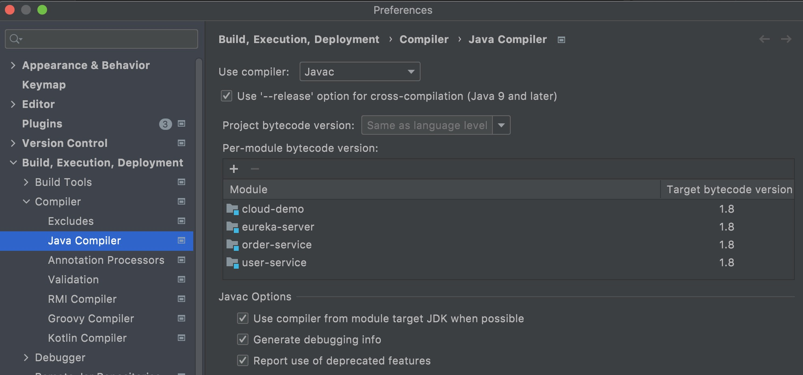
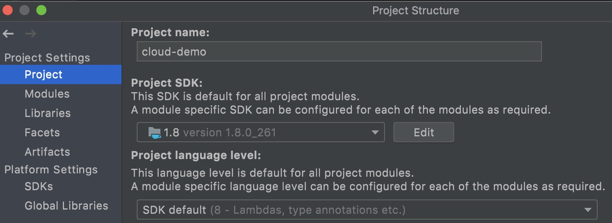

# 起因
配置Eureka 微服务时,提示类加载器有关错误: Unsupported class file major version 60.

# 经过
排查Eureka的pom和父亲pom中的property,发现`java.version`字段不对应,eureka的是16, 而其他的pom是1.8.

设置完pom,刷新,再检查下项目的compiler,SDK的配置:

以及project structure:

# 结果
成功编译并运行.
