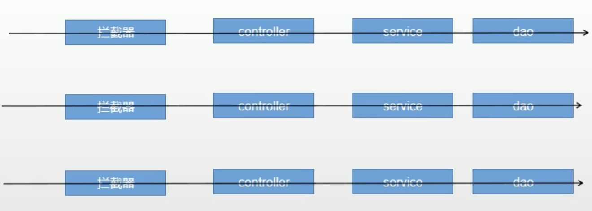

# ThreadLocal
`Threadlocal`是一个线程内部的存储类，可以在指定线程内存储数据，数据存储以后，只有指定线程可以得到存储数据.

`ThreadLocal`提供了线程内存储变量的能力，这些变量不同之处在于每一个线程读取的变量是对应的互相独立的。通过get和set方法就可以得到当前线程对应的值。

从表面上看`ThreadLocal`像是一个k-v Map，key为当前的线程，value就是需要存储的对象。来看点源码:

```java
//set 方法
public void set(T value) {
      //获取当前线程
      Thread t = Thread.currentThread();
      //实际存储的数据结构类型
      ThreadLocalMap map = getMap(t);
      //如果存在map就直接set，没有则创建map并set
      if (map != null)
          map.set(this, value);
      else
          createMap(t, value);
  }
  
//getMap方法
ThreadLocalMap getMap(Thread t) {
      //thred中维护了一个ThreadLocalMap
      return t.threadLocals;
 }
 
//createMap
void createMap(Thread t, T firstValue) {
      //实例化一个新的ThreadLocalMap，并赋值给线程的成员变量threadLocals
      t.threadLocals = new ThreadLocalMap(this, firstValue);
}
```

# 在Spring Boot中的应用
在Spring Boot的默认servlet容器中, 每个请求会开个独立的线程:


假设今天我从拦截器那里获取了一点信息, 想要在后续的东西里面复用, 可以使用`ThreadLocal`. 并且信息只在当前线程/请求中可见.

# 示例

我们的拦截器获取到了当前请求的用户登录信息:
```java
public class CartInterceptor implements HandlerInterceptor {


    public static ThreadLocal<UserInfoTo> toThreadLocal = new ThreadLocal<>();

    /***
     * 目标方法执行之前
     * @param request
     * @param response
     * @param handler
     * @return
     * @throws Exception
     */
    @Override
    public boolean preHandle(HttpServletRequest request, HttpServletResponse response, Object handler) throws Exception {

        UserInfoTo userInfoTo = new UserInfoTo();

        HttpSession session = request.getSession();
        //获得当前登录用户的信息
        MemberResponseVo memberResponseVo = (MemberResponseVo) session.getAttribute(LOGIN_USER);

        if (memberResponseVo != null) {
            //用户登录了
            userInfoTo.setUserId(memberResponseVo.getId());
        }

        Cookie[] cookies = request.getCookies();
        if (cookies != null && cookies.length > 0) {
            for (Cookie cookie : cookies) {
                //user-key
                String name = cookie.getName();
                if (name.equals(TEMP_USER_COOKIE_NAME)) {
                    userInfoTo.setUserKey(cookie.getValue());
                    //标记为已是临时用户
                    userInfoTo.setTempUser(true);
                }
            }
        }

        //如果没有临时用户一定分配一个临时用户
        if (StringUtils.isEmpty(userInfoTo.getUserKey())) {
            String uuid = UUID.randomUUID().toString();
            userInfoTo.setUserKey(uuid);
        }

        //目标方法执行之前 (*)
        toThreadLocal.set(userInfoTo);
        return true;
    }
}
```

上述代码的(*)处我们放进去了一个userInfoTO. 接下来进入Controller中的一个方法:

```java
@GetMapping(value = "/cart.html")
    public String cartListPage(Model model) throws ExecutionException, InterruptedException {
        //快速得到用户信息：id,user-key (*)
        // UserInfoTo userInfoTo = CartInterceptor.toThreadLocal.get();

        CartVo cartVo = cartService.getCart();
        model.addAttribute("cart",cartVo);
        return "cartList";
}
```

# 结论

- ThreadLocal事一个线程安全的, 在同线程里能够维护一个公共量的类.

- Spring Boot的Tomcat容器每个请求都是个独立线程, 能够使用ThreadLocal比较方便的操作同请求下的数据.


