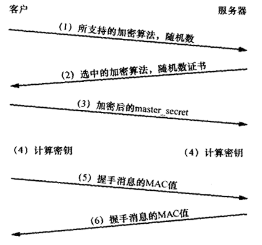

# SSL握手手的目的
1. 客户端与服务器需要就一组用于保护数据的算法达成一致；
2. 它们需要确立一组由那些算法所使用的加密密钥；
3. 握手还可以选择对客户端进行认证。

# 过程
1. 客户端将它所支持的**算法列表**和一个用作产生密钥的**随机数**发送给服务器；
2. 服务器从算法列表中选择一种**加密算法**，并将它和一份包含服务器**公钥的证书**发送给客户端；该证书还包含了用于认证目的的服务器标识，服务器同时还提供了一个**用作产生密钥的随机数**；
3. 客户端对服务器的证书进行验证(有关验证证书，可以参考数字签名)，并抽取服务器的公用密钥；然后，再产生一个称作**pre_master_secret的随机密码串**，并使用服务器的公用密钥对其进行加密(参考非对称加/解密)，并将加密后的信息发送给服务器；
4. 客户端与服务器端根据pre_master_secret以及客户端与服务器的随机数值独立计算出加密和MAC密钥(参考**DH密钥交换算法**)。
5. 客户端将所有握手消息的MAC值发送给服务器；
6. 服务器将所有握手消息的MAC值发送给客户端。

*第5与第6步用以防止握手本身遭受篡改。设想一个攻击者想要控制客户端与服务器所使用的算法。客户端提供多种算法的情况相当常见，某些强度弱而某些强度强，以便能够与仅支持弱强度算法的服务器进行通信。攻击者可以删除客户端在第1步所提供的所有高强度算法，于是就迫使服务器选择一种弱强度的算法。第5步与第6步的MAC交换就能阻止这种攻击，因为客户端的MAC是根据原始消息计算得出的，而服务器的MAC是根据攻击者修改过的消息计算得出的，这样经过检查就会发现不匹配。由于客户端与服务器所提供的随机数为密钥产生过程的输入，所以握手不会受到重放攻击的影响。这些消息是首个在新的加密算法与密钥下加密的消息。*

