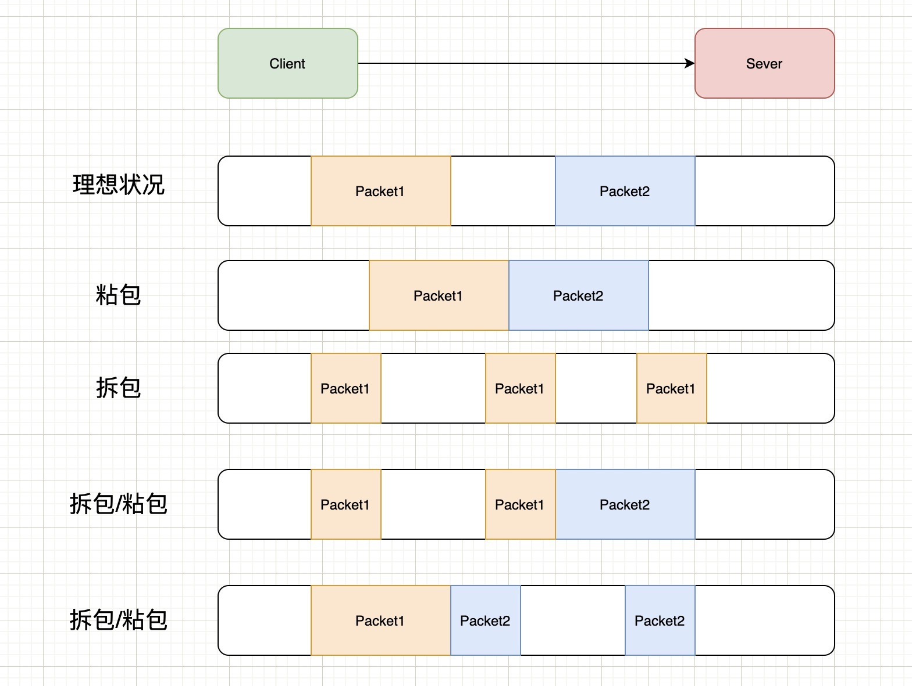

# 什么是粘包？
TCP是面向字节流的协议，就是没有界限的一串数据，本没有“包”的概念，“粘包”和“拆包”一说是为了有助于形象地理解这两种现象。

**为什么UDP没有粘包？**
粘包拆包问题在数据链路层、网络层以及传输层都有可能发生。日常的网络应用开发大都在传输层进行，由于UDP有消息保护边界，不会发生粘包拆包问题，因此粘包拆包问题只发生在TCP协议中。

# 粘包拆包发生场景
因为TCP是面向流，没有边界，而操作系统在发送TCP数据时，会通过缓冲区来进行优化，例如缓冲区为1024个字节大小。

如果一次请求发送的数据量比较小，没达到缓冲区大小，TCP则会将多个请求合并为同一个请求进行发送，这就形成了粘包问题。

如果一次请求发送的数据量比较大，超过了缓冲区大小，TCP就会将其拆分为多次发送，这就是拆包。

# 常见的解决方案
对于粘包和拆包问题，常见的解决方案有四种：
1. 发送端将每个包都封装成固定的长度，比如100字节大小。如果不足100字节可通过补0或空等进行填充到指定长度；
2. 发送端在每个包的末尾使用固定的分隔符，例如\r\n。如果发生拆包需等待多个包发送过来之后再找到其中的\r\n进行合并；例如，FTP协议；
3. 将消息分为头部和消息体，头部中保存整个消息的长度，只有读取到足够长度的消息之后才算是读到了一个完整的消息；
4. 通过自定义协议进行粘包和拆包的处理。

# Copyright
[面试题：聊聊TCP的粘包、拆包以及解决方案](https://cloud.tencent.com/developer/article/1804413#:~:text=%E5%A6%82%E6%9E%9C%E4%B8%80%E6%AC%A1%E8%AF%B7%E6%B1%82%E5%8F%91%E9%80%81%E7%9A%84,%E5%8F%91%E9%80%81%EF%BC%8C%E8%BF%99%E5%B0%B1%E6%98%AF%E6%8B%86%E5%8C%85%E3%80%82)
