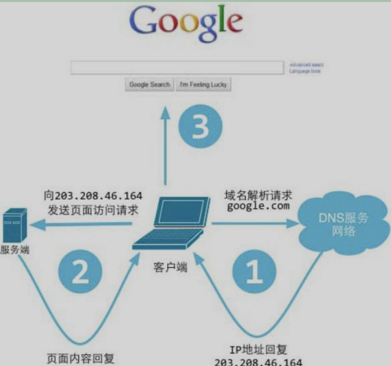
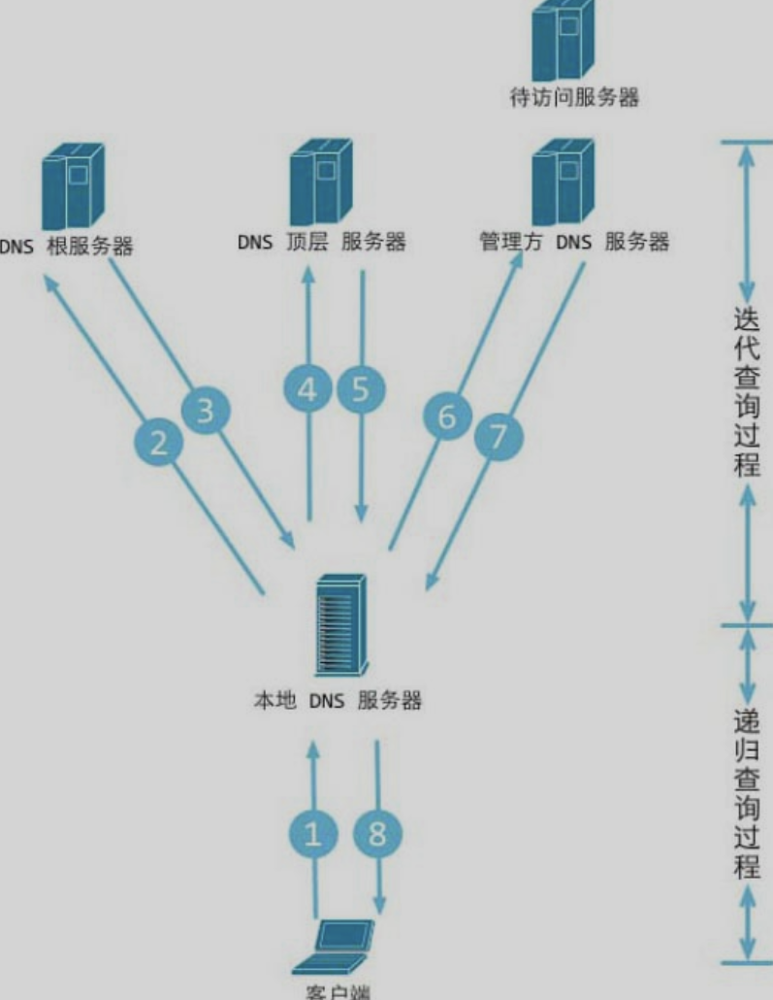

# 起因
虽然脑子里大致了解web网页的运作, 但是组织成语言不太容易. 现在简单梳理如下.

# Web工作方式
 
1. 浏览器是一个客户端，当你输入URL的时候，浏览器首先会去请求DNS服务器;
2. 通过DNS获取相应域名对应的IP: 本地host -> 若无, 本地DNS -> 若无, 首选DNS, 若有则获知权威解析结果 -> 若无, 若未用转发模式, 本地DNS会从根域名DNS服务器开始请求, 直到本地DNS请求到有对应记录的DNS服务器, 返回结果 -> 若使用转发模式, 则本地DNS把请求转发至上级DNS, 若有得到解析结果, 则把结果发给本地DNS, 由本地DNS返回给主机.

3. 根据IP建立TCP连接, 三次握手;
4. 等浏览器发送完HTTP Request（请求）包后，服务器接收到请求包之后才开始处理请求包，服务器调用自身服务，返回HTTP Response（响应）包；
5. 客户端收到来自服务器的响应后开始渲染这个Response包里的主体（body），等收到全部的内容，随后断开与该服务器之间的TCP连接。(如果不Keep-Live) 

一个Web服务器也被称为HTTP服务器，它通过HTTP协议与客户端通信。这个客户端通常指的是Web浏览器（其实手机端客户端内部也是浏览器实现的）。 

Web服务器的工作原理可以简单地归纳如下:
1. 客户端通过TCP/IP协议建立到服务器的TCP连接。 
2. 客户端向服务器发送HTTP协议请求包，请求服务器里的资源文档。 
3. 服务器向客户机发送HTTP协议应答包，如果请求的资源包含有动态语言的内容，那么服务器会调用动态语言的解释引擎负责处理“动态内容”，并将处理得到的数据返回给客户端。
4. 客户端与服务器断开。由客户端解释HTML文档，在客户端屏幕上渲染图形结果。
