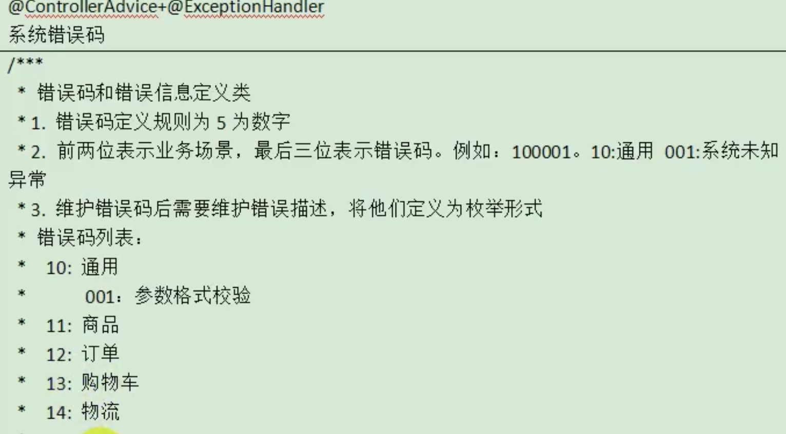

# 起因
Spring有时用到ControllerAdvice全局异常处理,那么处理时返回的JSON含状态码该怎么定义呢?

# 实例
参考案例:


# 代码

1. 错误码定义 -- 一个枚举类:
```java
public enum BizCodeEnume {
    UNKNOWN_EXCEPTION(10000, "未知异常"),
    VALIDATION_EXCEPTION(10001, "参数格式错误");

    private final Integer code;
    private final String message;

    BizCodeEnume(Integer code, String message) {
        this.code = code;
        this.message = message;
    }

    public Integer getCode() {
        return code;
    }

    public String getMessage() {
        return message;
    }
}
```

2. 自定义RESTful的JSON回应对象:
```java
public class R extends HashMap<String, Object> {
	private static final long serialVersionUID = 1L;
	
	public R() {
		put("code", 0);
		put("msg", "success");
	}
	
	public static R error() {
		return error(HttpStatus.SC_INTERNAL_SERVER_ERROR, "未知异常，请联系管理员");
	}
	
	public static R error(String msg) {
		return error(HttpStatus.SC_INTERNAL_SERVER_ERROR, msg);
	}
	
	public static R error(int code, String msg) {
		R r = new R();
		r.put("code", code);
		r.put("msg", msg);
		return r;
	}

	public static R ok(String msg) {
		R r = new R();
		r.put("msg", msg);
		return r;
	}
	
	public static R ok(Map<String, Object> map) {
		R r = new R();
		r.putAll(map);
		return r;
	}
	
	public static R ok() {
		return new R();
	}

	public R put(String key, Object value) {
		super.put(key, value);
		return this;
	}
}
```


3.错误处理:
```java
@Slf4j
@RestControllerAdvice(basePackages = "com.learn.demomarket.product.controller")
public class ExceptionControllerAdvice {

    @ExceptionHandler(value = MethodArgumentNotValidException.class)
    public R handleValidException(MethodArgumentNotValidException e) {
        log.error("发现异常:{}, 异常类型{}", e.getMessage(), e.getClass());
        BindingResult bindingResult = e.getBindingResult();

        Map<String, String> errorMap = new HashMap<>();

        bindingResult.getFieldErrors().forEach((fieldError) -> {
            errorMap.put(fieldError.getField(), fieldError.getDefaultMessage());
        });

        return R.error(BizCodeEnume.VALIDATION_EXCEPTION.getCode(), "数据校验问题").put("data", errorMap);
    }

    @ExceptionHandler(value = Throwable.class)
    public R handleException(Throwable throwable) {
        return R.error(BizCodeEnume.UNKNOWN_EXCEPTION.getCode(), BizCodeEnume.UNKNOWN_EXCEPTION.getMessage());
    }
}
```
