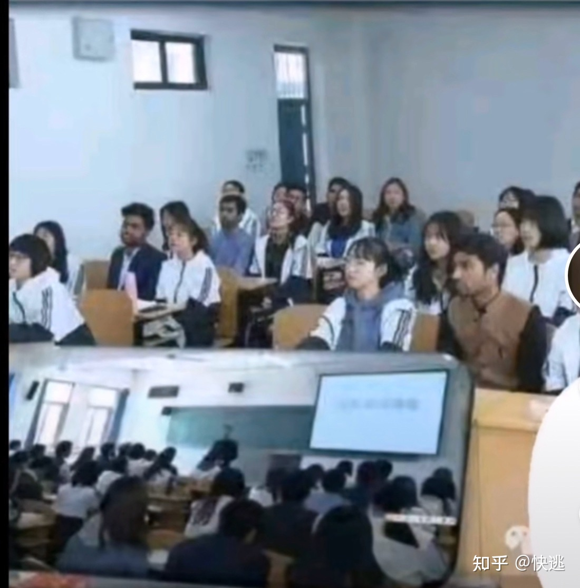
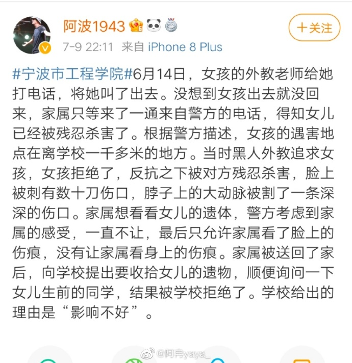
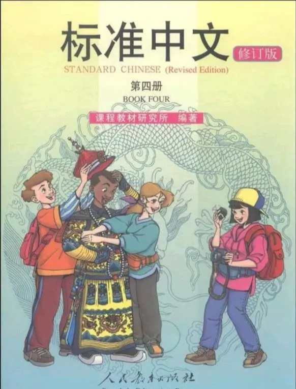

教育部部长陈宝生云：

>2049年，中国教育将稳稳地立于世界教育的中心，引领世界教育发展的潮流。到那个时候，中国教育的标准将成为世界教育的标准。

>2049年，中国将成为世界各国人民最向往的留学目的国，各国将有意愿和中华文化实现交流融合，将有大量师生来中国学习交流中国的发展经验，在交流过程中实现共同进步。

>2049年，对世界教育发展的规则，中国将有更大的发言权。中国将尽自己的努力，为世界教育发展提供中国方案、中国智慧。

>2049年，中国版的教材、汉语发音的教材，将走向世界。

-- 参见[中国青年网](https://baijiahao.baidu.com/s?id=1581937598304342041&wfr=spider&for=pc).

我表示赞同，无论是山东大学曾经的[学伴制度](https://baike.baidu.com/item/山东大学学伴事件/23617157?fr=aladdin)：

还是学校的[留学生豪华公寓](https://baijiahao.baidu.com/s?id=1638834551727604356&wfr=spider&for=pc)。无论是低门槛的留学生的[奖学金](https://www.sohu.com/a/329667735_732417)，还是就读顶尖高校的[低门槛](https://www.zhihu.com/question/56515678?ivk_sa=1024320u)。

此外，还有某个学校的外教杀害女学生事件，也得到了及时的处理：

综上所述，"成为留学生向往的目的地"的远大目标，终将实现!

**量中华之物力，结与国之欢心！**

>没有了祖国，你什么都不是!
 	-- 保罗·约瑟夫·戈培尔(纳粹德国宣传部长)
